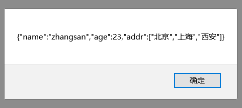
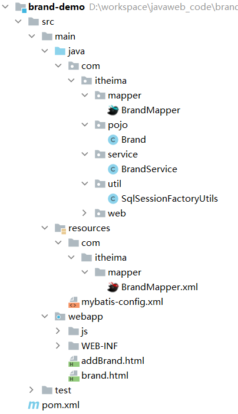

# JSON

## 1 概述

概念：`JavaScript Object Notation`。JavaScript 对象表示法.

如下是 `JavaScript` 对象的定义格式：

```js
{
	name:"zhangsan",
	age:23,
	city:"北京"
}
```

接下来我们再看看 `JSON` 的格式：

```json
{
	"name":"zhangsan",
	"age":23,
	"city":"北京"
}
```

 `json` 格式中的键要求必须使用双引号括起来，这是 `json` 格式的规定。

### 1.1 作用

由于其语法格式简单，层次结构鲜明，现多用于作为数据载体，在网络中进行数据传输。如下图所示就是服务端给浏览器响应的数据，这个数据比较简单，如果现需要将 JAVA 对象中封装的数据响应回给浏览器的话，应该以何种数据传输呢？


大家还记得 `ajax` 的概念吗？ 是 ==异步的 JavaScript 和 xml==。这里的 xml就是以前进行数据传递的方式，如下：

```xml
<student>
    <name>张三</name>
    <age>23</age>
    <city>北京</city>
</student>
```

再看 `json` 描述以上数据的写法：

```json
{	
	"name":"张三",
    "age":23,
    "city":"北京"
}
```

上面两种格式进行对比后就会发现 `json` 格式数据的简单，以及所占的字节数少等优点。

## 2 JSON 基础语法

### 2.1 定义格式

`JSON` 本质就是一个字符串，但是该字符串内容是有一定的格式要求的。 定义格式如下：

```js
var 变量名 = '{"key":value,"key":value,...}';
```

`JSON` 串的键要求必须使用双引号括起来，而值根据要表示的类型确定。value 的数据类型分为如下

* 数字（整数或浮点数）
* 字符串（使用双引号括起来）
* 逻辑值（true或者false）
* 数组（在方括号中）
* 对象（在花括号中）
* null

示例：

```javascript
var jsonStr = '{"name":"zhangsan","age":23,"addr":["北京","上海","西安"]}'
```

#### 2.1.1  代码演示

创建一个页面，在该页面的 `<script>` 标签中定义json字符串

```html
<!DOCTYPE html>
<html lang="en">
<head>
    <meta charset="UTF-8">
    <title>Title</title>
</head>
<body>
<script>
    //1. 定义JSON字符串
    var jsonStr = '{"name":"zhangsan","age":23,"addr":["北京","上海","西安"]}'
    alert(jsonStr);

</script>
</body>
</html>
```

通过浏览器打开，页面效果如下图所示



读取JSON的值可以通过将JSON转换成JSON对象，并取值

```html
<!DOCTYPE html>
<html lang="en">
<head>
    <meta charset="UTF-8">
    <title>Title</title>
</head>
<body>
<script>
    //1. 定义JSON字符串
    var jsonStr = '{"name":"zhangsan","age":23,"addr":["北京","上海","西安"]}'
    alert(jsonStr);

    //2. 将 JSON 字符串转为 JS 对象
    let jsObject = JSON.parse(jsonStr);
    alert(jsObject)
    alert(jsObject.name)
    //3. 将 JS 对象转换为 JSON 字符串
    let jsonStr2 = JSON.stringify(jsObject);
    alert(jsonStr2)
</script>
</body>
</html>
```

### 2.2 发送异步请求携带参数

后面我们使用 `axios` 发送请求时，如果要携带复杂的数据时都会以 `JSON` 格式进行传递，原始格式如下：

```js
axios({
    method:"post",
    url:"http://localhost:8080/ajax-demo/axiosServlet",
    data:"username=zhangsan"
}).then(function (resp) {
    alert(resp.data);
})
```

现在可以提前定义一个 js 对象，用来封装需要提交的参数，然后使用 `JSON.stringify(js对象)` 转换为 `JSON` 串，再将该 `JSON` 串作为 `axios` 的 `data` 属性值进行请求参数的提交。如下：

```js
var jsObject = {name:"张三"};

axios({
    method:"post",
    url:"http://localhost:8080/ajax-demo/axiosServlet",
    data: JSON.stringify(jsObject)
}).then(function (resp) {
    alert(resp.data);
})
```

而 `axios` 是一个很强大的工具。我们只需要将需要提交的参数封装成 js 对象，并将该 js 对象作为 `axios` 的 `data` 属性值进行，它会自动将 js 对象转换为 `JSON` 串进行提交。如下：

```js
var jsObject = {name:"张三"};

axios({
    method:"post",
    url:"http://localhost:8080/ajax-demo/axiosServlet",
    data:jsObject  //这里 axios 会将该js对象转换为 json 串的
}).then(function (resp) {
    alert(resp.data);
})
```

> 注意：
>
> * js 提供的 `JSON` 对象我们只需要了解一下即可。因为 `axios` 会自动对 js 对象和 `JSON` 串进行想换转换。
> * 发送异步请求时，如果请求参数是 `JSON` 格式，那请求方式必须是 `POST`。因为 `JSON` 串需要放在请求体中。

### 2.3  JSON串和Java对象的相互转换

学习完 json 后，接下来聊聊 json 的作用。以后我们会以 json 格式的数据进行前后端交互。前端发送请求时，如果是复杂的数据就会以 json 提交给后端；而后端如果需要响应一些复杂的数据时，也需要以 json 格式将数据响应回给浏览器。


在后端我们就需要重点学习以下两部分操作：

* 请求数据：JSON字符串转为Java对象
* 响应数据：Java对象转为JSON字符串

接下来给大家介绍一套 API，可以实现上面两部分操作。这套 API 就是 `Fastjson`

#### 2.3.1  Fastjson 概述

`Fastjson` 是阿里巴巴提供的一个Java语言编写的高性能功能完善的 `JSON` 库，是目前Java语言中最快的 `JSON` 库，可以实现 `Java` 对象和 `JSON` 字符串的相互转换。

#### 2.3.2  Fastjson 使用

`Fastjson` 使用也是比较简单的，分为以下三步完成

1. **导入坐标**

   ```xml
   <dependency>
       <groupId>com.alibaba</groupId>
       <artifactId>fastjson</artifactId>
       <version>1.2.62</version>
   </dependency>
   ```

2. **Java对象转JSON**

   ```java
   String jsonStr = JSON.toJSONString(obj);
   ```

   将 Java 对象转换为 JSON 串，只需要使用 `Fastjson` 提供的 `JSON` 类中的 `toJSONString()` 静态方法即可。

3. **JSON字符串转Java对象**

   ```java
   User user = JSON.parseObject(jsonStr, User.class);
   ```

   将 json 转换为 Java 对象，只需要使用 `Fastjson` 提供的 `JSON` 类中的 `parseObject()` 静态方法即可。

#### 2.3.3  代码演示

* 引入坐标

* 创建一个类，专门用来测试 Java 对象和 JSON 串的相互转换，代码如下：

  ```java
  public class FastJsonDemo {
  
      public static void main(String[] args) {
          //1. 将Java对象转为JSON字符串
          User user = new User();
          user.setId(1);
          user.setUsername("zhangsan");
          user.setPassword("123");
  
          String jsonString = JSON.toJSONString(user);
          System.out.println(jsonString);//{"id":1,"password":"123","username":"zhangsan"}
  
  
          //2. 将JSON字符串转为Java对象
          User u = JSON.parseObject("{\"id\":1,\"password\":\"123\",\"username\":\"zhangsan\"}", User.class);
          System.out.println(u);
      }
  }
  ```

  

## 6，案例

### 6.1  需求

使用Axios + JSON 完成品牌列表数据查询和添加。页面效果还是下图所示：


### 6.2  查询所有功能


如上图所示就该功能的整体流程。前后端需以 JSON 格式进行数据的传递；由于此功能是查询所有的功能，前端发送 ajax 请求不需要携带参数，而后端响应数据需以如下格式的 json 数据


#### 6.2.1  环境准备

将 `02-AJAX\04-资料\3. 品牌列表案例\初始工程` 下的 `brand-demo` 工程拷贝到我们自己 `工作空间` ，然后再将项目导入到我们自己的 Idea 中。工程目录结构如下：



==注意：==

* 在给定的原始工程中已经给定一些代码。而在此案例中我们只关注前后端交互代码实现
* 要根据自己的数据库环境去修改连接数据库的信息，在 `mybatis-config.xml` 核心配置文件中修改

#### 6.2.2  后端实现

在 `com.itheima.web` 包下创建名为 `SelectAllServlet` 的 `servlet`，具体的逻辑如下：

* 调用 service 的 `selectAll()` 方法进行查询所有的逻辑处理
* 将查询到的集合数据转换为 json 数据。我们将此过程称为 ==序列化==；如果是将 json 数据转换为 Java 对象，我们称之为 ==反序列化==
* 将 json 数据响应回给浏览器。这里一定要设置响应数据的类型及字符集 `response.setContentType("text/json;charset=utf-8");`

`SelectAllServlet` 代码如下：

```java
@WebServlet("/selectAllServlet")
public class SelectAllServlet extends HttpServlet {
    private BrandService brandService = new BrandService();

    @Override
    protected void doGet(HttpServletRequest request, HttpServletResponse response) throws ServletException, IOException {
        //1. 调用Service查询
        List<Brand> brands = brandService.selectAll();

        //2. 将集合转换为JSON数据   序列化
        String jsonString = JSON.toJSONString(brands);

        //3. 响应数据  application/json   text/json
        response.setContentType("text/json;charset=utf-8");
        response.getWriter().write(jsonString);
    }

    @Override
    protected void doPost(HttpServletRequest request, HttpServletResponse response) throws ServletException, IOException {
        this.doGet(request, response);
    }
}
```


#### 6.2.3  前端实现

1. **引入 js 文件**

在 `brand.html` 页面引入 `axios` 的 js 文件

```html
<script src="js/axios-0.18.0.js"></script>
```

2. **绑定 `页面加载完毕` 事件**

在 `brand.html` 页面绑定加载完毕事件，该事件是在页面加载完毕后被触发，代码如下

```js
window.onload = function() {
	
}
```

3. **发送异步请求**

在页面加载完毕事件绑定的匿名函数中发送异步请求，代码如下：

```js
 //2. 发送ajax请求
axios({
    method:"get",
    url:"http://localhost:8080/brand-demo/selectAllServlet"
}).then(function (resp) {

});
```

4. **处理响应数据**

在 `then` 中的回调函数中通过 `resp.data` 可以获取响应回来的数据，而数据格式如下


现在我们需要拼接字符串，将下面表格中的所有的 `tr` 拼接到一个字符串中，然后使用 `document.getElementById("brandTable").innerHTML = 拼接好的字符串`  就可以动态的展示出用户想看到的数据


而表头行是固定的，所以先定义初始值是表头行数据的字符串，如下

```js
//获取数据
let brands = resp.data;
let tableData = " <tr>\n" +
    "        <th>序号</th>\n" +
    "        <th>品牌名称</th>\n" +
    "        <th>企业名称</th>\n" +
    "        <th>排序</th>\n" +
    "        <th>品牌介绍</th>\n" +
    "        <th>状态</th>\n" +
    "        <th>操作</th>\n" +
    "    </tr>";
```

接下来遍历响应回来的数据 `brands` ，拿到每一条品牌数据

```js
for (let i = 0; i < brands.length ; i++) {
    let brand = brands[i];
	
}
```

紧接着就是从 `brand` 对象中获取数据并且拼接 `数据行`，累加到 `tableData` 字符串变量中

```js
tableData += "\n" +
    "    <tr align=\"center\">\n" +
    "        <td>"+(i+1)+"</td>\n" +
    "        <td>"+brand.brandName+"</td>\n" +
    "        <td>"+brand.companyName+"</td>\n" +
    "        <td>"+brand.ordered+"</td>\n" +
    "        <td>"+brand.description+"</td>\n" +
    "        <td>"+brand.status+"</td>\n" +
    "\n" +
    "        <td><a href=\"#\">修改</a> <a href=\"#\">删除</a></td>\n" +
    "    </tr>";
```

最后再将拼接好的字符串写到表格中

```js
// 设置表格数据
document.getElementById("brandTable").innerHTML = tableData;
```

**整体页面代码如下：**

```html
<!DOCTYPE html>
<html lang="en">
<head>
    <meta charset="UTF-8">
    <title>Title</title>
</head>
<body>
<a href="addBrand.html"><input type="button" value="新增"></a><br>
<hr>
<table id="brandTable" border="1" cellspacing="0" width="100%">
   
</table>

<script src="js/axios-0.18.0.js"></script>

<script>
    //1. 当页面加载完成后，发送ajax请求
    window.onload = function () {
        //2. 发送ajax请求
        axios({
            method:"get",
            url:"http://localhost:8080/brand-demo/selectAllServlet"
        }).then(function (resp) {
            //获取数据
            let brands = resp.data;
            let tableData = " <tr>\n" +
                "        <th>序号</th>\n" +
                "        <th>品牌名称</th>\n" +
                "        <th>企业名称</th>\n" +
                "        <th>排序</th>\n" +
                "        <th>品牌介绍</th>\n" +
                "        <th>状态</th>\n" +
                "        <th>操作</th>\n" +
                "    </tr>";

            for (let i = 0; i < brands.length ; i++) {
                let brand = brands[i];

                tableData += "\n" +
                    "    <tr align=\"center\">\n" +
                    "        <td>"+(i+1)+"</td>\n" +
                    "        <td>"+brand.brandName+"</td>\n" +
                    "        <td>"+brand.companyName+"</td>\n" +
                    "        <td>"+brand.ordered+"</td>\n" +
                    "        <td>"+brand.description+"</td>\n" +
                    "        <td>"+brand.status+"</td>\n" +
                    "\n" +
                    "        <td><a href=\"#\">修改</a> <a href=\"#\">删除</a></td>\n" +
                    "    </tr>";
            }
            // 设置表格数据
            document.getElementById("brandTable").innerHTML = tableData;
        })
    }
</script>
</body>
</html>
```

### 6.3  添加品牌功能


如上所示，当我们点击 `新增` 按钮，会跳转到 `addBrand.html` 页面。在 `addBrand.html` 页面输入数据后点击 `提交` 按钮，就会将数据提交到后端，而后端将数据保存到数据库中。

具体的前后端交互的流程如下：


==说明：==

前端需要将用户输入的数据提交到后端，这部分数据需要以 json 格式进行提交，数据格式如下：


#### 6.3.1  后端实现

在 `com.itheima.web` 包下创建名为 `AddServlet` 的 `servlet`，具体的逻辑如下：

* 获取请求参数

  由于前端提交的是 json 格式的数据，所以我们不能使用 `request.getParameter()` 方法获取请求参数

  * 如果提交的数据格式是 `username=zhangsan&age=23` ，后端就可以使用 `request.getParameter()` 方法获取
  * 如果提交的数据格式是 json，后端就需要通过 request 对象获取输入流，再通过输入流读取数据 

* 将获取到的请求参数（json格式的数据）转换为 `Brand` 对象

* 调用 service 的 `add()` 方法进行添加数据的逻辑处理

* 将 json 数据响应回给浏览器。

`AddServlet` 代码如下：

```java
@WebServlet("/addServlet")
public class AddServlet extends HttpServlet {

    private BrandService brandService = new BrandService();

    @Override
    protected void doGet(HttpServletRequest request, HttpServletResponse response) throws ServletException, IOException {

        //1. 接收数据,request.getParameter 不能接收json的数据
       /* String brandName = request.getParameter("brandName");
        System.out.println(brandName);*/

        // 获取请求体数据
        BufferedReader br = request.getReader();
        String params = br.readLine();
        // 将JSON字符串转为Java对象
        Brand brand = JSON.parseObject(params, Brand.class);
        //2. 调用service 添加
        brandService.add(brand);
        //3. 响应成功标识
        response.getWriter().write("success");
    }

    @Override
    protected void doPost(HttpServletRequest request, HttpServletResponse response) throws ServletException, IOException {
        this.doGet(request, response);
    }
}
```

#### 6.3.2  前端实现

在 `addBrand.html` 页面给 `提交` 按钮绑定点击事件，并在绑定的匿名函数中发送异步请求，代码如下：

```js
//1. 给按钮绑定单击事件
document.getElementById("btn").onclick = function () {
    //2. 发送ajax请求
    axios({
        method:"post",
        url:"http://localhost:8080/brand-demo/addServlet",
        data:???
    }).then(function (resp) {
        // 判断响应数据是否为 success
        if(resp.data == "success"){
            location.href = "http://localhost:8080/brand-demo/brand.html";
        }
    })
}
```

现在我们只需要考虑如何获取页面上用户输入的数据即可。

首先我们先定义如下的一个 js 对象，该对象是用来封装页面上输入的数据，并将该对象作为上面发送异步请求时 `data` 属性的值。

```js
// 将表单数据转为json
var formData = {
    brandName:"",
    companyName:"",
    ordered:"",
    description:"",
    status:"",
};
```

接下来获取输入框输入的数据，并将获取到的数据赋值给 `formData` 对象指定的属性。比如获取用户名的输入框数据，并把该数据赋值给 `formData` 对象的 `brandName` 属性

```js
// 获取表单数据
let brandName = document.getElementById("brandName").value;
// 设置数据
formData.brandName = brandName;
```

==说明：其他的输入框都用同样的方式获取并赋值。==但是有一个比较特殊，就是状态数据，如下图是页面内容


我们需要判断哪儿个被选中，再将选中的单选框数据赋值给 `formData` 对象的 `status` 属性，代码实现如下：

```js
let status = document.getElementsByName("status");
for (let i = 0; i < status.length; i++) {
    if(status[i].checked){
        //
        formData.status = status[i].value ;
    }
}
```

**整体页面代码如下：**

```html
<!DOCTYPE html>
<html lang="en">

<head>
    <meta charset="UTF-8">
    <title>添加品牌</title>
</head>
<body>
<h3>添加品牌</h3>
<form action="" method="post">
    品牌名称：<input id="brandName" name="brandName"><br>
    企业名称：<input id="companyName" name="companyName"><br>
    排序：<input id="ordered" name="ordered"><br>
    描述信息：<textarea rows="5" cols="20" id="description" name="description"></textarea><br>
    状态：
    <input type="radio" name="status" value="0">禁用
    <input type="radio" name="status" value="1">启用<br>

    <input type="button" id="btn"  value="提交">
</form>

<script src="js/axios-0.18.0.js"></script>

<script>
    //1. 给按钮绑定单击事件
    document.getElementById("btn").onclick = function () {
        // 将表单数据转为json
        var formData = {
            brandName:"",
            companyName:"",
            ordered:"",
            description:"",
            status:"",
        };
        // 获取表单数据
        let brandName = document.getElementById("brandName").value;
        // 设置数据
        formData.brandName = brandName;

        // 获取表单数据
        let companyName = document.getElementById("companyName").value;
        // 设置数据
        formData.companyName = companyName;

        // 获取表单数据
        let ordered = document.getElementById("ordered").value;
        // 设置数据
        formData.ordered = ordered;

        // 获取表单数据
        let description = document.getElementById("description").value;
        // 设置数据
        formData.description = description;

        let status = document.getElementsByName("status");
        for (let i = 0; i < status.length; i++) {
            if(status[i].checked){
                //
                formData.status = status[i].value ;
            }
        }
        //console.log(formData);
        //2. 发送ajax请求
        axios({
            method:"post",
            url:"http://localhost:8080/brand-demo/addServlet",
            data:formData
        }).then(function (resp) {
            // 判断响应数据是否为 success
            if(resp.data == "success"){
                location.href = "http://localhost:8080/brand-demo/brand.html";
            }
        })
    }
</script>
</body>
</html>
```

==说明：==

`查询所有` 功能和 `添加品牌` 功能就全部实现，大家肯定会感觉前端的代码很复杂；而这只是暂时的，后面学习了 `vue` 前端框架后，这部分前端代码就可以进行很大程度的简化。