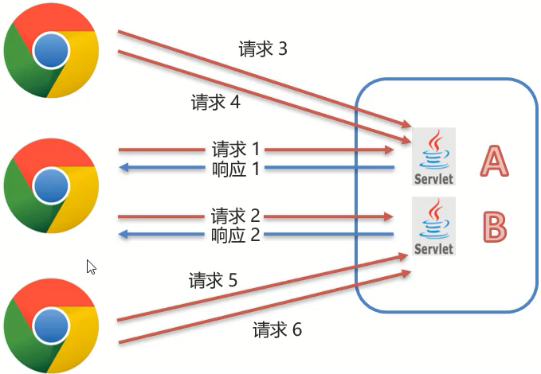
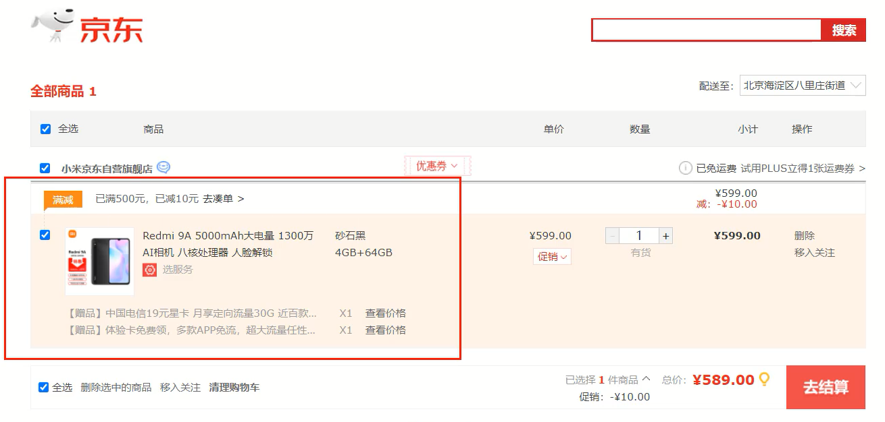
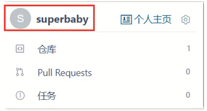
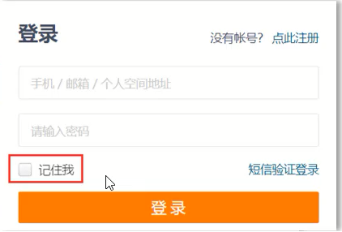
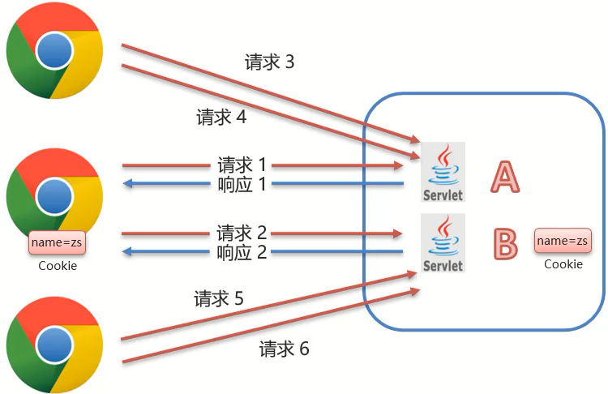
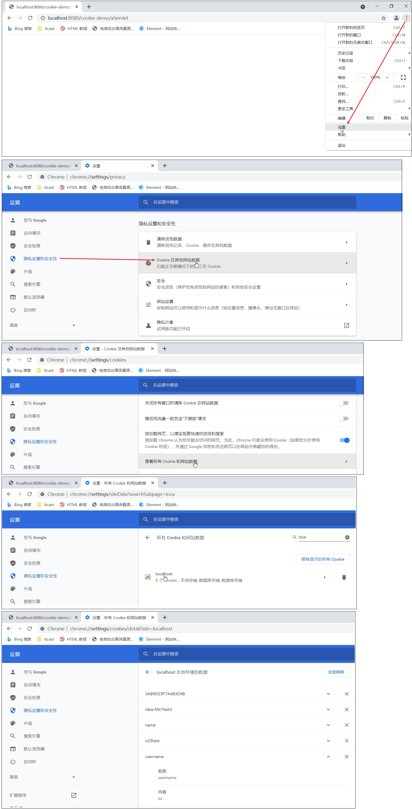
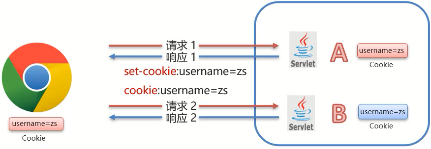
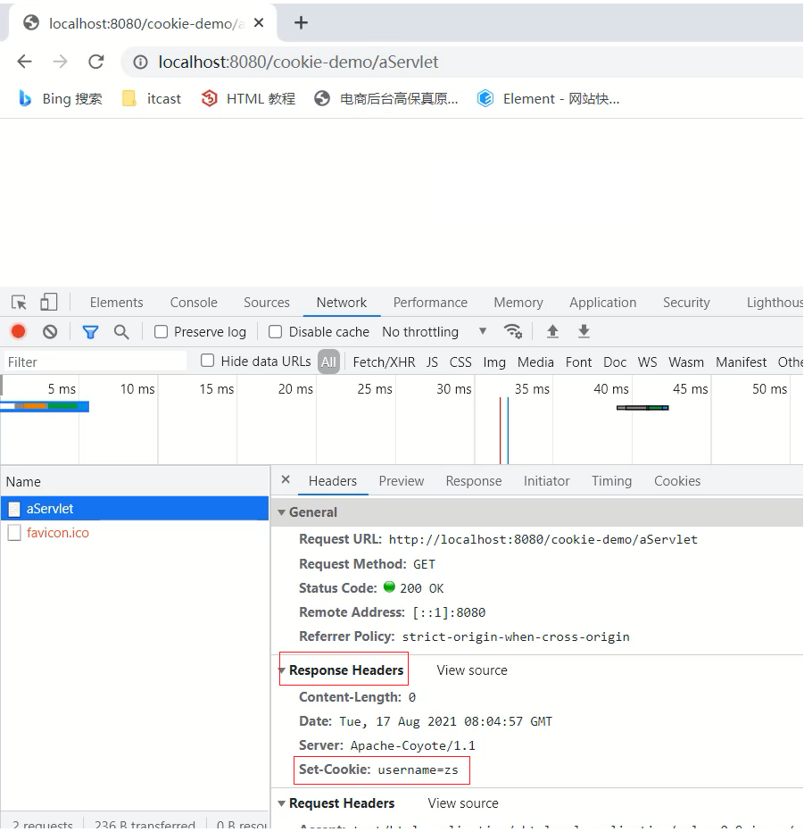

# 1 会话跟踪技术

首先理解会话的概念，再去理解绘画跟踪的概念

## 1.1 会话

用户打开浏览器，访问web服务器的资源，会话建立，直到有一方断开连接，会话结束。在一次会话中可以包含多次请求和响应。

1. 从浏览器发出请求到服务端响应数据给前端之后，一次会话(在浏览器和服务器之间)就被建立了
2. 会话被建立后，如果浏览器或服务端都没有被关闭，则会话就会持续建立着
3. 浏览器和服务器就可以继续使用该会话进行请求发送和响应，上述的整个过程就被称之为会话。

用实际场景来理解下会话，比如在我们访问京东的时候，当打开浏览器进入京东首页后，浏览器和京东的服务器之间就建立了一次会话，后面的搜索商品,查看商品的详情,加入购物车等都是在这一次会话中完成。

思考:下图中总共建立了几个会话?



**每个浏览器都会与服务端建立了一个会话，加起来总共是3个会话。**

## 1.2 会话跟踪

一种维护浏览器状态的方法，服务器需要识别多次请求是否来自于同一浏览器，以便在同一次会话的多次请求间共享数据。

* 服务器会收到多个请求，这多个请求可能来自多个浏览器，如上图中的6个请求来自3个浏览器
* 服务器需要用来识别请求是否来自同一个浏览器
* 服务器用来识别浏览器的过程，这个过程就是==会话跟踪==
* 服务器识别浏览器后就可以在同一个会话中多次请求之间来共享数据

## 1.3 功能举例

那么我们又有一个问题需要思考，一个会话中的多次请求为什么要共享数据呢?有了这个数据共享功能后能实现哪些功能呢?

* 购物车: `加入购物车`和`去购物车结算`是两次请求，但是后面这次请求要想展示前一次请求所添加的商品，就需要用到数据共享。

  

* 页面展示用户登录信息:很多网站，登录后访问多个功能发送多次请求后，浏览器上都会有当前登录用户的信息[用户名]，比如百度、京东、码云等。

  

* 网站登录页面的`记住我`功能:当用户登录成功后，勾选`记住我`按钮后下次再登录的时候，网站就会自动填充用户名和密码，简化用户的登录操作，多次登录就会有多次请求，他们之间也涉及到共享数据

  

* 登录页面的验证码功能:生成验证码和输入验证码点击注册这也是两次请求，这两次请求的数据之间要进行对比，相同则允许注册，不同则拒绝注册，该功能的实现也需要在同一次会话中共享数据。

  

**思考:为什么现在浏览器和服务器不支持数据共享呢?**

* 浏览器和服务器之间使用的是HTTP请求来进行数据传输
* HTTP协议是无状态的，每次浏览器向服务器请求时，服务器都会将该请求视为新的请求
* HTTP协议设计成无状态的目的是让每次请求之间相互独立，互不影响
* 请求与请求之间独立后，就无法实现多次请求之间的数据共享

# 2 Cookie

Cookie：客户端会话技术，将数据保存到客户端，以后每次请求都携带Cookie数据进行访问。

## 2.1 Cookie的基本使用

### 2.1.1 工作流程



1. 服务端提供了两个Servlet，分别是ServletA和ServletB
2. 浏览器发送HTTP请求1给服务端，服务端ServletA接收请求并进行业务处理
3. 服务端ServletA在处理的过程中可以创建一个Cookie对象并将`name=zs`的数据存入Cookie
4. 服务端ServletA在响应数据的时候，会把Cookie对象响应给浏览器
5. 浏览器接收到响应数据，会把Cookie对象中的数据存储在浏览器内存中，此时浏览器和服务端就**建立了一次会话**
6. 在同一次会话==中浏览器再次发送HTTP请求2给服务端ServletB，浏览器会携带Cookie对象中的所有数据
7. ServletB接收到请求和数据后，就可以获取到存储在Cookie对象中的数据，这样同一个会话中的多次请求之间就实现了数据共享

### 2.1.2 基本使用

#### 发送Cookie

* 创建Cookie对象，并设置数据

```
Cookie cookie = new Cookie("key","value");
```

* 发送Cookie到客户端：使用==response==对象

```
response.addCookie(cookie);
```

**案例：**在Servlet中生成Cookie对象并存入数据，然后将数据发送给浏览器

1. 创建Maven项目,项目名称为cookie-demo，并在pom.xml添加依赖
2. 编写Servlet类，名称为AServlet
3. 在AServlet中创建Cookie对象，存入数据，发送给前端
4. 启动测试，在浏览器查看Cookie对象中的值

(1)创建Maven项目cookie-demo，并在pom.xml添加依赖

```xml
<properties>
    <maven.compiler.source>8</maven.compiler.source>
    <maven.compiler.target>8</maven.compiler.target>
</properties>

<dependencies>
    <!--servlet-->
    <dependency>
        <groupId>javax.servlet</groupId>
        <artifactId>javax.servlet-api</artifactId>
        <version>3.1.0</version>
        <scope>provided</scope>
    </dependency>
    <!--jsp-->
    <dependency>
        <groupId>javax.servlet.jsp</groupId>
        <artifactId>jsp-api</artifactId>
        <version>2.2</version>
        <scope>provided</scope>
    </dependency>
    <!--jstl-->
    <dependency>
        <groupId>jstl</groupId>
        <artifactId>jstl</artifactId>
        <version>1.2</version>
    </dependency>
    <dependency>
        <groupId>taglibs</groupId>
        <artifactId>standard</artifactId>
        <version>1.1.2</version>
    </dependency>
</dependencies>
<build>
    <plugins>
        <plugin>
            <groupId>org.apache.tomcat.maven</groupId>
            <artifactId>tomcat7-maven-plugin</artifactId>
            <version>2.2</version>
        </plugin>
    </plugins>
</build>
```

(2)编写Servlet类，名称为AServlet

```java
@WebServlet("/aServlet")
public class AServlet extends HttpServlet {
    @Override
    protected void doGet(HttpServletRequest request, HttpServletResponse response) throws ServletException, IOException {

    }

    @Override
    protected void doPost(HttpServletRequest request, HttpServletResponse response) throws ServletException, IOException {
        this.doGet(request, response);
    }
}
```

(3)在Servlet中创建Cookie对象，存入数据，发送给前端

```java
@WebServlet("/aServlet")
public class AServlet extends HttpServlet {
    @Override
    protected void doGet(HttpServletRequest request, HttpServletResponse response) throws ServletException, IOException {
        //发送Cookie
        //1. 创建Cookie对象
        Cookie cookie = new Cookie("username","zs");
        //2. 发送Cookie，response
        response.addCookie(cookie);
    }

    @Override
    protected void doPost(HttpServletRequest request, HttpServletResponse response) throws ServletException, IOException {
        this.doGet(request, response);
    }
}
```

（4）启动测试，在浏览器查看Cookie对象中的值

访问`http://localhost:8080/cookie-demo/aServlet`

chrome浏览器查看Cookie的值，有两种方式,分布式:

方式一:



方式二:选中打开开发者工具或者 使用快捷键F12 或者 Ctrl+Shift+I


#### 获取Cookie

- 获取客户端携带的所有Cookie，使用==request==对象

```
Cookie[] cookies = request.getCookies();
```

- 遍历数组，获取每一个Cookie对象：for
- 使用Cookie对象方法获取数据

```
cookie.getName();
cookie.getValue();
```

**案例：**在Servlet中获取前一个案例存入在Cookie对象中的数据

1. 编写一个新Servlet类，名称为BServlet
2. 在BServlet中使用request对象获取Cookie数组，遍历数组，从数据中获取指定名称对应的值
3. 启动测试，在控制台打印出获取的值

(1)编写一个新Servlet类，名称为BServlet

```java
@WebServlet("/bServlet")
public class BServlet extends HttpServlet {
    @Override
    protected void doGet(HttpServletRequest request, HttpServletResponse response) throws ServletException, IOException {

    }

    @Override
    protected void doPost(HttpServletRequest request, HttpServletResponse response) throws ServletException, IOException {
        this.doGet(request, response);
    }
}
```

（2）在BServlet中使用request对象获取Cookie数组，遍历数组，从数据中获取指定名称对应的值

```java
@WebServlet("/bServlet")
public class BServlet extends HttpServlet {
    @Override
    protected void doGet(HttpServletRequest request, HttpServletResponse response) throws ServletException, IOException {
        //获取Cookie
        //1. 获取Cookie数组
        Cookie[] cookies = request.getCookies();
        //2. 遍历数组
        for (Cookie cookie : cookies) {
            //3. 获取数据
            String name = cookie.getName();
            if("username".equals(name)){
                String value = cookie.getValue();
                System.out.println(name+":"+value);
                break;
            }
        }

    }

    @Override
    protected void doPost(HttpServletRequest request, HttpServletResponse response) throws ServletException, IOException {
        this.doGet(request, response);
    }
}
```

（3）启动测试，在控制台打印出获取的值

访问`http://localhost:8080/cookie-demo/bServlet`


在IDEA控制台就能看到输出的结果:


==思考:==测试的时候

* 在访问AServlet和BServlet的中间把关闭浏览器,重启浏览器后访问BServlet能否获取到Cookie中的数据?

这个问题，我们会在Cookie的使用细节中讲，大家可以动手先试下。

## 2.2 原理分析

对于Cookie的实现原理是基于HTTP协议的,其中设计到HTTP协议中的两个请求头信息:

* 响应头:set-cookie
* 请求头: cookie



* 前面的案例中已经能够实现：AServlet给前端发送Cookie。BServlet从request中获取Cookie的功能
* 对于AServlet响应数据的时候，Tomcat服务器都是基于HTTP协议来响应数据
* 当Tomcat发现后端要返回的是一个Cookie对象之后，Tomcat就会在响应头中添加一行数据`Set-Cookie:username=zs`
* 浏览器获取到响应结果后，从响应头中就可以获取到`Set-Cookie`对应值`username=zs`,并将数据存储在浏览器的内存中
* 浏览器再次发送请求给BServlet的时候，浏览器会自动在请求头中添加`Cookie: username=zs`发送给服务端BServlet
* Request对象会把请求头中cookie对应的值封装成一个个Cookie对象，最终形成一个数组
* BServlet通过Request对象获取到Cookie[]后，就可以从中获取自己需要的数据

**用案例验证：**

(1)访问AServlet对应的地址`http://localhost:8080/cookie-demo/aServlet`

使用Chrom浏览器打开开发者工具(F12或Crtl+Shift+I)进行查看==响应头==中的数据



（2）访问BServlet对应的地址`http://localhost:8080/cookie-demo/bServlet

使用Chrom浏览器打开开发者工具(F12或Crtl+Shift+I)进行查看==请求头==中的数据


## 2.3 使用细节

### 2.3.1 存活时间

**思考一个问题:**


1. 浏览器发送请求给AServlet,AServlet会响应一个存有`usernanme=zs`的Cookie对象给浏览器
2. 浏览器接收到响应数据将cookie存入到浏览器内存中
3. 当浏览器再次发送请求给BServlet,BServlet就可以使用Request对象获取到Cookie数据
4. 在发送请求到BServlet之前，如果把浏览器关闭再打开进行访问，BServlet能否获取到Cookie数据?

> 注意：浏览器关闭再打开不是指打开一个新的选显卡，而且必须是先关闭再打开，顺序不能变。

**答：**默认情况下，Cookie存储在浏览器内存中，当浏览器关闭，内存释放，则Cookie被销毁。BServlet中无法再获取到Cookie数据

如果使用这种默认情况下的Cookie,有些需求就无法实现，比如:


`记住我`的功能：

* 第一次输入用户名和密码并勾选`记住我`然后进行登录
* 下次再登陆的时候，用户名和密码就会被自动填充，不需要再重新输入登录
* 比如`记住我`这个功能需要记住用户名和密码一个星期，那么使用默认情况下的Cookie就会出现问题
* 因为默认情况，浏览器一关，Cookie就会从浏览器内存中删除，对于`记住我`功能就无法实现

为了完成记住我功能，需要设置Cookie存活时间

```java
/*
	参数值：
		正数：将Cookie写入浏览器所在电脑的硬盘，持久化存储。到时间自动删除
		负数：默认值，Cookie在当前浏览器内存中，当浏览器关闭，则Cookie被销毁
		零：删除对应Cookie
*/
setMaxAge(int seconds)
```

在AServlet中去设置Cookie的存活时间：

```java
@WebServlet("/aServlet")
public class AServlet extends HttpServlet {
    @Override
    protected void doGet(HttpServletRequest request, HttpServletResponse response) throws ServletException, IOException {
        //发送Cookie
        //1. 创建Cookie对象
        Cookie cookie = new Cookie("username","zs");
        //设置存活时间   ，1周 7天
        cookie.setMaxAge(60*60*24*7); //易阅读，需程序计算
		//cookie.setMaxAge(604800); //不易阅读(可以使用注解弥补)，程序少进行一次计算
        //2. 发送Cookie，response
        response.addCookie(cookie);
    }

    @Override
    protected void doPost(HttpServletRequest request, HttpServletResponse response) throws ServletException, IOException {
        this.doGet(request, response);
    }
}
```

修改完代码后，启动测试，访问`http://localhost:8080/cookie-demo/aServlet`

* 访问一个AServlet后，把浏览器关闭重启后，再去访问`http://localhost:8080/cookie-demo/bServet`,能在控制台打印出`username:zs`,说明Cookie没有随着浏览器关闭而被销毁
*  通过浏览器查看Cookie的内容，会发现Cookie的相关信息


### 2.3.2 存储中文

**Cookie不能直接存储中文**

首先，先来演示一个效果，将之前`username=zs`的值改成`username=张三`，把汉字`张三`存入到Cookie中，看是什么效果:

```java
@WebServlet("/aServlet")
public class AServlet extends HttpServlet {
    @Override
    protected void doGet(HttpServletRequest request, HttpServletResponse response) throws ServletException, IOException {
 		//发送Cookie
        String value = "张三";
        Cookie cookie = new Cookie("username",value);
        //设置存活时间   ，1周 7天
        cookie.setMaxAge(60*60*24*7);
        //2. 发送Cookie，response
        response.addCookie(cookie);
    }

    @Override
    protected void doPost(HttpServletRequest request, HttpServletResponse response) throws ServletException, IOException {
        this.doGet(request, response);
    }
}
```

启动访问测试，访问`http://localhost:8080/cookie-demo/aServlet`会发现浏览器会提示错误信息


这个时候，我们可以使用之前学过的一个知识点叫`URL编码`。如果需要存储中文，就需要进行转码，具体的实现思路为:

1. 在AServlet中对中文进行URL编码，采用URLEncoder.encode()，将编码后的值存入Cookie中
2. 在BServlet中获取Cookie中的值,获取的值为URL编码后的值
3. 将获取的值在进行URL解码,采用URLDecoder.decode()，就可以获取到对应的中文值

(1)在AServlet中对中文进行URL编码

```java
@WebServlet("/aServlet")
public class AServlet extends HttpServlet {
    @Override
    protected void doGet(HttpServletRequest request, HttpServletResponse response) throws ServletException, IOException {
        //发送Cookie
        String value = "张三";
        //对中文进行URL编码
        value = URLEncoder.encode(value, "UTF-8");
        System.out.println("存储数据："+value);
        //将编码后的值存入Cookie中
        Cookie cookie = new Cookie("username",value);
        //设置存活时间   ，1周 7天
        cookie.setMaxAge(60*60*24*7);
        //2. 发送Cookie，response
        response.addCookie(cookie);
    }

    @Override
    protected void doPost(HttpServletRequest request, HttpServletResponse response) throws ServletException, IOException {
        this.doGet(request, response);
    }
}
```

(2)在BServlet中获取值，并对值进行解码

```java
@WebServlet("/bServlet")
public class BServlet extends HttpServlet {
    @Override
    protected void doGet(HttpServletRequest request, HttpServletResponse response) throws ServletException, IOException {
        //获取Cookie
        //1. 获取Cookie数组
        Cookie[] cookies = request.getCookies();
        //2. 遍历数组
        for (Cookie cookie : cookies) {
            //3. 获取数据
            String name = cookie.getName();
            if("username".equals(name)){
                String value = cookie.getValue();//获取的是URL编码后的值 %E5%BC%A0%E4%B8%89
                //URL解码
                value = URLDecoder.decode(value,"UTF-8");
                System.out.println(name+":"+value);//value解码后为 张三
                break;
            }
        }

    }

    @Override
    protected void doPost(HttpServletRequest request, HttpServletResponse response) throws ServletException, IOException {
        this.doGet(request, response);
    }
}
```

# 3 Session

Cookie已经能完成一次会话多次请求之间的数据共享，之前我们还提到过Session也可以实现，那么:

- 什么是Session?
- Session如何来使用?
- Session是如何实现的?
- Session的使用注意事项有哪些?

## 3.1 Session的基本使用

Session：服务端会话跟踪技术，将数据保存到服务端。

* Session是存储在服务端而Cookie是存储在客户端
* 存储在客户端的数据容易被窃取和截获，存在很多不安全的因素
* 存储在服务端的数据相比于客户端来说就更安全

### 3.1.1 工作流程

 

* 在服务端的AServlet获取一个Session对象，把数据存入其中
* 在服务端的BServlet获取到相同的Session对象，从中取出数据
* 就可以实现一次会话中多次请求之间的数据共享了
* 现在最大的问题是如何保证AServlet和BServlet使用的是同一个Session对象(在原理分析会讲解)?

### 3.1.2 基本使用

在JavaEE中提供了HttpSession接口，来实现一次会话的多次请求之间数据共享功能。具体的使用步骤为:

* 获取Session对象,使用的是request对象

```java
HttpSession session = request.getSession();
```

* Session对象提供的功能:

  ```java
//存储数据到 session 域中
  void setAttribute(String name, Object o);
  //根据 key，获取值
  Object getAttribute(String name);
//根据 key，删除该键值对
  void removeAttribute(String name);
```

**案例:**在一个Servlet中往Session中存入数据，在另一个Servlet中获取Session中存入的数据

1. 创建名为SessionDemo1的Servlet类
2. 创建名为SessionDemo2的Servlet类
3. 在SessionDemo1的方法中:获取Session对象、存储数据
4. 在SessionDemo2的方法中:获取Session对象、获取数据
5. 启动测试

(1)创建名为SessionDemo1的Servlet类

```java
@WebServlet("/demo1")
public class SessionDemo1 extends HttpServlet {
    @Override
    protected void doGet(HttpServletRequest request, HttpServletResponse response) throws ServletException, IOException {
    
    }

    @Override
    protected void doPost(HttpServletRequest request, HttpServletResponse response) throws ServletException, IOException {
        this.doGet(request, response);
    }
}
```

(2)创建名为SessionDemo2的Servlet类

```java
@WebServlet("/demo2")
public class SessionDemo2 extends HttpServlet {
    @Override
    protected void doGet(HttpServletRequest request, HttpServletResponse response) throws ServletException, IOException {
    
    }

    @Override
    protected void doPost(HttpServletRequest request, HttpServletResponse response) throws ServletException, IOException {
        this.doGet(request, response);
    }
}
```

(3)SessionDemo1:获取Session对象、存储数据

```java
@WebServlet("/demo1")
public class SessionDemo1 extends HttpServlet {
    @Override
    protected void doGet(HttpServletRequest request, HttpServletResponse response) throws ServletException, IOException {
    	//存储到Session中
        //1. 获取Session对象
        HttpSession session = request.getSession();
        //2. 存储数据
        session.setAttribute("username","zs");
    }

    @Override
    protected void doPost(HttpServletRequest request, HttpServletResponse response) throws ServletException, IOException {
        this.doGet(request, response);
    }
}
```

(4)SessionDemo2:获取Session对象、获取数据

```java
@WebServlet("/demo2")
public class SessionDemo2 extends HttpServlet {
    @Override
    protected void doGet(HttpServletRequest request, HttpServletResponse response) throws ServletException, IOException {
        //获取数据，从session中
        //1. 获取Session对象
        HttpSession session = request.getSession();
        //2. 获取数据
        Object username = session.getAttribute("username");
        System.out.println(username);
    }

    @Override
    protected void doPost(HttpServletRequest request, HttpServletResponse response) throws ServletException, IOException {
        this.doGet(request, response);
    }
}
```

(5)启动测试，

* 先访问`http://localhost:8080/cookie-demo/demo1`,将数据存入Session
* 在访问`http://localhost:8080/cookie-demo/demo2`,从Session中获取数据
* 查看控制台


通过案例的效果，能看到Session是能够在一次会话中两次请求之间共享数据。

## 3.2 Session的原理分析

**Session是基于Cookie实现的**

这句话其实不太能详细的说明Session的底层实现，接下来，咱们一步步来分析下Session的具体实现原理


Session要想实现一次会话多次请求之间的数据共享，就必须要保证多次请求获取Session的对象是同一个。

**问题一：**要验证这个结论也很简单，只需要在上面案例中的两个Servlet中分别打印下Session对象

```java
//SessionDemo1
@WebServlet("/demo1")
public class SessionDemo1 extends HttpServlet {
    @Override
    protected void doGet(HttpServletRequest request, HttpServletResponse response) throws ServletException, IOException {
    	//存储到Session中
        //1. 获取Session对象
        HttpSession session = request.getSession();
        System.out.println(session);
        //2. 存储数据
        session.setAttribute("username","zs");
    }

    @Override
    protected void doPost(HttpServletRequest request, HttpServletResponse response) throws ServletException, IOException {
        this.doGet(request, response);
    }
}
```

```java
//SessionDemo2
@WebServlet("/demo2")
public class SessionDemo2 extends HttpServlet {
    @Override
    protected void doGet(HttpServletRequest request, HttpServletResponse response) throws ServletException, IOException {
        //获取数据，从session中
        //1. 获取Session对象
        HttpSession session = request.getSession();
        System.out.println(session);
        //2. 获取数据
        Object username = session.getAttribute("username");
        System.out.println(username);
    }

    @Override
    protected void doPost(HttpServletRequest request, HttpServletResponse response) throws ServletException, IOException {
        this.doGet(request, response);
    }
}
```

启动测试，分别访问

`http://localhost:8080/cookie-demo/demo1`

`http://localhost:8080/cookie-demo/demo2`


通过打印可以得到如下结论:

* 两个Servlet类中获取的Session对象是同一个
* 把demo1和demo2请求刷新多次，控制台最终打印的结果都是同一个

**问题二：**如果新开一个浏览器，访问demo1或者demo2,打印在控制台的Session还是同一个对象么?


> 注意：在一台电脑上演示的时候，如果是相同的浏览器必须要把浏览器全部关掉重新打开，才算新开的一个浏览器。当然也可以使用不同的浏览器进行测试，就不需要把之前的浏览器全部关闭。

测试的结果：如果是不同浏览器或者重新打开浏览器后，打印的Session就不一样了。

所以Session实现的也是一次会话中的多次请求之间的数据共享。

**最后的问题：**Session是如何保证在一次会话中获取的Session对象是同一个呢?


1. demo1在第一次获取session对象的时候，session对象会有一个唯一的标识，假如是`id:10`
2. demo1在session中存入其他数据并处理完成所有业务后，需要通过Tomcat服务器响应结果给浏览器
3. Tomcat服务器发现业务处理中使用了session对象，就会把session的唯一标识`id:10`当做一个cookie，添加`Set-Cookie:JESSIONID=10`到响应头中，并响应给浏览器
4. 浏览器接收到响应结果后，会把响应头中的coookie数据存储到浏览器的内存中
5. 浏览器在同一会话中访问demo2的时候，会把cookie中的数据按照`cookie: JESSIONID=10`的格式添加到请求头中并发送给服务器Tomcat
6. demo2获取到请求后，从请求头中就读取cookie中的JSESSIONID值为10，然后就会到服务器内存中寻找`id:10`的session对象，如果找到了，就直接返回该对象，如果没有则新创建一个session对象
7. 关闭打开浏览器后，因为浏览器的cookie已被销毁，所以就没有JESSIONID的数据，服务端获取到的session就是一个全新的session对象

**演示：**

(1)使用chrome浏览器访问`http://localhost:8080/cookie-demo/demo1`,打开开发者模式(F12或Ctrl+Shift+I),查看==响应头(Response Headers)==数据:


(2)使用chrome浏览器再次访问`http://localhost:8080/cookie-demo/demo2`，查看==请求头(Request Headers)==数据:


## 3.3 Session的使用细节

### 3.3.1 Session钝化与活化

**思考:** 服务器重启后，Session中的数据是否还在?

要想回答这个问题，我们可以先看下下面这幅图，

 

1. 服务器端AServlet和BServlet共用的session对象应该是存储在服务器的内存中
2. 服务器重新启动后，内存中的数据应该是已经被释放，对象也应该都销毁了

所以session数据应该也已经不存在了。但是如果session不存在会引发什么问题呢?举个例子说明下：

- 用户把需要购买的商品添加到购物车，因为要实现同一个会话多次请求数据共享，所以假设把数据存入Session对象中
- 用户正要付钱的时候接到一个电话，付钱的动作就搁浅了
- 正在用户打电话的时候，购物网站因为某些原因需要重启
- 重启后session数据被销毁，购物车中的商品信息也就会随之而消失
- 用户想再次发起支付，就会出为问题

**所以说对于session的数据，我们应该做到就算服务器重启了，也应该能把数据保存下来才对。**

钝化：在服务器正常关闭后，Tomcat会自动将Session数据写入硬盘的文件中。钝化的数据路径为:`项目目录\target\tomcat\work\Tomcat\localhost\项目名称\SESSIONS.ser`


活化：再次启动服务器后，从文件中加载数据到Session中。数据加载到Session中后，路径中的`SESSIONS.ser`文件会被删除掉

> 注意：这里所说的关闭和启动应该要确保是正常的关闭和启动。Tomcat的活化钝化自动完成

### 3.3.2 Session销毁

session的销毁会有两种方式:

1. 默认情况下，无操作，30分钟自动销毁。对于这个失效时间，是可以通过配置进行修改的：

```xml
//在项目的web.xml中配置
<?xml version="1.0" encoding="UTF-8"?>
<web-app xmlns="http://xmlns.jcp.org/xml/ns/javaee"
         xmlns:xsi="http://www.w3.org/2001/XMLSchema-instance"
         xsi:schemaLocation="http://xmlns.jcp.org/xml/ns/javaee http://xmlns.jcp.org/xml/ns/javaee/web-app_3_1.xsd"
         version="3.1">

    <session-config>
        <session-timeout>100</session-timeout>
    </session-config>
</web-app>
```

2. 调用Session对象的invalidate()进行销毁，在SessionDemo2类中添加session销毁的方法

```java
@WebServlet("/demo2")
public class SessionDemo2 extends HttpServlet {
    @Override
    protected void doGet(HttpServletRequest request, HttpServletResponse response) throws ServletException, IOException {
        //获取数据，从session中

        //1. 获取Session对象
        HttpSession session = request.getSession();
        System.out.println(session);

        // 销毁
        session.invalidate();
        //2. 获取数据
        Object username = session.getAttribute("username");
        System.out.println(username);
    }

    @Override
    protected void doPost(HttpServletRequest request, HttpServletResponse response) throws ServletException, IOException {
        this.doGet(request, response);
    }
}
```

启动访问测试，先访问demo1将数据存入到session，再次访问demo2从session中获取数据


该销毁方法一般会在用户退出的时候，需要将session销毁掉。

## 4，用户登录注册案例

### 4.1 需求分析

 需求说明：

1. 完成用户登录功能，如果用户勾选“记住用户” ，则下次访问登录页面==自动==填充用户名密码

2. 完成注册功能，并实现==验证码==功能


### 4.2 用户登录功能

1. 需求:


* 用户登录成功后，跳转到列表页面，并在页面上展示当前登录的用户名称
* 用户登录失败后，跳转回登录页面，并在页面上展示对应的错误信息

2. 实现流程分析


(1)前端通过表单发送请求和数据给Web层的LoginServlet

(2)在LoginServlet中接收请求和数据[用户名和密码]

(3)LoginServlet接收到请求和数据后，调用Service层完成根据用户名和密码查询用户对象

(4)在Service层需要编写UserService类，在类中实现login方法，方法中调用Dao层的UserMapper

(5)在UserMapper接口中，声明一个根据用户名和密码查询用户信息的方法

(6)Dao层把数据查询出来以后，将返回数据封装到User对象，将对象交给Service层

(7)Service层将数据返回给Web层

(8)Web层获取到User对象后，判断User对象，如果为Null,则将错误信息响应给登录页面，如果不为Null，则跳转到列表页面，并把当前登录用户的信息存入Session携带到列表页面。

3. 具体实现

(1)完成Dao层的代码编写

(1.1)将`04-资料\1. 登录注册案例\2. MyBatis环境\UserMapper.java`放到com.itheima.mapper`包下:

```java
public interface UserMapper {
    /**
     * 根据用户名和密码查询用户对象
     * @param username
     * @param password
     * @return
     */
    @Select("select * from tb_user where username = #{username} and password = #{password}")
    User select(@Param("username") String username,@Param("password")  String password);

    /**
     * 根据用户名查询用户对象
     * @param username
     * @return
     */
    @Select("select * from tb_user where username = #{username}")
    User selectByUsername(String username);

    /**
     * 添加用户
     * @param user
     */
    @Insert("insert into tb_user values(null,#{username},#{password})")
    void add(User user);
}
```

(1.2)将`04-资料\1. 登录注册案例\2. MyBatis环境\User.java`放到`com.itheima.pojo`包下:

```java
public class User {

    private Integer id;
    private String username;
    private String password;

    public Integer getId() {
        return id;
    }

    public void setId(Integer id) {
        this.id = id;
    }

    public String getUsername() {
        return username;
    }

    public void setUsername(String username) {
        this.username = username;
    }

    public String getPassword() {
        return password;
    }

    public void setPassword(String password) {
        this.password = password;
    }

    @Override
    public String toString() {
        return "User{" +
                "id=" + id +
                ", username='" + username + '\'' +
                ", password='" + password + '\'' +
                '}';
    }
}
```

(1.3)将`04-资料\1. 登录注册案例\2. MyBatis环境\UserMapper.xml`放入到resources/com/itheima/mapper`目录下:

```xml
<?xml version="1.0" encoding="UTF-8" ?>
<!DOCTYPE mapper
        PUBLIC "-//mybatis.org//DTD Mapper 3.0//EN"
        "http://mybatis.org/dtd/mybatis-3-mapper.dtd">
<mapper namespace="com.itheima.mapper.UserMapper">

</mapper>
```

(2)完成Service层的代码编写

(2.1)在`com.itheima.service`包下，创建UserService类

```java
public class UserService {
    //1.使用工具类获取SqlSessionFactory
    SqlSessionFactory factory = SqlSessionFactoryUtils.getSqlSessionFactory();
    /**
     * 登录方法
     * @param username
     * @param password
     * @return
     */
    public User login(String username,String password){
        //2. 获取SqlSession
        SqlSession sqlSession = factory.openSession();
        //3. 获取UserMapper
        UserMapper mapper = sqlSession.getMapper(UserMapper.class);
        //4. 调用方法
        User user = mapper.select(username, password);
        //释放资源
        sqlSession.close();

        return  user;
    }
}
```

(3)完成页面和Web层的代码编写

(3.1)将`04-资料\1. 登录注册案例\1. 静态页面`拷贝到项目的`webapp`目录下:


(3.2)将login.html内容修改成login.jsp

```jsp
<%@ page contentType="text/html;charset=UTF-8" language="java" %>
<!DOCTYPE html>
<html lang="en">

<head>
    <meta charset="UTF-8">
    <title>login</title>
    <link href="css/login.css" rel="stylesheet">
</head>

<body>
<div id="loginDiv" style="height: 350px">
    <form action="/brand-demo/loginServlet" method="post" id="form">
        <h1 id="loginMsg">LOGIN IN</h1>
        <div id="errorMsg">用户名或密码不正确</div>
        <p>Username:<input id="username" name="username" type="text"></p>
        <p>Password:<input id="password" name="password" type="password"></p>
        <p>Remember:<input id="remember" name="remember" type="checkbox"></p>
        <div id="subDiv">
            <input type="submit" class="button" value="login up">
            <input type="reset" class="button" value="reset">&nbsp;&nbsp;&nbsp;
            <a href="register.html">没有账号？</a>
        </div>
    </form>
</div>
</body>
</html>
```

(3.3)创建LoginServlet类

```java
@WebServlet("/loginServlet")
public class LoginServlet extends HttpServlet {
    private UserService service = new UserService();

    @Override
    protected void doGet(HttpServletRequest request, HttpServletResponse response) throws ServletException, IOException {
        //1. 获取用户名和密码
        String username = request.getParameter("username");
        String password = request.getParameter("password");
   
        //2. 调用service查询
        User user = service.login(username, password);

        //3. 判断
        if(user != null){
            //登录成功，跳转到查询所有的BrandServlet
            
            //将登陆成功后的user对象，存储到session
            HttpSession session = request.getSession();
            session.setAttribute("user",user);
            
            String contextPath = request.getContextPath();
            response.sendRedirect(contextPath+"/selectAllServlet");
        }else {
            // 登录失败,
            // 存储错误信息到request
            request.setAttribute("login_msg","用户名或密码错误");
            // 跳转到login.jsp
            request.getRequestDispatcher("/login.jsp").forward(request,response);

        }
    }

    @Override
    protected void doPost(HttpServletRequest request, HttpServletResponse response) throws ServletException, IOException {
        this.doGet(request, response);
    }
}
```

(3.4)在brand.jsp中<body>标签下添加欢迎当前用户的提示信息:

```jsp
<h1>${user.username},欢迎您</h1>
```

(3.5) 修改login.jsp，将错误信息使用EL表达式来获取

```jsp
修改前内容:<div id="errorMsg">用户名或密码不正确</div>
修改后内容: <div id="errorMsg">${login_msg}</div>
```

(4)启动，访问测试

(4.1) 进入登录页面，输入错误的用户名或密码


(4.2)输入正确的用户和密码信息


**小结**

* 在LoginServlet中，将登录成功的用户数据存入session中，方法在列表页面中获取当前登录用户信息进行展示
* 在LoginServlet中，将登录失败的错误信息存入到request中，如果存入到session中就会出现这次会话的所有请求都有登录失败的错误信息，这个是不需要的，所以不用存入到session中

### 4.3 记住我-设置Cookie

1. 需求:

如果用户勾选“记住用户” ，则下次访问登陆页面自动填充用户名密码。这样可以提升用户的体验。


对应上面这个需求，最大的问题就是: 如何自动填充用户名和密码?

2. 实现流程分析

因为`记住我`功能要实现的效果是，就算用户把浏览器关闭过几天再来访问也能自动填充，所以需要将登陆信息存入一个可以长久保存，并且能够在浏览器关闭重新启动后依然有效的地方，就是我们前面讲的==Cookie==,所以:

* 将用户名和密码写入==Cookie==中，并且持久化存储Cookie,下次访问浏览器会自动携带Cookie

* 在页面获取Cookie数据后，设置到用户名和密码框中

* 何时写入Cookie?
  * 用户必须登陆成功后才需要写
  * 用户必须在登录页面勾选了`记住我`的复选框


(1)前端需要在发送请求和数据的时候，多携带一个用户是否勾选`Remember`的数据

(2)LoginServlet获取到数据后，调用Service完成用户名和密码的判定

(3)登录成功，并且用户在前端勾选了`记住我`，需要往Cookie中写入用户名和密码的数据，并设置Cookie存活时间

(4)设置成功后，将数据响应给前端

3. 具体实现

(1)在login.jsp为复选框设置值

```jsp
<%@ page contentType="text/html;charset=UTF-8" language="java" %>
<!DOCTYPE html>
<html lang="en">

<head>
    <meta charset="UTF-8">
    <title>login</title>
    <link href="css/login.css" rel="stylesheet">
</head>

<body>
<div id="loginDiv" style="height: 350px">
    <form action="/brand-demo/loginServlet" method="post" id="form">
        <h1 id="loginMsg">LOGIN IN</h1>
        <div id="errorMsg">${login_msg}</div>
        <p>Username:<input id="username" name="username" type="text"></p>
        <p>Password:<input id="password" name="password" type="password"></p>
        <p>Remember:<input id="remember" name="remember" value="1" type="checkbox"></p>
        <div id="subDiv">
            <input type="submit" class="button" value="login up">
            <input type="reset" class="button" value="reset">&nbsp;&nbsp;&nbsp;
            <a href="register.html">没有账号？</a>
        </div>
    </form>
</div>
</body>
</html>
```

(2)在LoginServlet获取复选框的值并在登录成功后进行设置Cookie

```java
@WebServlet("/loginServlet")
public class LoginServlet extends HttpServlet {
    private UserService service = new UserService();

    @Override
    protected void doGet(HttpServletRequest request, HttpServletResponse response) throws ServletException, IOException {
        //1. 获取用户名和密码
        String username = request.getParameter("username");
        String password = request.getParameter("password");

        //获取复选框数据
        String remember = request.getParameter("remember");

        //2. 调用service查询
        User user = service.login(username, password);

        //3. 判断
        if(user != null){
            //登录成功，跳转到查询所有的BrandServlet

            //判断用户是否勾选记住我，字符串写前面是为了避免出现空指针异常
            if("1".equals(remember)){
                //勾选了，发送Cookie
                //1. 创建Cookie对象
                Cookie c_username = new Cookie("username",username);
                Cookie c_password = new Cookie("password",password);
                // 设置Cookie的存活时间
                c_username.setMaxAge( 60 * 60 * 24 * 7);
                c_password.setMaxAge( 60 * 60 * 24 * 7);
                //2. 发送
                response.addCookie(c_username);
                response.addCookie(c_password);
            }

            //将登陆成功后的user对象，存储到session
            HttpSession session = request.getSession();
            session.setAttribute("user",user);

            String contextPath = request.getContextPath();
            response.sendRedirect(contextPath+"/selectAllServlet");
        }else {
            // 登录失败,

            // 存储错误信息到request
            request.setAttribute("login_msg","用户名或密码错误");

            // 跳转到login.jsp
            request.getRequestDispatcher("/login.jsp").forward(request,response);

        }
    }

    @Override
    protected void doPost(HttpServletRequest request, HttpServletResponse response) throws ServletException, IOException {
        this.doGet(request, response);
    }
}
```

(3)启动访问测试，

只有当前用户名和密码输入正确，并且勾选了Remeber的复选框，在响应头中才可以看得cookie的相关数据


### 4.4 记住我-获取Cookie

1. 需求

登录成功并勾选了Remeber后，后端返回给前端的Cookie数据就已经存储好了，接下来就需要在页面获取Cookie中的数据，并把数据设置到登录页面的用户名和密码框中。


如何在页面直接获取Cookie中的值呢?

2. 实现流程分析

在页面可以使用EL表达式，${cookie.==key==.value}

key:指的是存储在cookie中的键名称


(1)在login.jsp用户名的表单输入框使用value值给表单元素添加默认值，value可以使用`${cookie.username.value}`

(2)在login.jsp密码的表单输入框使用value值给表单元素添加默认值，value可以使用`${cookie.password.value}`

3. 具体实现

(1)修改login.jsp页面

```jsp
<%@ page contentType="text/html;charset=UTF-8" language="java" %>
<!DOCTYPE html>
<html lang="en">

<head>
    <meta charset="UTF-8">
    <title>login</title>
    <link href="css/login.css" rel="stylesheet">
</head>

<body>
<div id="loginDiv" style="height: 350px">
    <form action="/brand-demo/loginServlet" method="post" id="form">
        <h1 id="loginMsg">LOGIN IN</h1>
        <div id="errorMsg">${login_msg}</div>
        <p>Username:<input id="username" name="username" value="${cookie.username.value}" type="text"></p>

        <p>Password:<input id="password" name="password" value="${cookie.password.value}" type="password"></p>
        <p>Remember:<input id="remember" name="remember" value="1" type="checkbox"></p>
        <div id="subDiv">
            <input type="submit" class="button" value="login up">
            <input type="reset" class="button" value="reset">&nbsp;&nbsp;&nbsp;
            <a href="register.html">没有账号？</a>
        </div>
    </form>
</div>
</body>
</html>
```

4. 访问测试，重新访问登录页面，就可以看得用户和密码已经被填充。


### 4.5 用户注册功能

1. 需求

* 注册功能：保存用户信息到数据库
* 验证码功能
  * 展示验证码：展示验证码图片，并可以点击切换
  * 校验验证码：验证码填写不正确，则注册失败


2. 实现流程分析


(1)前端通过表单发送请求和数据给Web层的RegisterServlet

(2)在RegisterServlet中接收请求和数据[用户名和密码]

(3)RegisterServlet接收到请求和数据后，调用Service层完成用户信息的保存

(4)在Service层需要编写UserService类，在类中实现register方法，需要判断用户是否已经存在，如果不存在，则完成用户数据的保存

(5)在UserMapper接口中，声明两个方法，一个是根据用户名查询用户信息方法，另一个是保存用户信息方法

(6)在UserService类中保存成功则返回true，失败则返回false,将数据返回给Web层

(7)Web层获取到结果后，如果返回的是true,则提示`注册成功`，并转发到登录页面，如果返回false则提示`用户名已存在`并转发到注册页面

3. 具体实现

(1)Dao层代码参考资料中的内容完成

(2)编写Service层代码

```java
public class UserService {
    //1.使用工具类获取SqlSessionFactory
    SqlSessionFactory factory = SqlSessionFactoryUtils.getSqlSessionFactory();
    /**
     * 注册方法
     * @return
     */

    public boolean register(User user){
        //2. 获取SqlSession
        SqlSession sqlSession = factory.openSession();
        //3. 获取UserMapper
        UserMapper mapper = sqlSession.getMapper(UserMapper.class);
        //4. 判断用户名是否存在
        User u = mapper.selectByUsername(user.getUsername());

        if(u == null){
            // 用户名不存在，注册
            mapper.add(user);
            sqlSession.commit();
        }
        sqlSession.close();

        return u == null;

    }
}
```

(3)完成页面和Web层的代码编写

(3.1)将register.html内容修改成register.jsp

```jsp
<%@ page contentType="text/html;charset=UTF-8" language="java" %>
<!DOCTYPE html>
<html lang="en">
<head>
    <meta charset="UTF-8">
    <title>欢迎注册</title>
    <link href="css/register.css" rel="stylesheet">
</head>
<body>
<div class="form-div">
    <div class="reg-content">
        <h1>欢迎注册</h1>
        <span>已有帐号？</span> <a href="login.html">登录</a>
    </div>
    <form id="reg-form" action="/brand-demo/registerServlet" method="post">
        <table>
            <tr>
                <td>用户名</td>
                <td class="inputs">
                    <input name="username" type="text" id="username">
                    <br>
                    <span id="username_err" class="err_msg" style="display:none">用户名不太受欢迎</span>
                </td>
            </tr>
            <tr>
                <td>密码</td>
                <td class="inputs">
                    <input name="password" type="password" id="password">
                    <br>
                    <span id="password_err" class="err_msg" style="display: none">密码格式有误</span>
                </td>
            </tr>
            <tr>
                <td>验证码</td>
                <td class="inputs">
                    <input name="checkCode" type="text" id="checkCode">
                    
                    <a href="#" id="changeImg" >看不清？</a>
                </td>
            </tr>
        </table>
        <div class="buttons">
            <input value="注 册" type="submit" id="reg_btn">
        </div>
        <br class="clear">
    </form>
</div>
</body>
</html>
```

(3.2)编写RegisterServlet

```java
@WebServlet("/registerServlet")
public class RegisterServlet extends HttpServlet {
    private UserService service = new UserService();

    @Override
    protected void doGet(HttpServletRequest request, HttpServletResponse response) throws ServletException, IOException {
       //1. 获取用户名和密码数据
        String username = request.getParameter("username");
        String password = request.getParameter("password");
        
        User user = new User();
        user.setUsername(username);
        user.setPassword(password);

        //2. 调用service 注册
        boolean flag = service.register(user);
        //3. 判断注册成功与否
        if(flag){
             //注册功能，跳转登陆页面
            request.setAttribute("register_msg","注册成功，请登录");
            request.getRequestDispatcher("/login.jsp").forward(request,response);
        }else {
            //注册失败，跳转到注册页面

            request.setAttribute("register_msg","用户名已存在");
            request.getRequestDispatcher("/register.jsp").forward(request,response);
        }


    }

    @Override
    protected void doPost(HttpServletRequest request, HttpServletResponse response) throws ServletException, IOException {
        this.doGet(request, response);
    }
}
```

(3.3)需要在页面上展示后台返回的错误信息，需要修改register.jsp

```jsp
修改前:<span id="username_err" class="err_msg" style="display:none">用户名不太受欢迎</span>
修改后:<span id="username_err" class="err_msg">${register_msg}</span>
```

(3.4)如果注册成功，需要把成功信息展示在登录页面，所以也需要修改login.jsp

```jsp
修改前:<div id="errorMsg">${login_msg}</div>
修改后:<div id="errorMsg">${login_msg} ${register_msg}</div>
```

(3.5)修改login.jsp，将注册跳转地址修改为register.jsp

```jsp
修改前：<a href="register.html">没有账号？</a>
修改后: <a href="register.jsp">没有账号？</a>
```

(3.6)启动测试，

如果是注册的用户信息已经存在:


如果注册的用户信息不存在，注册成功:


### 4.6 验证码-展示

1. 需求分析

展示验证码：展示验证码图片，并可以点击切换


验证码的生成是通过工具类来实现的，具体的工具类参考

`04-资料\1. 登录注册案例\CheckCodeUtil.java`

在该工具类中编写main方法进行测试:

```java
public static void main(String[] args) throws IOException {
    //生成验证码的图片位置
    OutputStream fos = new FileOutputStream("d://a.jpg");
    //checkCode为最终验证码的数据
    String checkCode = CheckCodeUtil.outputVerifyImage(100, 50, fos, 4);
    System.out.println(checkCode);
}

```

生成完验证码以后，我们就可以知晓:

* 验证码就是使用Java代码生成的一张图片
* 验证码的作用:防止机器自动注册，攻击服务器

2. 实现流程分析


(1)前端发送请求给CheckCodeServlet

(2)CheckCodeServlet接收到请求后，生成验证码图片，将图片用Reponse对象的输出流写回到前端

思考:如何将图片写回到前端浏览器呢?

(1)Java中已经有工具类生成验证码图片，测试类中只是把图片生成到磁盘上
(2)生成磁盘的过程中使用的是OutputStream流，如何把这个图片生成在页面呢?
(3)前面在将Reponse对象的时候，它有一个方法可以获取其字节输出流，getOutputStream()
(4)综上所述，我们可以把写往磁盘的流对象更好成Response的字节流，即可完成图片响应给前端

3. 具体实现

(1)修改Register.jsp页面，将验证码的图片从后台获取

```jsp
<tr>
    <td>验证码</td>
        <td class="inputs">
        <input name="checkCode" type="text" id="checkCode">
        
        <a href="#" id="changeImg" >看不清？</a>
    </td>
</tr>

<script>
    document.getElementById("changeImg").onclick = function () {
       	//路径后面添加时间戳的目的是避免浏览器进行缓存静态资源
        document.getElementById("checkCodeImg").src = "/brand-demo/checkCodeServlet?"+new Date().getMilliseconds();
    }
</script>
```

(2)编写CheckCodeServlet类，用来接收请求生成验证码

```java
@WebServlet("/checkCodeServlet")
public class CheckCodeServlet extends HttpServlet {
    @Override
    protected void doGet(HttpServletRequest request, HttpServletResponse response) throws ServletException, IOException {
        // 生成验证码
        ServletOutputStream os = response.getOutputStream();
        String checkCode = CheckCodeUtil.outputVerifyImage(100, 50, os, 4);
    }

    @Override
    protected void doPost(HttpServletRequest request, HttpServletResponse response) throws ServletException, IOException {
        this.doGet(request, response);
    }
}
```

### 4.7验证码-校验

1. 需求

* 判断程序生成的验证码 和 用户输入的验证码 是否一样，如果不一样，则阻止注册
* 验证码图片访问和提交注册表单是==两次==请求，所以要将程序生成的验证码存入Session中


思考:为什么要把验证码数据存入到Session中呢?

* 生成验证码和校验验证码是两次请求，此处就需要在一个会话的两次请求之间共享数据
* 验证码属于安全数据类的，所以我们选中Session来存储验证码数据。

2. 实现流程分析


(1)在CheckCodeServlet中生成验证码的时候，将验证码数据存入Session对象

(2)前端将验证码和注册数据提交到后台，交给RegisterServlet类

(3)RegisterServlet类接收到请求和数据后，其中就有验证码，和Session中的验证码进行对比

(4)如果一致，则完成注册，如果不一致，则提示错误信息

3. 具体实现

(1)修改CheckCodeServlet类，将验证码存入Session对象

```java
@WebServlet("/checkCodeServlet")
public class CheckCodeServlet extends HttpServlet {
    @Override
    protected void doGet(HttpServletRequest request, HttpServletResponse response) throws ServletException, IOException {

        // 生成验证码
        ServletOutputStream os = response.getOutputStream();
        String checkCode = CheckCodeUtil.outputVerifyImage(100, 50, os, 4);

        // 存入Session
        HttpSession session = request.getSession();
        session.setAttribute("checkCodeGen",checkCode);


    }

    @Override
    protected void doPost(HttpServletRequest request, HttpServletResponse response) throws ServletException, IOException {
        this.doGet(request, response);
    }
}
```

(2)在RegisterServlet中，获取页面的和session对象中的验证码，进行对比

```java
package com.itheima.web;

import com.itheima.pojo.User;
import com.itheima.service.UserService;

import javax.servlet.ServletException;
import javax.servlet.annotation.WebServlet;
import javax.servlet.http.*;
import java.io.IOException;

@WebServlet("/registerServlet")
public class RegisterServlet extends HttpServlet {
    private UserService service = new UserService();

    @Override
    protected void doGet(HttpServletRequest request, HttpServletResponse response) throws ServletException, IOException {
       //1. 获取用户名和密码数据
        String username = request.getParameter("username");
        String password = request.getParameter("password");

        User user = new User();
        user.setUsername(username);
        user.setPassword(password);

        // 获取用户输入的验证码
        String checkCode = request.getParameter("checkCode");

        // 程序生成的验证码，从Session获取
        HttpSession session = request.getSession();
        String checkCodeGen = (String) session.getAttribute("checkCodeGen");

        // 比对
        if(!checkCodeGen.equalsIgnoreCase(checkCode)){

            request.setAttribute("register_msg","验证码错误");
            request.getRequestDispatcher("/register.jsp").forward(request,response);

            // 不允许注册
            return;
        }
        //2. 调用service 注册
        boolean flag = service.register(user);
        //3. 判断注册成功与否
        if(flag){
             //注册功能，跳转登陆页面

            request.setAttribute("register_msg","注册成功，请登录");
            request.getRequestDispatcher("/login.jsp").forward(request,response);
        }else {
            //注册失败，跳转到注册页面

            request.setAttribute("register_msg","用户名已存在");
            request.getRequestDispatcher("/register.jsp").forward(request,response);
        }


    }

    @Override
    protected void doPost(HttpServletRequest request, HttpServletResponse response) throws ServletException, IOException {
        this.doGet(request, response);
    }
}
```

至此，用户的注册登录功能就已经完成了。

(8)