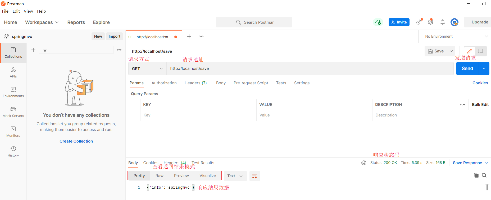

## 3，PostMan工具的使用

### 3.1 PostMan简介

代码编写完后，我们要想测试，只需要打开浏览器直接输入地址发送请求即可。发送的是`GET`请求可以直接使用浏览器，但是如果要发送的是`POST`请求呢?

如果要求发送的是post请求，我们就得准备页面在页面上准备form表单，测试起来比较麻烦。所以我们就需要借助一些第三方工具，如PostMan.

* PostMan是一款功能强大的网页调试与发送网页HTTP请求的Chrome插件。
* 作用：常用于进行接口测试

* 特征
  * 简单
  * 实用
  * 美观
  * 大方

### 3.2 PostMan安装

双击`资料\Postman-win64-8.3.1-Setup.exe`即可自动安装，

安装完成后，如果需要注册，可以按照提示进行注册，如果底部有跳过测试的链接也可以点击跳过注册

看到如下界面，就说明已经安装成功。

### 3.3 PostMan使用

#### 3.3.1 创建WorkSpace工作空间

#### 3.3.2 发送请求

#### 3.3.3 保存当前请求

**注意:**第一次请求需要创建一个新的目录，后面就不需要创建新目录，直接保存到已经创建好的目录即可。