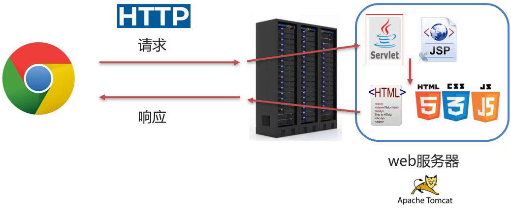
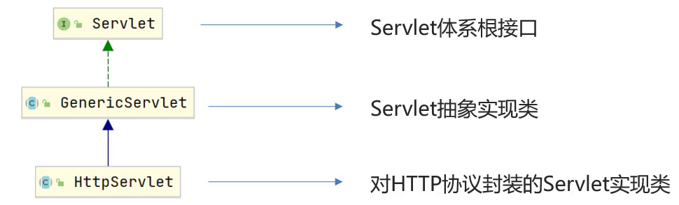
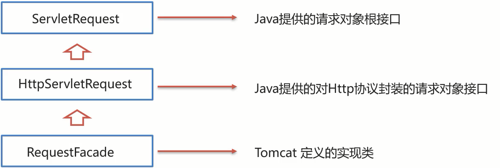

# Servlet

## 1 简介



* Servlet是JavaWeb最为核心的内容，它是Java提供的一门动态web资源开发技术。

* 使用Servlet就可以实现，根据不同的登录用户在页面上动态显示不同内容。

* Servlet是JavaEE规范之一，其实就是一个接口，将来我们需要定义Servlet类实现Servlet接口，并由web服务器运行Servlet

## 2 基本知识

### 2.1 快速入门

**需求:** 编写一个Servlet类，并使用IDEA中Tomcat插件进行部署，最终通过浏览器访问所编写的Servlet程序。

1. 创建web项目，导入servlet坐标

   ```xml
   <dependency>
       <groupId>javax.servlet</groupId>
       <artifactId>javax.servlet-api</artifactId>
       <version>3.1.0</version>
       <!--
   		因为Tomcat的lib目录中已经有servlet-api这个jar包，
   		如果在生成war包的时候生效就会和Tomcat中的jar包冲突，导致报错.
   		所以使用provided限制
       -->
       <scope>provided</scope>
   </dependency>
   ```

2. 定义Servlet类

   ```java
   package com.itheima.web;
   
   import javax.servlet.*;
   import java.io.IOException;
   
   @WebServlet("url")
   public class ServletDemo1 implements Servlet {
   
       public void service(ServletRequest servletRequest, ServletResponse servletResponse) throws ServletException, IOException 
       {
           System.out.println("servlet hello world~");
       }
       
       public void init(ServletConfig servletConfig) throws ServletException{}
   
       public ServletConfig getServletConfig()
       {
           return null;
       }
   
       public String getServletInfo() 
       {
           return null;
       }
   
       public void destroy(){}
   }
   ```

3. 指定Servlet的访问路径

   ```java
   @WebServlet("/demo1")
   ```

4. 打开浏览器访问

   ```
   http://localhost:8080/web-demo/demo1
   ```

### 2.2 执行流程及生命周期

#### 执行流程

```
http://localhost:8080/web-demo/demo1
```

* 浏览器发出`http://localhost:8080/web-demo/demo1`请求，从请求中可以解析出三部分内容，分别是`localhost:8080`、`web-demo`、`demo1`
  * 根据`localhost:8080`可以找到要访问的Tomcat Web服务器
  * 根据`web-demo`可以找到部署在Tomcat服务器上的web-demo项目
  * 根据`demo1`可以找到要访问的是项目中的哪个Servlet类，根据@WebServlet后面的值进行匹配
* 找到ServletDemo1这个类后，Tomcat Web服务器就会为ServletDemo1这个类创建一个对象，然后调用对象中的service方法
  * ServletDemo1实现了Servlet接口，所以类中必然会重写service方法供Tomcat Web服务器进行调用
  * service方法中有ServletRequest和ServletResponse两个参数，ServletRequest封装的是请求数据，ServletResponse封装的是响应数据，后期我们可以通过这两个参数实现前后端的数据交互

#### 生命周期

Servlet运行在Servlet容器(web服务器)中，其生命周期由容器来管理，分为4个阶段：

1. 加载和实例化：默认情况下，当Servlet第一次被访问时，由容器创建Servlet对象

   - 默认情况，Servlet会在服务器启动后，第一次访问被容器创建。

   - 还可以通过`@WebServlet`注解来调整Servlet被创建的时间

     ```
     通过WebServlet中的loadOnstartup属性来调整Servlet被创建的时间
     	负整数:第一次访问时创建Servlet对象
     	0或正整数:服务器启动时创建Servlet对象，数字越小优先级越高
     ```

2. 初始化：在Servlet实例化之后，容器将调用Servlet的`init()`方法初始化这个对象，完成一些如加载配置文件、创建连接等初始化的工作。该方法只调用一次
3. 请求处理：每次请求Servlet时，Servlet容器都会调用Servlet的`service()`方法对请求进行处理
4. 服务终止：当需要释放内存或者容器关闭时，容器就会调用Servlet实例的`destroy()`方法完成资源的释放。在`destroy()`方法调用之后，容器会释放这个Servlet实例，该实例随后会被Java的垃圾收集器所回收

### 2.3 体系结构及方法介绍

#### 方法介绍

Servlet一共有五个方法，如下所示

```java
//初始化方法，在Servlet被创建时执行，只执行一次
void init(ServletConfig config);

//提供服务方法， 每次Servlet被访问，都会调用该方法
void service(ServletRequest req, ServletResponse res);

//销毁方法，当Servlet被销毁时，调用该方法。在内存释放或服务器关闭时销毁Servlet
void destroy();

//该方法用来返回Servlet的相关信息，没有什么太大的用处，一般返回一个空字符串即可
String getServletInfo();

//获取ServletConfig对象
ServletConfig getServletConfig();
```

#### 体系结构



开发web项目时，不需要实现Servlet接口，只需要继承HttpServlet即可。HttpServlet对HTTP协议进行了封装操作。在开发时只需要重写如下两个方法即可

```java
@Override
protected void doGet(HttpServletRequest req, HttpServletResponse resp) throws ServletException, IOException {
        //TODO GET 请求方式处理逻辑
}

@Override
protected void doPost(HttpServletRequest req, HttpServletResponse resp) throws ServletException, IOException {
        //TODO Post 请求方式处理逻辑
}
```

### 2.4 Servlet配置

#### 访问路径

Servlet类编写好后，要想被访问到，就需要配置其访问路径。

访问路径配置规则：

- 精确匹配

  ```java
  @WebServlet(urlPatterns = "/user/select")
  //精确到路径名，访问时需要输入/user/select
  ```

- 目录匹配

  ```java
  @WebServlet("/user/*")
  //访问时*可以输入任意路径
  ```

  > 注意：如果一个路径可以访问到两个资源时，优先访问精确路径

- 扩展名匹配

  ```java
  @WebServlet("*.do")
  //只需要在访问路径输入.do结尾的URL即可   
  ```

  > 注意：使用扩展名匹配时，可以不在开头加`/`

- 任意匹配

  ```java
  @WebServlet("/")
  @WebServlet("/*")
  //输入任意路径匹配
  ```

  > `/`和`/*`的区别：
  >
  > 1. 当我们的项目中的Servlet配置了 "/",会覆盖掉tomcat中的DefaultServlet,当其他的url-pattern都匹配不上时都会走这个Servlet
  >
  > 2. 当我们的项目中配置了"/*",意味着匹配任意访问路径
  >
  > 3. DefaultServlet是用来处理静态资源，如果配置了"/"会把默认的覆盖掉，就会引发请求静态资源的时候没有走默认的而是走了自定义的Servlet类，最终导致静态资源不能被访问

五种配置的优先级为 精确匹配 > 目录匹配> 扩展名匹配 > /* > /

还可以为一个Servlet配置多个访问路径

```java
@WebServlet(urlPatterns = {"/demo1","/demo2"})
```

#### XML配置

xml的配置分为如下两步

1. 编写Servlet类

   ```java
   package com.itheima.web;
   
   import javax.servlet.ServletRequest;
   import javax.servlet.ServletResponse;
   import javax.servlet.annotation.WebServlet;
   
   public class ServletDemo13 extends MyHttpServlet {​    
       @Override    
       protected void doGet(ServletRequest req, ServletResponse res) 
   	{ 
           System.out.println("demo13 get...");    
       }    
       
       @Override    
       protected void doPost(ServletRequest req, ServletResponse res) {}
   }
   ```

2. 在web.xml中配置该Servlet

   ```xml
   <?xml version="1.0" encoding="UTF-8"?>
   <web-app xmlns="http://xmlns.jcp.org/xml/ns/javaee"
            xmlns:xsi="http://www.w3.org/2001/XMLSchema-instance"
            xsi:schemaLocation="http://xmlns.jcp.org/xml/ns/javaee http://xmlns.jcp.org/xml/ns/javaee/web-app_4_0.xsd"
            version="4.0">
       
       <!-- Servlet 全类名 -->
       <servlet>
           <!-- servlet的名称，名字任意-->
           <servlet-name>demo13</servlet-name>
           <!-- servlet的类全名 -->
           <servlet-class>com.itheima.web.ServletDemo13</servlet-class>
       </servlet>
   
       <!-- Servlet 访问路径 -->
       <servlet-mapping>
           <!-- servlet的名称，要和上面的名称一致-->
           <servlet-name>demo13</servlet-name>
           <!-- servlet的访问路径-->
           <url-pattern>/demo13</url-pattern>
       </servlet-mapping>
       
   </web-app>
   ```

#### 注解配置

Servlet3.0之后，可以使用注解来配置访问路径及其他参数

```java
@WebServlet("/demo1")
```

### 2.5 Request和Response对象

#### 2.5.1 Request对象

##### 概述

Request对象负责获取请求数据

* 浏览器会发送HTTP请求到后台服务器[Tomcat]
* HTTP的请求中会包含很多请求数据[请求行+请求头+请求体]
* 后台服务器[Tomcat]会对HTTP请求中的数据进行解析并把解析结果存入到一个对象中
* 所存入的对象即为request对象，所以我们可以从request对象中获取请求的相关参数
* 获取到数据后就可以继续后续的业务，比如获取用户名和密码就可以实现登录操作的相关业务

##### 继承体系



ServletRequest和HttpServletRequest是继承关系，并且两个都是接口。由于本笔记使用Tomcat容器，所以Tomcat提供了方法参数接口的具体实现类，并完成了对象的创建。实现类就是RequestFacade

> 查询实现类方法，只需要查询HttpServletRequest方法即可

##### 方法

HTTP请求数据总共分为三部分内容，分别是请求行、请求头、请求体，对于这三部分内容的数据，HttpServletRequest提供了如下方法

```java
String getMethod();		//获取请求方法
String getContextPath();	//获得项目访问路径
StringBuffer getRequestURL();	//获得URL
String getRequestURI();		//获得URI
String getHeader(String name);	//获得请求头
String getQueryString();	//获得请求参数(GET方法)
ServletInputStream getInputStream();	//获得请求参数，POST方式，用于获得文件数据
BufferedReader getReader();		//获得请求参数，POST方式，用于获得字符数据
```

##### 获取请求参数的通用方式

1. 根据不同的请求方法获取参数

   ```
   username=zhangsan&password=123
   ```

2. 将参数进行分割

   ```
   username zhangsan password 123
   ```

3. 存入一个`Map<String,String[]>`集合

```java
Map<String,String[]> getParameterMap();	//获取所有参数Map集合
String[] getParameterValues(String name);	//根据名称获取参数值（数组）
String getParameter(String name);	//根据名称获取参数值(单个值)
```

##### 乱码问题

1. 浏览器将中文转为UTF-8编码，再使用URL编码。最后发送给服务器
2. 服务器先解析URL编码，然后使用ISO-8859-1进行还原
3. 因为解码方式不一致，导致乱码

- post解决

  ```java
  //在获取参数之前使用如下代码
  ////设置字符输入流的编码，设置的字符集要和页面保持一致
  request.setCharacterEncoding("UTF-8");
  ```

- get解决

  ```java
  //获取参数
  String username = request.getParameter("username");
  
  //先对乱码数据进行编码：按照ISO-8859-1的方式转成byte数组
  byte[] bytes = username.getBytes(StandardCharsets.ISO_8859_1);
  //字节数组解码
  username = new String(bytes, StandardCharsets.UTF_8);
  ```

> 注意：Tomcat8.0之后，已将GET请求乱码问题解决，设置默认的解码方式为UTF-8

##### 请求转发

1. 浏览器发送请求给服务器，服务器中对应的资源A接收到请求

2. 资源A处理完请求后将请求发给资源B

3. 资源B处理完后将结果响应给浏览器

请求从资源A到资源B的过程就叫请求转发

```java
//实现方式
req.getRequestDispatcher("资源B路径").forward(req,resp);
```

请求转发资源间共享数据:使用Request对象

```java
void setAttribute(String name,Object o);	//存储数据到request域中
Object getAttribute(String name);	//根据key获取值
void removeAttribute(String name);	//根据key删除该键值对
```

#### 2.5.2 Response对象

##### 概述

response:设置响应数据

* 业务处理完后，后台就需要给前端返回业务处理的结果即响应数据
* 把响应数据封装到response对象中
* 后台服务器[Tomcat]会解析response对象,按照[响应行+响应头+响应体]格式拼接结果
* 浏览器最终解析结果，把内容展示在浏览器给用户浏览

##### 继承体系


##### 方法

```java
void setStatus(int sc);	//设置响应状态码
void setHeader(String name,String value);	//设置响应头键值对

PrintWriter getWriter();	//获取字符输出流
ServletOutputStream getOutputStream();	//获取字节输出流
```

##### 请求重定向

1. 浏览器发送请求给服务器，服务器中对应的资源A接收到请求

2. 资源A现在无法处理该请求，就会给浏览器响应一个302的状态码+location的一个访问资源B的路径

3. 浏览器接收到响应状态码为302就会重新发送请求到location对应的访问地址去访问资源B

4. 资源B接收到请求后进行处理并最终给浏览器响应结果，这整个过程就叫重定向

```java
//重定向实现方式
resp.setStatus(302);
resp.setHeader("location","资源B的访问路径");

//简化
resposne.sendRedirect("/request-demo/resp2")
```

##### 重定向和请求转发时的差别

| 重定向                          | 请求转发                        |
| ------------------------------- | ------------------------------- |
| 浏览器地址栏路径发生变化        | 浏览器地址栏路径不发生变化      |
| 可以重定向到任意资源            | 只能转发到当前服务器的内部资源  |
| 两次请求，不能用request共享数据 | 一次请求，可以用request共享数据 |

##### 路径问题

有的时候加项目路径，有的时候不加项目路径。到底什么时候加呢

- 浏览器使用该路径时，要加项目路径
- 服务器使用该路径时，不需要加项目路径

##### 使用commons-io来简化响应字节数据

```java
//原方式
@WebServlet("/resp4")
public class ResponseDemo4 extends HttpServlet {
    @Override
    protected void doGet(HttpServletRequest request, HttpServletResponse response) throws ServletException, IOException {
        
        //1. 读取文件
        FileInputStream fis = new FileInputStream("d://a.jpg");
        
        //2. 获取response字节输出流
        ServletOutputStream os = response.getOutputStream();
        
        //3. 完成流的copy
        byte[] buff = new byte[1024];
        int len = 0;
        while ((len = fis.read(buff))!= -1){
            os.write(buff,0,len);
        }
        fis.close();
    }

    @Override
    protected void doPost(HttpServletRequest request, HttpServletResponse response) throws ServletException, IOException {
        this.doGet(request, response);
    }
}
```

```java
/*
	添加依赖
	<dependency>
    <groupId>commons-io</groupId>
    <artifactId>commons-io</artifactId>
    <version>2.6</version>
	</dependency>
*/

//commos-io方式
@WebServlet("/resp4")
public class ResponseDemo4 extends HttpServlet {
    @Override
    protected void doGet(HttpServletRequest request, HttpServletResponse response) throws ServletException, IOException {
        //1. 读取文件
        FileInputStream fis = new FileInputStream("d://a.jpg");
        //2. 获取response字节输出流
        ServletOutputStream os = response.getOutputStream();
        //3. 完成流的copy
      	IOUtils.copy(fis,os);
        fis.close();
    }

    @Override
    protected void doPost(HttpServletRequest request, HttpServletResponse response) throws ServletException, IOException {
        this.doGet(request, response);
    }
}
```

