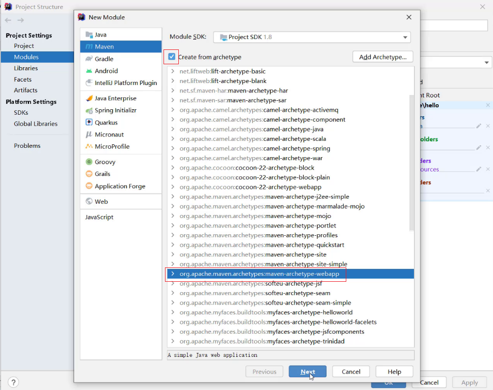
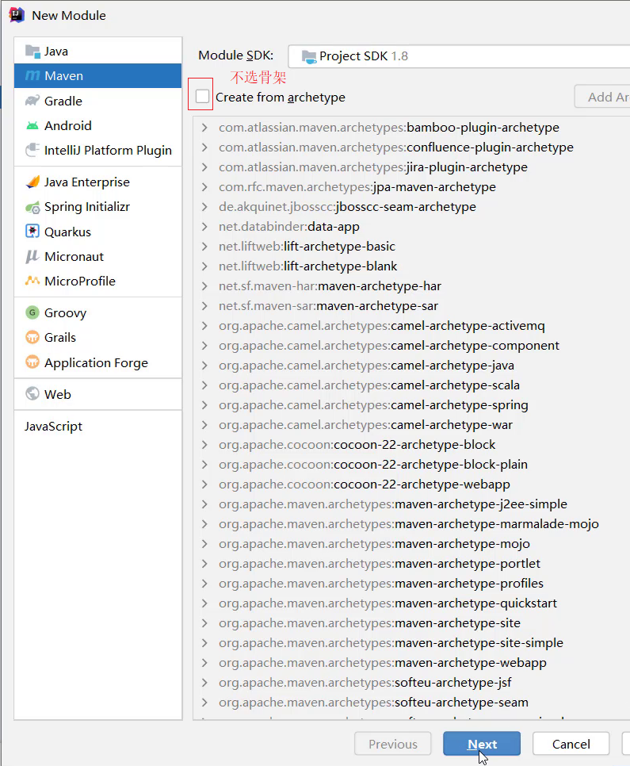
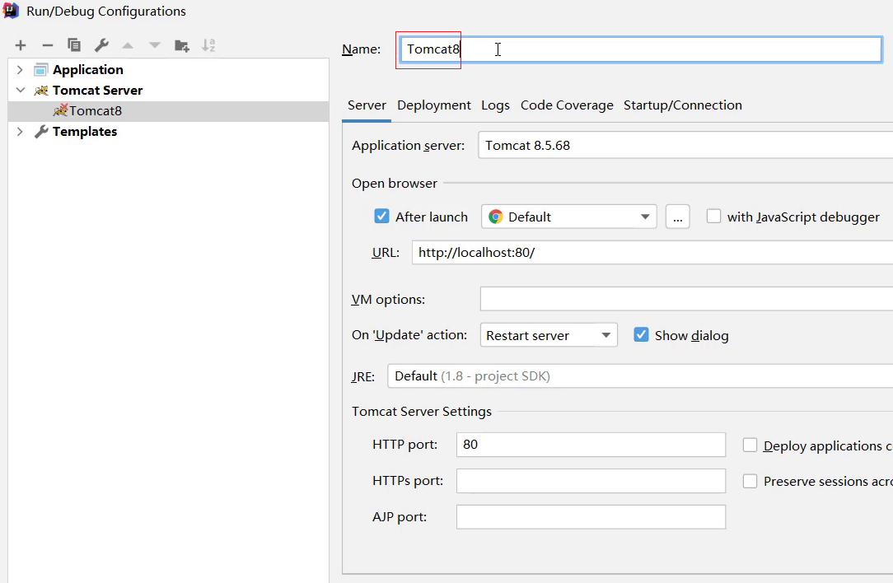

# Tomcat

## 1 简介

### 1.1 web服务器

Web服务器是一个应用程序，对HTTP协议的操作进行封装。使得程序员不必直接对协议进行操作，让Web开发更加便捷。把自己写的Web项目部署到服务器软件中（如Tomcat），当Web服务器启动后，部署在Web服务器软件中的页面就可以直接通过浏览器来访问了。

Web服务器主要功能是"提供网上信息浏览服务"。


**Web服务器软件使用步骤**

* 准备静态资源
* 下载安装Web服务器软件
* 将静态资源部署到Web服务器上
* 启动Web服务器使用浏览器访问对应的资源

### 1.2 Tomcat服务器

* Tomcat是Apache软件基金会一个核心项目，是一个开源免费的轻量级Web服务器，支持Servlet/JSP少量JavaEE规范。

* 概念中提到了JavaEE规范，那什么又是JavaEE规范呢?

  JavaEE: Java Enterprise Edition,Java企业版。指Java企业级开发的技术规范总和。包含13项技术规范:JDBC、JNDI、EJB、RMI、JSP、Servlet、XML、JMS、Java IDL、JTS、JTA、JavaMail、JAF。

* 因为Tomcat支持Servlet/JSP规范，所以Tomcat也被称为Web容器、Servlet容器。Servlet需要依赖Web服务器才能运行。

* Tomcat的官网: https://tomcat.apache.org/ 从官网上可以下载对应的版本进行使用。

## 2 使用

Tomcat是绿色软件，下载压缩包后直接解压即可，卸载时删除整个目录即可

### 2.1 启动

在Tomcat家目录下，访问bin文件夹，双击startup.bat启动

启动后，通过http://localhost:8080访问

### 2.2 关闭

Tomcat提供3种不同的关闭方式

- 直接关闭DOS命令端口：强制关闭（不建议）
- bin\shutdown.bat:正常关闭
- Ctrl+c：正常关闭

### 3.3 配置

#### 修改端口

Tomcat默认的端口是8080，要想修改Tomcat启动的端口号，需要修改 conf/server.xml


> 注: HTTP协议默认端口号为80，如果将Tomcat端口号改为80，则将来访问Tomcat时，将不用输入端口号。

#### 端口占用

Tomcat的端口号取值范围是0-65535之间任意未被占用的端口，如果设置的端口号被占用，启动的时候就会包如下的错误


#### 启动时DOS窗口一闪而过

- 需要检查JAVA_HOME环境变量是否正确配置


- 还可以通过在startup.bat和shutdown.bat文件中加入如下代码

  ```
  SET JAVA_HOME=C:\Program Files\Java\jdk-11.0.15.1	
  SET TOMCAT_HOME=C:\Software\apache-tomcat-8.5.82
  //路径是jdk和Tomcat的家目录
  ```

### 3.4 项目部署

- 第一种方式可以将项目放置到家目录下的webapps目录
  - 通过浏览器访问项目下的资源（http://localhost:8080/projectName/resourceName），说明部署成功

- 第二种部署方式是通过war包部署
  - Tomcat会自动检测war包，并将其解压缩
  - 然后通过浏览器访问资源即可

## 3 Maven创建web项目

Tomcat中运行的绝大多数是web项目，使用Maven工具可以快速的将其创建出来

### 3.1 Web项目结构

Maven web项目在开发的时候和部署时的结构不一样，下面介绍开发时和部署时的项目结构

- 开发中的项目


- 部署时的项目结构


**开发中的项目结构和部署时的项目结构的区别**

* 开发项目通过执行Maven打包命令==package==,可以获取到部署的Web项目目录
* 编译后的Java字节码文件和resources的资源文件，会被放到WEB-INF下的classes目录下
* pom.xml中依赖坐标对应的jar包，会被放入WEB-INF下的lib目录下

### 3.2 创建Maven web项目

#### 使用骨架

> 具体的步骤包含:
>
> 1.创建Maven项目
>
> 2.选择使用Web项目骨架
>
> 3.输入Maven项目坐标创建项目
>
> 4.确认Maven相关的配置信息后，完成项目创建
>
> 5.删除pom.xml中多余内容
>
> 6.补齐Maven Web项目缺失的目录结构

1. 创建Maven项目

   

2. 选择使用Web项目骨架

   

3. 输入Maven项目坐标创建项目

   

4. 确认Maven相关的配置信息后，完成项目创建

   

5. 删除pom.xml中多余内容，只留下面的这些内容，注意打包方式 jar和war的区别

   

6. 补齐Maven Web项目缺失的目录结构，默认没有java和resources目录，需要手动完成创建补齐，最终的目录结果如下

   

#### 不使用骨架

>具体的步骤包含:
>
>1.创建Maven项目
>
>2.选择不使用Web项目骨架
>
>3.输入Maven项目坐标创建项目
>
>4.在pom.xml设置打包方式为war
>
>5.补齐Maven Web项目缺失webapp的目录结构
>
>6.补齐Maven Web项目缺失WEB-INF/web.xml的目录结构

1. 创建Maven项目

   

2. 选择不使用Web项目骨架

   

3. 输入Maven项目坐标创建项目

   

4. 在pom.xml设置打包方式为war,默认是不写代表打包方式为jar

   

5. 补齐Maven Web项目缺失webapp的目录结构

   

6. 补齐Maven Web项目缺失WEB-INF/web.xml的目录结构

   

7. 补充完后，最终的项目结构如下:

   


## 4 IDEA使用Tomcat

### 4.1 集成本地Tomcat

目标: 将本地安装好的Tomcat集成到IDEA中，完成项目部署，具体的实现步骤

1. 打开添加本地Tomcat的面板

   

2. 指定本地Tomcat的具体路径

   

3. 修改Tomcat的名称，此步骤可以不改，只是让名字看起来更有意义，HTTP port中的端口也可以进行修改，比如把8080改成80

   

4. 将开发项目部署项目到Tomcat中

   

   >扩展内容： xxx.war和 xxx.war exploded这两种部署项目模式的区别?
   >
   >​	war模式是将WEB工程打成war包，把war包发布到Tomcat服务器上
   >
   >​	war exploded模式是将WEB工程以当前文件夹的位置关系发布到Tomcat服务器上
   >
   >​	war模式部署成功后，Tomcat的webapps目录下会有部署的项目内容
   >
   >​	war exploded模式部署成功后，Tomcat的webapps目录下没有，而使用的是项目的target目录下的内容进行部署
   >
   >​	建议大家都选war模式进行部署，更符合项目部署的实际情况

5. 部署成功后，就可以启动项目，为了能更好的看到启动的效果，可以在webapp目录下添加a.html页面

   

6. 启动成功后，可以通过浏览器进行访问测试

   

7. 最终的注意事项

   

### 4.2 Tomcat Maven插件

在IDEA中使用本地Tomcat进行项目部署，相对来说步骤比较繁琐，所以我们需要一种更简便的方式来替换它，那就是直接使用Maven中的Tomcat插件来部署项目，具体的实现步骤，只需要两步，分别是:

1. 在pom.xml中添加Tomcat插件

   ```xml
   <build>
       <plugins>
       	<!--Tomcat插件 -->
           <plugin>
               <groupId>org.apache.tomcat.maven</groupId>
               <artifactId>tomcat7-maven-plugin</artifactId>
               <version>2.2</version>
           </plugin>
       </plugins>
   </build>
   ```

2. 使用Maven Helper插件快速启动项目，选中项目，右键-->Run Maven --> tomcat7:run


==注意:==

* 如果选中项目并右键点击后，看不到Run Maven和Debug Maven，这个时候就需要在IDEA中下载Maven Helper插件，具体的操作方式为: File --> Settings --> Plugins --> Maven Helper ---> Install,安装完后按照提示重启IDEA，就可以看到了。


* Maven Tomcat插件目前只有Tomcat7版本，没有更高的版本可以使用
* 使用Maven Tomcat插件，要想修改Tomcat的端口和访问路径，可以直接修改pom.xml

```xml
<build>
    <plugins>
    	<!--Tomcat插件 -->
        <plugin>
            <groupId>org.apache.tomcat.maven</groupId>
            <artifactId>tomcat7-maven-plugin</artifactId>
            <version>2.2</version>
            <configuration>
            	<port>80</port><!--访问端口号 -->
                <!--项目访问路径
					未配置访问路径: http://localhost:80/tomcat-demo2/a.html
					配置/后访问路径: http://localhost:80/a.html
					如果配置成 /hello,访问路径会变成什么?
						答案: http://localhost:80/hello/a.html
				-->
                <path>/</path>
            </configuration>
        </plugin>
    </plugins>
</build>
```

