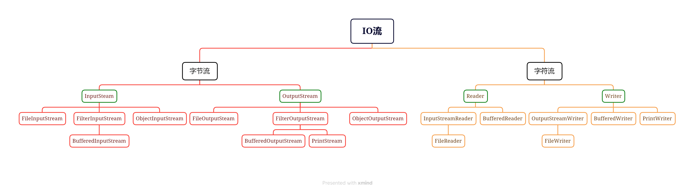

# 1 File

```java
java.io.File
```

该类主要用于文件和目录的创建，文件的查找和文件的删除等

File对象代表磁盘中实际存在的文件和目录。

File类的功能如下：

- 访问其表示的文件或目录的属性信息

- 可以创建或删除文件和目录

- 可以访问一个目录的所有一级子项

  **注：**File不能访问文件数据

```java
/*
	常用构造：
	File(String pathname)
	文件路径可以写绝对路径，也可以写相对路径
	可以写存在的，也可以写不存在的
*/
File file = new File("./demo.txt");	

//文件操作
String name = file.getName();		//String getName();返回文件名
long length = file.length();		//long length();获取大小，就是文件在硬盘上实际占用的空间(单位是字节)
boolean cw = file.canWrite();		//boolean canWrite();判断文件是否可写
boolean cr = file.canRead();		//boolean canRead();判断文件是否可读
boolean ih = file.isHidden();		//boolean isHidden();判断文件是否隐藏
boolean es = file.exists();		//boolean exists(); 判断文件存不存在
file.createNewFile();		//创建新文件
file.delete();		//将file表示的文件删除
file.isfile();		//boolean isFile();判断file是否为文件
```

**注意：**实际开发过程中，考虑跨平台原因，一般不会使用绝对路径。相对路径跨平台性更好，但是要根据具体软件或系统而定。在IDEA中，./表示当前程序所在的项目目录

```java
//目录操作，目录操作和文件操作大多相同，下面记录和文件操作不同的地方或一些注意事项
dir.mkdir();	//创建目录时要求所在的目录必须存在，否则创建失败
dir.mkdirs();	//创建目录时会将不存在的父目录一起创建出来
dir.delete();	//删除目录时，只有空目录可以被删除
dir.isDirectory();	//boolean isDirectory();判断dir是否为目录

/*File[] listFiles();
	- 返回当前dir的所有一级子项，每个子项都包含在返回的数组中作为一个元素
	- 该方法可以添加一个构造器
*/
File[] subs = dir.listFiles();	

File[] subs = dir.listFiles(filter);	
/*
File[] listFiles(FileFilter filter)
该方法会将该目录中每一个子项都作为参数先传给filter的accept方法，
只有accept方法返回为true的子项最终才会被包含在返回的File[]数组中进行返回。
注意：该方法需要重写Filter接口中的accept()方法
*/
```

# 2 IO流

IO流的主要工作是读取文件数据，Java将IO流分为两类：

- 字节流：可以读写任何文件，主要读写音视频文件
- 字符流：只能读写文本文件

以内存为视点，每种流都有输入和输出两个方向，因此为四种流：

- 输入：又称读入，内存从网络或硬盘读入数据
- 输出：又称写出，从内存向网络或硬盘写出数据

```java
java.io.InputStream	//字节输入流
```

```java
java.io.OutputStream //字节输出流
```

```java
java.io.Reader	//字符输入流
```

```java
java.io.Writer	//字符输出流
```

> 注：以上四种都是抽象类

基本的IO流结构：



## 2.1 字节流

```java
java.io.InputStream和java.io.OutputStream
```

所有字节输入流和输出流的超类，它们都是抽象类，下面是对应的两个实现类：

```java
java.io.FileInputStream
```

```java
java.io.FileOutputStream
```

```java
//java.io.FileOutputStream
/*
	常用构造方法：
	FileOutputStream(String path)
	FileOutputStream(File file)
	以上两种为覆盖模式，创建文件流时如果指定的文件存在，该文件内容会被清除。
	
	FileOutputStream(String path,boolean append)
    FileOutputStream(File file,boolean append)
    如果第二个参数为true则是追加模式，如果指定的文件存在，原来的内容都会保留，新写入的内容会顺序的追加到文件中。
*/
FileOutputStream fos = new FileOutputStream("./demo.txt");

/*
	void write(int d)
	写出一个字节，写出的内容是给定的int值对应的二进制值的低八位
	
	00000000 00000000 00000000 00000000
	                           ^^^^^^^^
	带有^标记的为低八位
	
	void write(byte[] data)
    将给定的字节数组中所有内容全部写出
    void write(byte[] data,int off,int len)
    将给定的字节数组，从下标off处开始，连续len个字节一次性写出
*/
fos.write(1);

/*
	flush():刷新流，刷新之后还可以继续写数据
	- 因为Java不是直接向程序中写数据，而是存到一个缓存区中，到达一定程度再刷新
	- 或者使用flush手动刷新
*/
flush();

/*
	close()
	- 关闭流，释放资源
	- 关闭之前会刷新流
	- 关闭后，不能用流写数据
	- 流使用完毕必须关闭，否则会影响内存速度
	- 最好再try-catch-finally中使用
	- InputStream,OutputStream都实现了Closeable接口
		都属于资源对象，可以自动关闭
*/
close();
```

```java
//java.io.FileInputStream
/*
	常用构造方法：
	FileInputStream(String path)
	FileInputStream(File file)
*/
FileInputStream fis = new FileInputStream("./demo.txt");
FileInputStream fis = new FileInputStream(File file);

/*
	int read()
	读取一个字节，并以int型返回。返回的int值对应的2进制的低八位为读取到
    的字节数据。如果返回值为int的-1则表示读取到了流的末尾
*/
int d = fis.read();

/*
int read(byte[] data)
    - 一次性读取data数组总长度的字节量，并存入到数组当中
    - 返回值为实际读取到的字节量。如果返回值为-1则表示读取到了末尾。
    注意：
    - 如果剩余的字节不能填满一个数组，未填满的部分依旧保存上一次读取的数据
*/
bytes[] bytes = new Bytes[3];
int len = fis.read(bytes);

/*
	问题：
		- 假设读取一个文本
		- 如果最后一次读取了2个，如何转换？
	答：
		- 使用String的构造器String(byte[] bytes,int start,int end)
		- 该构造器可以从start位开始读，读end个结束
*/
String str = new String(bytes,0,len);
```

## 2.2 字符流

```
java.io.Reader和java.io.Writer
```

`java.io.Reader`和`java.io.Writer`是所有字符输入与输出流的超类,特点都是以char为单位。

实际开发中，使用如下两个流

```java
java.io.FileReader	//文件字符输入流
```

```java
java.io.FileWriter	//文件字符输出流
```

上面两个流，分别继承`InputStreamReader`,`OutputStreamWriter`。可以对文件中的字符进行操作

```java
//java.io.FileReader
/*
	public FileReader(File file)
	public FileReader(String pathname)
	创建字符输入流
*/
FileReader file = new FileReader("test.txt");

/*
	public int read();
	每次读取一个字符返回，如果没有字符可读返回-1
	
	public int read(char[] buffer)
	- 每次读取一个字符数组
	- 返回读取的字符个数
	- 并将读取到的字符存在数组中
	- 如果没有字符返回-1
	
	下面代码是读取1024个字节放进buffer数据，再返回读取的数量
	如果读取不到1024（比如读取了12个字符），则返回12
*/
char[] buffer = new char[1024];
int len = file.read(buffer);
```

```java
//java.io.FileWriter
/*	
	构造方法：
	public FileWriter(File file)
	public FileWriter(String filepath)
	- 创建字符输出流管道
	
	public FileWriter(File file,boolean append)
	public FileWriter(String filepath,boolean append)
	- 追加模式
*/
FileWriter file = new FileWriter("test.txt",true);	//用追加模式向文件写入字符

/*
	void write(int c)	
	- 写一个字符
	void write(char[] cbuf)
	- 写入一个字符数组
	void write(char[] cbuf,int off,int len)
	- 写入字符数据的一部分，off是开始的位置，len是写入个数
	void write(String str)
	- 写入一个字符串
	void write(String str,int off,int len)
	- 写入字符串的一部分，off是开始的位置，len是写入个数
*/

/*
	flust()
	- 刷新流
	close()
	- 关闭流
	- 所有特性和字节流一样
*/
flush();
close();
```

## 2.3 缓冲流

> 注意：本节内容需要2.1和2.2节知识

缓冲流又称高效流，或者高级流。2.1和2.2也称为原始流

作用：缓冲流自带缓冲区，可以提高原始字节流，字符流读写数据的性能

原理简单示意：


- 在基础流中，数据首先从硬盘读取到内存，再由内存进行写入
- 由于内存速度与较快，硬盘速度慢，因此，效率不高


- 此时，如果我们在内存中设立缓冲区，将硬盘中的数据首先写入左缓冲区
- 转移数据时，直接从左缓冲区转移到右缓冲区
- 转移的同时，再对左缓冲区填补
- 由于转移操作在内存中，效率会大大提高
- 缓冲区在内存中

IO流中的图，使用`Buffered`开头的都是缓冲流

### 2.3.1 字节缓冲流

```java
java.io.BufferedInputStream	//缓冲字节输入流
```

```java
java.io.BufferedOutputStream	//缓冲字节输出流
```

```java
//java.io.BufferedInputStream
/*
	构造方法：
	BufferedInputStream(InputStream in)
	- 传入一个输入流进行包装，默认缓冲区8kb
	BufferedInputStream(InputStream in, int size)
	- 传入一个输入流并指定缓冲区大小
*/

FileInputStream fis = new FileInputStream("test.txt");
BufferedInputStream bis = new BufferedInputStream(fis);
```

```java
//java.io.BufferedOutputStream
/*
	构造方法：
	BufferedOutputStream(OutputStream out)
	- 传入一个输出流进行包装，缓冲区默认8kb
	BufferedOutputStream(OutputStream out,int size)
	- 传入一个输出流进行包装，指定缓冲区大小
*/
FileOutputStream fos = new FileOutputStream("test.txt");
BufferedOutputStream bos = new BufferedOutputStream(fos);
```

其余方法和基本流一致

经过代码检验，使用字节缓冲流加1kb数组性能较好，对照组如下：

- 基本流，一字节一字节读取
- 基本流，1024字节读取
- 缓冲流，一字节一字节读取
- 缓冲流，1024字节读取

### 2.3.2 字符缓冲流

```java
java.io.BufferedReader	//字符缓冲输入流
```

```java
java.io.BufferedWriter	//字符缓冲输出流
```

```java
//java.io.BufferedReader
/*
	public BufferedReader(Reader r)
	- 将低级字符流包装成缓冲字符输入流
	
	public String readLine()
	- 读取一行数据，返回数据
	- 如果读取完毕，返回null
	
	其他方法和低级六一致
*/
FileReader fr = new FileReader("test.txt");
BufferedReader br = new BufferedReader(fr);
String line = br.readLine();
```

```java
//java.io.BufferedWriter
/*
	public BufferedWriter(Writer w)
	- 把低级字符流包装成字符缓冲输出流
	
	public void newLine();
	- 换行
	
	其他方法和字符流一致
*/
FileWriter fw = new FileWriter("test.txt");
BufferedWriter bw = new BufferedWriter(fw);
bw.newLine();
```

## 2.4 字符转换流

```java
java.io.InputStreamReader	//字符输入转换流
```

```java
java.io.OutputStreamWriter	//字符输出转换流
```

```java
//java.io.InputStreamReader
/*
	public InputStreamReader(InputStream is)
	- 可以把原始的字节流按照默认编码转换成字符输入流
	public InputStreamReader(InputStream is,String charset)
	- 可以把原始的字节流按照指定的编码转换成输入流
*/

FileInputStream fis = new FileInputStream("test.txt");	//test.txt是GBK编码的文件
InputStreamReader isr = new InputStreamReader(is,"GBK");	//将test.txt转换为GBK的流
```

> 注意：转换后的流不需要转到utf8，可以直接使用

```java
//java.io.OutputStreamWriter
/*
	public OutputStreamWriter(OutputStream os)
	- 可以把原始的字节输出流按照默认编码转为字符输出流
	public OutputStreamWriter(OutputStream os,String charset)
	- 可以把原始的字节输出流按照指定编码转换为字符输出流
*/
FileOutputStream fos = new FileOutputStream("test.txt");
OutputStreamWirter osr = new OutputStreamWriter(fos,"GBK");	//字符使用GBK编码，再由fos写入到文件中
```

## 2.5 对象序列化

对象序列化：以内存为视点，将一个Java对象写入到文件，叫做对象序列化

对象反序列化：以内存为视点，将一个Java对象读取到内存，称为对象反序列化

```java
java.io.ObjectInputStream	//对象反序列化
java.io.ObjectOutputStream	//对象序列化
```

```java
//java.io.ObjectInputStream
/*
	构造方法：
	public ObjectInputStream(InputStream in)
	- 把低级的字节输入流包装成对象字节输入流
*/
ObjectInputStream ois = new ObjectInputStream(new InputStream("test.txt"));

/*
	public Object readObject()
	把存储在磁盘中的对象数据恢复到内存中
*/
Object object = ois.readObject();
```

```java
//Java.io.ObjectOutputStream
/*
	构造方法：
	public ObjectOutputStream(OutputStream out)
	- 把低级的字节输出流包装成对象字节输出流
*/
ObjectOutputStream oos = new ObjectOutputStream(new OutputStream("test.txt"));

/*
	pulic void writeObject(Object object)
	- 把内存中的对象写入到硬盘中
*/
Student s = new Student();
oos.writeObject();
```

如果对象的属性有敏感数据，不能进行打印，可以使用`transient`来限制

```java
public class Student{
    private String name;
    private Integer age;
    private transient String Idcard;	//序列化时，不会记录该属性的值
}
```

可以使用`serialVersionUID`常量来说明该类的序列化版本号。

如果硬盘中的对象与程序的版本号不一致，则不会反序列化。

必须将该对象重新序列化，才可以反序列化

```java
public class Student{
    
    //说明该类的序列化版本号为1
    private static final long serialVersionUID = 1;
    
    private String name;
    private Integer age;
    private transient String Idcard;	//序列化时，不会记录该属性的值
}
```

## 2.6 打印流

打印流可以实现方便，高效的打印数据到文件中去。

> 注意，是print打印，不是write写

```java
java.io.PrintStream	//字节打印流
```

```java
java.io.PrintWrite	//字符打印流
```

上面两个类，可以实现打印什么数据就写什么数据。比如打印整数97，就是打印97，而不是打印a

```java
//java.io.PrintStream
/*
	public PrintStream(OutputStream os)
	- 将一个低级流包装成打印流
	public PrintStream(File f)
	- 打印流可以直接穿file对象
	public PrintStream(String filepath)
	- 打印流可以直接指定路径
*/
PrintStream ps = new PrintStream("test.txt");

/*
	public void print(XXX xxx)
	- 打印任意类型
	
	public void write(byte[] bytes)
	- 写bytes数组，一般不用
*/
ps.print(true);
```

```java
//java.io.PrintWrite
/*
	public PrintWriter(OutputStream os)
	- 将字节流包装为字符打印流
	public PrintWriter(Write w)
	- 将字符流包装为字符打印流
	public PrintWriter(File f)
	- 直接向f中写入
	public PrintWriter(String filepath)
	- 直接使用路径写
*/
PrintWriter pw = new PrintWriter("test.txt");
/*
	public void print(XXX xxx)
	- 打印任意类型数据
	
	public void write(char[] chars)
	- 打印字符数组，一般不用
*/
pw.print(97);
```

## 2.7 commos-io框架

commons-io是apache开源基金会提供的一组有关IO操作的类库，可以提升IO功能开发的效率

官网：[Commons IO – Commons IO Overview (apache.org)](https://commons.apache.org/proper/commons-io/)

主要有两个类：FileUtils,IOUtils

FileUtils一些方法：

| 方法                                                  | 说明                         |
| ----------------------------------------------------- | ---------------------------- |
| String readFileToString(File file,String encoding)    | 读取文件中的数据，返回字符串 |
| void copy(File srcFile,File destFile)                 | 复制文件                     |
| void copyDirtoryToDirectory(File srcDir,File destDir) | 复制文件夹                   |

