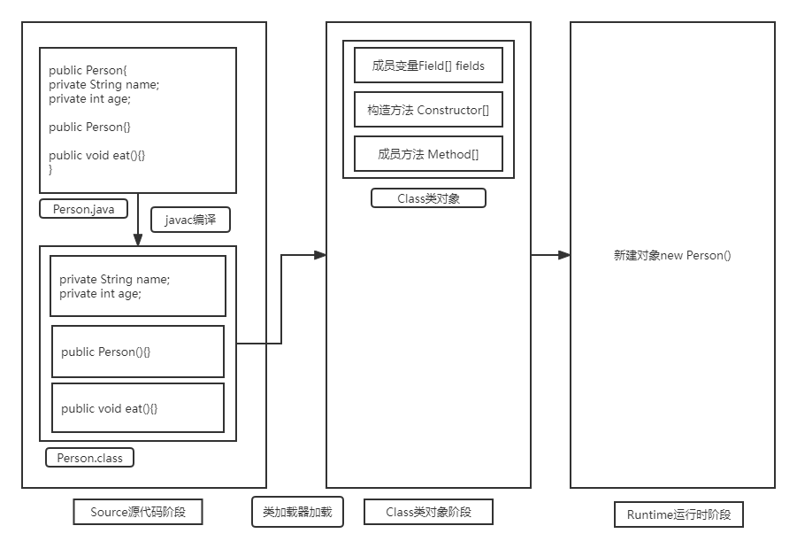

# 1 注解

## 1.1 注解概述

- Java 注解（Annotation）又称 Java 标注，是 JDK5.0 引入的一种注释机制。
- Java 语言中的类、构造器、方法、成员变量、参数等都可以被注解进行标注。
- 对Java中类、方法、成员变量做标记，然后进行特殊处理
- 注解（Annotation），也叫元数据。一种代码级别的说明

## 1.2 注解的格式

```java
public @interface 注解名称{
    public 属性类型 属性名() default 默认值;
}
```

## 1.3 常见的内置注解

### Override

定义在java.lang.Override中，此注解只适用于修饰方法，表示一个方法声明打算重写超类中的另一个方法

### Deprecated

定义在java.lang.Deprecated中，此注释可以用于修饰方法、属性、类。表示不鼓励程序员使用这样的元素，通常是因为它很危险或存在更好的选择

### SuppressWarnings

定义在java.lang.SuppressWarnings中，用来抑制编译时的警告信息，需要配合一些参数使用，参数已经被设置好了

```java
@SuppressWarnings("all")	//抑制所有警告信息
```

## 1.4 元注解

元注解的作用就是负责注解其他注解

这些元注解和它们所支持的类可以在java.lang.annotation包中找到

### @Target

用于描述注解的使用范围

```java
import java.lang.annotation.ElementType;
import java.lang.annotation.Target;

@Target(value = ElementType.METHOD)	//ann01只能在方法中生效
public @interface ann01 {
}
```

| 属性           | 描述     |
| -------------- | -------- |
| TYPE           | 类，接口 |
| FIELD          | 成员变量 |
| METHOD         | 成员方法 |
| PARAMETER      | 方法参数 |
| CONSTRUCTOR    | 构造器   |
| LOCAL_VARIABLE | 局部变量 |

### @Retention

用于标注当前注解的保留级别，有三个选项
* RetentionPolicy.SOURCE 注解仅保留在源代码中
* RetentionPolicy.CLASS 注解保留在字节码中，但是反射机制不能调用
* RetentionPolicy.RUNTIME 注解保留在字节码文件中，并且可以被反射机制所使用（程序运行时可以调用）
* 当不指定@Retention时，默认的保留级别为CLASS，因此我们通常都需要明确指出保留级别为RUNTIME

```java
package annotation;

import java.lang.annotation.Retention;
import java.lang.annotation.RetentionPolicy;

@Retention(value = RetentionPolicy.RUNTIME)	//注解在运行时也会被保留
public @interface ann01 {}
```

### @Document

说明该注解会包含在javadoc中

### @Inherited

子类可以继承父类中的该注解

## 1.5 自定义注解

注意事项：

- 使用@interface自定义注解时，自动继承了java.lang.annotation.Annotation接口
- 格式：public @interface 注解名{内容}

```java

import java.lang.annotation.ElementType;
import java.lang.annotation.Retention;
import java.lang.annotation.RetentionPolicy;
import java.lang.annotation.Target;

/**
 * 注解可以定义参数
 *
 */
@Target(ElementType.METHOD)
@Retention(RetentionPolicy.RUNTIME)
public @interface AutoRunMethod {
    /*
        定义参数的格式为:
        格式:类型 参数名() [default 默认值]
        注:default可选，用于为当前参数定义默认值。如果不指定，则使用注解时必须为此参数赋值。

        使用注解传参时格式:
        @注解名(参数名1=参数值1[,参数名2=参数值2,....])

        如果注解@AutoRunMethod只有一个参数，且参数名为num时，那么使用时格式如下:
        @AutoRunMethod(num=1)

        =============重点=============
        如果注解中只有一个参数，参数名建议选取value,这样的好处是，使用时可以不指定参数名，如:
        @AutoRunMethod(1)

        如果指定了默认值，则可以不指定参数，例如:
        @AutoRunMethod()   此时注解中参数的使用default的默认值

     */
    //为注解定义一个int型的参数
//    int num() default 1;//一个参数时，参数名不建议选取value以外的名字。
    int value() default 1;
}
```


# 2 反射（Reflect）

## 2.1 Java代码从编写到运行的过程



1. 首先，在编写完源文件(.java)后，编译器会将源文件编译为类文件(.class)，然后将其存储在硬盘中，此阶段称为源代码阶段。
2. 当要使用类文件时，类加载器将其加载进内存，并将类文件中的信息提取。同时创建一个Class类对象，将类文件中的信息存放到类对象中，此时称为类对象阶段
3. 程序开始运行，使用类对象来创建新的Person对象

## 2.2 静态语言&动态语言

### 动态语言

动态语言可以在运行时改变其结构，例如添加新的函数，对象，甚至代码可以被引进，已有的函数可以被删除等等等等。通俗讲就是在运行时代码可以根据某些条件改变其自身结构

动态语言的例子：JavaScript、PHP、Python

### 静态语言

与动态语言相对应，运行时结构不变的语言就是静态语言。如Java、C、C++

> Java不是动态语言，但Java可以称为“准动态语言”。利用Java的反射机制，可以让Java有一定的动态性

## 2.3 反射概述

反射是在运行时获取类的字节码文件对象，然后可以解析类中的全部成分

反射机制大大的提高了代码的灵活度，但是会有更高的系统开销和较慢的运行效率。因此反射不能被大量使用

反射的作用：

- 在运行时得到一个类的全部成分
- 破坏封装性

- 破坏泛型约束性
  - 通过编译阶段（变成class文件）后，泛型会被自动擦除
  - 反射是作用在运行时的技术，此时不存在泛型
- 通用框架的底层原理

## 2.4 反射机制的使用

### 2.4.1 获取Class对象

1. Class.forName("全类名")
   - 在源代码阶段使用
   - 多用于配置文件，将类名定义在配置文件中。读取文件，加载类
2. 类名.class
   - 加载类时使用（类被加载进内存，但没有创建对象）
   - 多用于参数的传递
3. 对象.getClass()：
   - getClass()方法在Object类中定义，被所有对象继承
   - 运行时获取（已经创建出对象）

>同一个字节码文件(*.class)在一次程序运行的过程中，只会被加载一次，不论通过哪一种方式获取的Class对象都是同一个

```java
public class ReflectDemo01 {
    public static void main(String[] args) throws Exception {

        //Class.forName("全类名")
        Class cls1 = Class.forName("reflect.Person");
        System.out.println(cls1);
        
        //类名.class
        Class cls2 = Person.class;
        System.out.println(cls2);

        //对象.getClass()
        Person p1 = new Person();
        Class cls3 = p1.getClass();
        System.out.println(cls3);

        /*
            比较各个类对象的地址,如果相同则是同一个对象
        */
        System.out.println(cls1 == cls2);
        System.out.println(cls2 == cls3);
    }
}
```

类对象的功能

| 方法名                 | 描述                                                        |
| ---------------------- | ----------------------------------------------------------- |
| String getName()       | 获取当前类对象所表示的类的完全限定名                        |
| String getSimpleName() | 仅获取类名(不包含包名)                                      |
| Package getPackage()   | 获取当前类对象所表示的类的包，返回的Package实例表示该包信息 |

### 2.4.2 获取构造方法

```java
java.lang.reflect.Constructor	//构造器类
```

1. 获取类对象

2. 获取构造器对象

   | 方法                                                         | 描述                                       |
   | ------------------------------------------------------------ | ------------------------------------------ |
   | Constructor<?>[] getConstructors()                           | 返回所有构造器对象的数组（只能拿public的） |
   | Constructor<?>[] getDeclaredConstructors()                   | 返回所有构造器对象的数组，存在就能拿到     |
   | Constructor<T> getConstructor(Class<?>... parameterTypes)    | 返回单个构造器对象（只能拿public的）       |
   | Constructor<T> getDeclaredConstructor(Class<?>... parameterTypes) | 返回单个构造器对象，存在就能拿到           |

3. 功能

   ```java
   T newInstance(Object... initargs)	//创建对象
   /*
   	Class对象也有newInstance方法
   	public T newInstance();
   	该方法只能调用无参构造器，Java官方不推荐使用
   */
   void setAccessible(true)		//忽略访问权限修饰符的安全检查,又称暴力反射
   ```

### 2.4.3 获取成员变量

```java
java.lang.reflect.Field;	//成员变量类
```

1. 获取类对象

2. 获取成员变量对象

   | 方法                                | 描述                                         |
   | ----------------------------------- | -------------------------------------------- |
   | Field[] getFields()                 | 返回所有成员变量对象的数组（只能拿public的） |
   | Field[] getDeclaredFields()         | 返回所有成员变量对象的数组，存在就能拿到     |
   | Field getField(String name)         | 返回单个成员变量对象（只能拿public的）       |
   | Field getDeclaredField(String name) | 返回单个成员变量对象，存在就能拿到           |

3. 功能

   ```java
   /*
   	设置值，
   		- obj是要设置的对象
   		- value是要赋的值
   */
   void set(Object obj, Object value)	
   Object get(Object obj)	//获取某个对象的成员变量的值，参数为需要获取的对象
   void setAccessible(true)		//忽略访问权限修饰符的安全检查,又称暴力反射
   ```

### 2.4.4 获取成员方法

```java
java.reflect.Method;	//成员方法类
```

1. 获取类对象

2. 获取成员方法对象

   | 方法                                                         | 描述                                         |
   | ------------------------------------------------------------ | -------------------------------------------- |
   | Method[] getMethods()                                        | 返回所有成员方法对象的数组（只能拿public的） |
   | Method[] getDeclaredMethods()                                | 返回所有成员方法对象的数组，存在就能拿到     |
   | Method getMethod(String name, Class<?>... parameterTypes)    | 返回单个成员方法对象（只能拿public的）       |
   | Method getDeclaredMethod(String name, Class<?>... parameterTypes) | 返回单个成员方法对象，存在就能拿到           |

3. 功能

   ```java
   /*
   	执行方法
   		- obj是要调用该方法的对象
   		- Object... args是一个变长参数，传递的是方法需要的参数
   */
   Object invoke(Object obj,Object... args);
   String getName();	//获取方法名
   void setAccessible(true)		//忽略访问权限修饰符的安全检查,又称暴力反射
   ```

### 2.4.5 注解解析

- 注解的操作中经常需要进行解析，注解的解析就是判断是否存在注解，存在注解就解析出内容。

与注解解析相关的接口

| 接口                               | 描述                                 |
| ---------------------------------- | ------------------------------------ |
| java.lang.annotation.Annotation    | 注解都是Annotation类型的对象         |
| java.lang.reflect.AnnotatedElement | 该接口定义了与注解解析相关的解析方法 |

AnnotatedElement接口中的方法如下

| 方法                                                         | 说明                                                         |
| ------------------------------------------------------------ | ------------------------------------------------------------ |
| Annotation[]  getDeclaredAnnotations()                       | 获得当前对象上使用的所有注解，返回注解数组。                 |
| T getDeclaredAnnotation(Class<T> annotationClass)            | 根据注解类型获得对应注解对象                                 |
| boolean isAnnotationPresent(Class<Annotation> annotationClass) | 判断当前对象是否使用了指定的注解，如果使用了则返回true，否则false |

> 注意：所有类成分对象Class, Method , Field , Constructor，都实现了AnnotatedElement接口他们都拥有解析注解的能力。因此开发时，只需要用类成分进行注解解析即可。

# 3 动态代理

## 3.1 动态代理概述

代理：一个人没有能力精力或不愿意完成某一件事情，需要找个人代替或辅助自己去完成。

动态代理：Java中，一个代理对象可以动态的去代理任何一个对象的功能

## 3.2 测试用例

需求：模拟企业业务功能开发，并完成每个功能的性能统计

- 用户登录，用户删除，用户查询

1. 将需要代理的行为创建一个接口

   ```java
   public interface UserService {
   
       public String login(String username,String password);
       public void delete(String name);
       public void selectUsers();
   }
   ```

2. 创建一个实现类对象，实现这个接口

   ```java
   public class UserServiceImpl implements UserService{
   
       public String login(String username, String password) {
   		
           long startTime = System.currentTimeMillis();
           String rs = "登陆失败";
           if("admin".equals(username) && "123456".equals(password))
           {
               rs = "登陆成功";
               try
               {
                   Thread.sleep(2000);
               }
               catch (InterruptedException e)
               {
                   e.printStackTrace();
               }
           }
           long endTime = System.currentTimeMillis();
           System.out.println("login方法执行时间："+(endTime-startTime)/1000+"s");
   
           return rs;
       }
   
       public void delete(String name) {
   
           long startTime = System.currentTimeMillis();
           System.out.println("已经删除"+name);
           try
           {
               Thread.sleep(3000);
           }
           catch (InterruptedException e)
           {
   
               e.printStackTrace();
           }
           long endTime = System.currentTimeMillis();
           System.out.println("login方法执行时间："+(endTime-startTime)/1000+"s");
   
       }
   
       public void selectUsers() {
   		long startTime = System.currentTimeMillis();
           System.out.println("查询到了10000个用户");
           try
           {
               Thread.sleep(1000);
           }
           catch (InterruptedException e)
           {
   
               e.printStackTrace();
           }
           long endTime = System.currentTimeMillis();
           System.out.println("login方法执行时间："+(endTime-startTime)/1000+"s");
       }
   ```

3. 编写代码

   ```java
   public class APP {
   
       public static void main(String[] args) {
           UserService userService = new UserServiceImpl();
           System.out.println(userService.login("admin", "123456"));
           userService.delete("admin");
           userService.selectUsers();
       }
   }
   ```

**问题：性能测试的代码一直重复，无法做到复用**

## 3.3 使用方式

Java中提供了`java.lang.reflect.Proxy`类，用来创建一个代理对象

使用该类的要求

1. 将需要代理的方法编写到一个接口

2. 调用如下方法来获得代理对象

   ```java
   public static Object newProxyInstance(ClassLoader loader,Class<?>[] interfaces,InvocationHandler h)
   /*
   	第一个参数为类加载器
   	第二个参数是被代理对象实现的接口
   	第三个参数需要代理对象做的事情。为内部类
   */
   ```

代码改进

1. 取消实现类的性能测试部分

   ```java
   public class UserServiceImpl implements UserService{
   
       public String login(String username, String password) {
   
           String rs = "登陆失败";
   
           if("admin".equals(username) && "123456".equals(password))
           {
               rs = "登陆成功";
               try
               {
                   Thread.sleep(2000);
               }
               catch (InterruptedException e)
               {
                   e.printStackTrace();
               }
           }
   
           return rs;
       }
   
       public void delete(String name) {
   
           System.out.println("已经删除"+name);
           try
           {
               Thread.sleep(3000);
           }
           catch (InterruptedException e)
           {
   
               e.printStackTrace();
           }
   
       }
   
       public void selectUsers() {
   
           System.out.println("查询到了10000个用户");
           try
           {
               Thread.sleep(1000);
           }
           catch (InterruptedException e)
           {
   
               e.printStackTrace();
           }
   
       }
   }
   ```

2. 获取动态代理对象

   ```java
   public class ProxyUtil {
   
       public static UserService getProxy(final UserService userService)
       {
           return (UserService) Proxy.newProxyInstance(userService.getClass().getClassLoader(), userService.getClass().getInterfaces(), new InvocationHandler() {
               /*
               	method会将需要执行的方法传进来
               	args会将需要的参数传进来
               */
               public Object invoke(Object proxy, Method method, Object[] args) throws Throwable
               {
                   long startTime = System.currentTimeMillis();
                   Object rs = method.invoke(userService,args);
                   long endTime = System.currentTimeMillis();
                   System.out.println(method.getName()+"方法执行时间："+(endTime-startTime)/1000+"s");
                   return rs;
               }
           });
   
       }
   }
   ```

3. 使用代理对象执行程序

   ```java
   public class APP {
       public static void main(String[] args)
       {
           UserService userService = ProxyUtil.getProxy(new UserServiceImpl());
           System.out.println(userService.login("admin", "123456"));
           userService.delete("admin");
           userService.selectUsers();
       }
   }
   ```

   


