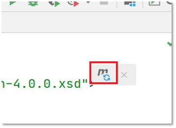

# Maven

官网：http://maven.apache.org/ 

## 1 Maven简介

Maven是专门用于管理和构建Java项目的工具，它的主要功能有：

* 提供了一套标准化的项目结构

* 提供了一套标准化的构建流程（编译，测试，打包，发布……）

* 提供了一套依赖管理机制

> 构建就是以我们编写的 Java 代码、框架配置文件、国际化等其他资源文件、JSP 页 面和图片等静态资源作为“原材料”，去“生产”出一个可以运行的项目的过程。

**标准化的项目结构：**

项目结构我们都知道，每一个开发工具（IDE）都有自己不同的项目结构，它们互相之间不通用。而Maven提供了一套标准化的项目结构，所有的IDE使用Maven构建的项目完全一样，所以IDE创建的Maven项目可以通用。如下图右边就是Maven构建的项目结构。


**标准化的构建流程：**


如上图所示我们开发了一套系统，代码需要进行编译、测试、打包、发布，这些操作如果需要反复进行就显得特别麻烦，而Maven提供了一套简单的命令来完成项目构建。

**依赖管理：**

依赖管理其实就是管理你项目所依赖的第三方资源（jar包、插件）。没有Maven的情况就需要去网上下载对应的依赖包，复制到项目中，还要将jar包加入工作环境这一系列的操作。如下图所示


而Maven使用标准的 坐标配置来管理各种依赖，只需要简单的配置就可以完成依赖管理。


如上图右边所示就是mysql驱动包的坐标，在项目中只需要写这段配置，其他都不需要我们担心，Maven都帮我们进行操作了。

### 1.1 Maven配置

- 配置镜像仓库

  ```xml
  <!--
  	在conf目录下找到setting.xml文件
   	在setting文件中找到<mirrors></mirrors>选项加入信息
  -->
  <mirror>
  	<id>aliyunmaven</id>
  	<mirrorOf>*</mirrorOf>
  	<name>阿里云公共仓库</name>
  	<url>https://maven.aliyun.com/repository/public</url>
  </mirror>
  ```

  > 注意：如果使用自定义的Maven仓库，Maven仓库文件夹不能包含Maven中的关键字
  >
  > Maven中的部分关键字
  >
  > mvn
  >
  > Project
  > POM
  > groupId
  > Artifact
  > dependencies
  > dependency
  > dependencyManagement
  > repository
  > optional
  > scope

- 配置jdk版本

  ```xml
  <!-- 在<profiles></profiles>中添加如下信息 -->
  <profile>  
  	<id>jdk-11.0.15.1</id>  
  	<activation>  
  		<activeByDefault>true</activeByDefault>  
  		<jdk>11</jdk>  
  	</activation>
  	<properties>
  		<project.build.sourceEncoding>UTF-8</project.build.sourceEncoding>
  		<maven.compiler.source>11</maven.compiler.source>  
  		<maven.compiler.target>11</maven.compiler.target>   
  	</properties>   
  </profile>
  ```

- 配置本地maven仓库

  ```xml
  <!-- 找到<settings></settings>下的<localRepository>标签 -->
  <localRepository>C:\Software\apache-maven-3.6.2\mvn_repo</localRepository>
  ```

> 注意：不同的IDEA版本需要使用不同的Maven版本。
>
> ​				- IDEA 2020.1 需要使用Maven3.6.2及以下

### 1.2 Maven模型


- 项目对象模型

  Maven会将一个项目抽象成对象来进行其他操作。Maven会扫描pom文件生成项目对象。

- 依赖管理

  当开发者需要他人开发的jar包时，Maven可以通过坐标的方式来快速导入jar包

- 构建生命周期

  构建Java项目时，Maven提供了多个生命周期来完成不同的构建操作（如编译，测试，发布，打包）。使用插件可以完成构建的不同步骤，最后生成不同的资源

### 1.2 仓库与坐标

#### 1.2.1 坐标

* Maven 中的坐标是资源的唯一标识
* 使用坐标来定义项目或引入项目中需要的依赖

**坐标主要组成**

* groupId：定义当前Maven项目隶属组织名称（通常是域名反写，例如：com.itheima）
* artifactId：定义当前Maven项目名称（通常是模块名称，例如 order-service、goods-service）
* version：定义当前项目版本号

如下图就是使用坐标表示一个项目：


> 注意：
>
> ​	- 上面所说的资源可以是插件、依赖、当前项目。
>
> ​	- 我们的项目如果被其他的项目依赖时，也是需要坐标来引入的。

创建Maven项目时，在项目中使用坐标来指定项目的依赖，那么依赖的jar包到底存储在什么地方呢？其实依赖jar包是存储在我们的本地仓库中。而项目运行时从本地仓库中拿需要的依赖jar包。

#### 1.2.2 仓库分类

* 本地仓库：自己计算机上的一个目录

* 中央仓库：由Maven团队维护的全球唯一的仓库

  * 地址： https://repo1.maven.org/maven2/

* 远程仓库(私服)：一般由公司团队搭建的私有仓库


当项目中使用坐标引入对应依赖jar包后，首先会查找本地仓库中是否有对应的jar包：

* 如果有，则在项目直接引用;

* 如果没有，则去中央仓库中下载对应的jar包到本地仓库。


如果还可以搭建远程仓库，将来jar包的查找顺序则变为：

> 本地仓库 --> 远程仓库--> 中央仓库


## 2 Maven基本使用

### 2.1 Maven 常用命令

| 命令        | 作用                      |
| ----------- | ------------------------- |
| mvn compile | 编译项目，生成classes文件 |
| mvn clean   | 清理classes文件           |
| mvn test    | 测试程序，生成报告        |
| mvn package | 将项目打成jar包           |
| mvn install | 安装到本地仓库            |

> 注意：执行命令时，需要在项目根目录下（能看到src和pom.xml文件夹下）

### 2.2 Maven 生命周期

Maven 构建项目生命周期描述的是一次构建过程经历经历了多少个事件

Maven 对项目构建的生命周期划分为3套：

* clean ：清理工作。

  
* default ：核心工作，例如编译，测试，打包，安装等。

  
* site ： 产生报告，发布站点等。这套声明周期一般不会使用。

  

#### 2.2.1 生命周期

同一套生命周期内，执行后边的命令，前面的所有命令会自动执行。例如默认（default）生命周期如下：


当我们执行 `install`（安装）命令时，它会先执行 `compile`命令，再执行 `test ` 命令，再执行 `package` 命令，最后执行 `install` 命令。

当我们执行 `package` （打包）命令时，它会先执行 `compile` 命令，再执行 `test` 命令，最后执行 `package` 命令。

默认的生命周期也有对应的很多命令，其他的一般都不会使用，我们只关注常用的：


#### 2.2.2 插件

- 插件与生命周期内的阶段绑定，执行一个生命周期时，到达不同的阶段调用不同的插件

- 默认Maven在各个生命周期上绑定有预设的功能

- 可以通过插件来自定义其他功能，插件的网址：[Maven – Available Plugins (apache.org)](https://maven.apache.org/plugins/index.html)

  ```xml
  <!--以resource插件为例-->
  <build>
  	<plugins>
  		<plugin>
  			<groupId>org.apache.maven.plugins</groupId>
  			<artifactId>maven-source-plugin</artifactId>
  			<version>2.2.1</version>
              <!--以下信息解释插件在哪执行，什么时候执行-->
  			<executions>
  				<execution>
                      <!--插件在main文件夹执行-->
  					<goals>
  						<goal>jar</goal>
  					</goals>
                      <!--在什么阶段执行-->
  					<phase>generate-test-resources</phase>
  				</execution>
  			</executions>
  		</plugin>
  	<plugins>
  <build>
  ```

### 2.3 IDEA中使用Maven

#### 配置Maven环境

1. 选择 IDEA中 File --> Settings


2. 搜索 maven 


3. 设置 IDEA 使用本地安装的 Maven，并修改配置文件路径


#### 创建Maven项目

* 创建模块，选择Maven，点击Next

  

* 填写模块名称，坐标信息，点击finish，创建完成

  

  创建好的项目目录结构如下：

  

* 编写 HelloWorld，并运行

#### 导入Maven项目

大家在学习时可能需要看老师的代码，当然也就需要将老师的代码导入到自己的IDEA中。我们可以通过以下步骤进行项目的导入：

* 选择右侧Maven面板，点击 + 号

  

* 选中对应项目的pom.xml文件，双击即可

  

* 如果没有Maven面板，选择

  View --> Appearance --> Tool Window Bars

  


可以通过下图所示进行命令的操作：


### 3.5 依赖管理

#### 3.5.1 依赖配置

依赖搜索网站：https://mvnrepository.com/

**使用坐标引入依赖的步骤：**

* 在项目的 pom.xml 中编写 <dependencies> 标签

* 在 <dependencies> 标签中 使用 <dependency> 引入坐标

* 定义坐标的 groupId，artifactId，version

  

* 点击刷新按钮，使坐标生效

  


**快捷方式导入依赖的坐标：**

每次需要引入jar包，都去对应的网站进行搜索是比较麻烦的，接下来给大家介绍一种快捷引入坐标的方式

* 在 pom.xml 中 按 alt + insert，选择 Dependency

  

* 在弹出的面板中搜索对应坐标，然后双击选中对应坐标

  

* 点击刷新按钮，使坐标生效

  

**自动导入设置：**

上面每次操作都需要点击刷新按钮，让引入的坐标生效。当然我们也可以通过设置让其自动完成

* 选择 IDEA中 File --> Settings

  

* 在弹出的面板中找到 Build Tools

  

* 选择 Any changes，点击 ok 即可生效

#### 3.5.2 依赖传递


- 依赖具有传递性
  - 直接依赖：在当前项目中通过依赖配置建立的依赖关系
  - 间接依赖：如果配置好一个依赖，该依赖依赖于其他资源，则为间接依赖

- 依赖传递冲突问题

  - 路径优先：当依赖中出现相同的资源时，层级越深，优先级越低，层级越浅，优先级越高。
  - 声明优先：当资源在相同层级被依赖时，配置顺序靠前得覆盖配置顺序靠后的
  - 特殊优先：当同一个项目配置了相同依赖的不同版本，后配置的覆盖先配置的

- 隐藏依赖：他人依赖一个资源时，他人无法看到资源的依赖

  ```xml
  <dependency>
  	<groupId>junit</groupId>
  	<artifactId>junit</artifactId>
  	<version>4.12</version>
      <!--默认为FALSE，FALSE看得见，TRUE看不见-->
  	<optional>true</optional>	
  </dependency>
  ```

- 排除依赖：他人依赖一个资源时，他人屏蔽掉资源的依赖

  ```xml
  <dependency>
  	<groupId>junit</groupId>
  	<artifactId>junit</artifactId>
  	<version>4.12</version>
      <!--可以配置多个屏蔽项-->
  	<exclusions>
  		<exclusion>
  			<groupId>org.hamcrest</groupId>
  			<artifactId>hamcrest-core</artifactId>
  		</exclusion>
  	</exclusions>
  </dependency>
  ```

  

#### 3.5.2 依赖范围

通过设置坐标的依赖范围(scope)，可以设置 对应jar包的作用范围：编译环境、测试环境、运行环境。

如下图所示给 `junit` 依赖通过 `scope` 标签指定依赖的作用范围。 那么这个依赖就只能作用在测试环境，其他环境下不能使用。


那么 `scope` 都可以有哪些取值呢？

| **依赖范围** | 编译classpath | 测试classpath | 运行classpath | 例子              |
| ------------ | ------------- | ------------- | ------------- | ----------------- |
| **compile**  | Y             | Y             | Y             | logback           |
| **test**     | -             | Y             | -             | Junit             |
| **provided** | Y             | Y             | -             | servlet-api       |
| **runtime**  | -             | Y             | Y             | jdbc驱动          |
| **system**   | Y             | Y             | -             | 存储在本地的jar包 |

* compile ：作用于编译环境、测试环境、运行环境。
* test ： 作用于测试环境。典型的就是Junit坐标，以后使用Junit时，都会将scope指定为该值
* provided ：作用于编译环境、测试环境。我们后面会学习 `servlet-api` ，在使用它时，必须将 `scope` 设置为该值，不然运行时就会报错
* runtime  ： 作用于测试环境、运行环境。jdbc驱动一般将 `scope` 设置为该值，当然不设置也没有任何问题 

> 注意：
>
> * 如果引入坐标不指定 `scope` 标签时，默认就是 compile  值。大部分jar包都是使用默认值。

##### 依赖范围的传递性

当项目有A依赖时，A依赖有其他依赖。这时依赖范围的传递会决定A依赖的其他依赖会不会在项目中显示。


比如，A依赖配置了compiler，A依赖的依赖配置了runtime。最后A依赖的依赖就是runtime
