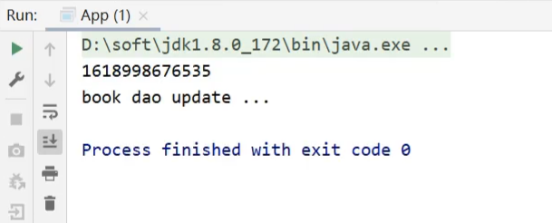
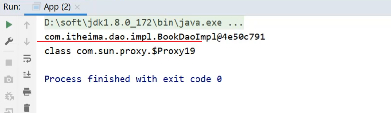
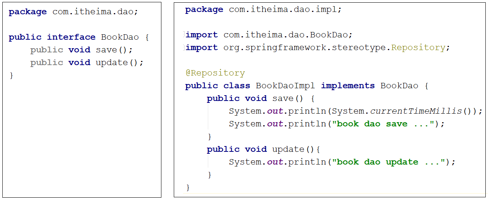
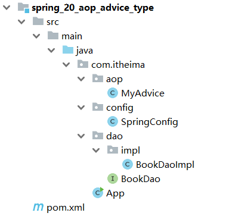
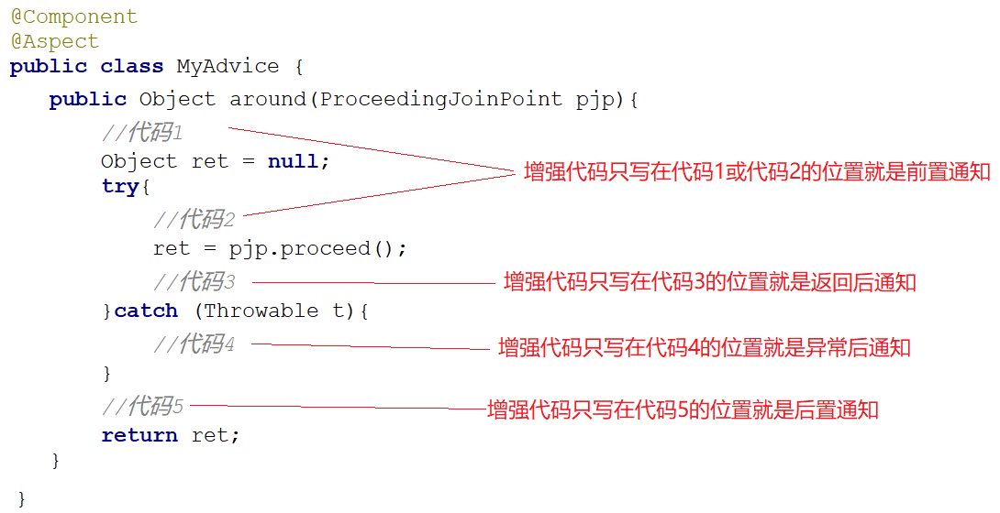
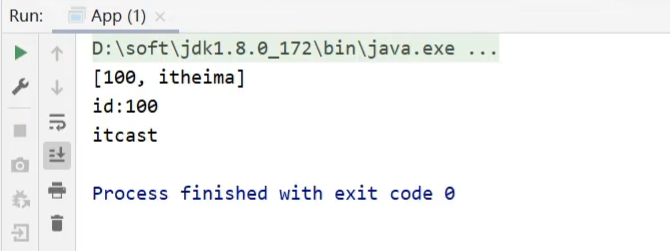
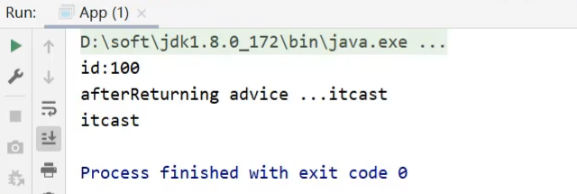
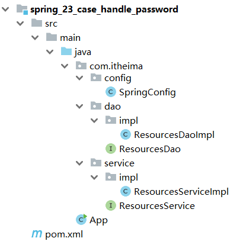

# AOP

## 1 AOP简介

### 1.1 什么是AOP?

AOP(Aspect Oriented Programming)面向切面编程，一种编程范式，指导开发者如何组织程序结构。与其类似的还有面向对象对象编程（OOP）。那么AOP也是一种编程思想，编程思想主要的内容就是指导程序员该如何编写程序，所以它们两个是不同的`编程范式`。

### 1.2 AOP作用

在不惊动原始设计的基础上为其进行功能增强，AOP是在Java动态代理的基础上进行编写。又称无入侵式/无侵入式编程

### 1.3 AOP核心概念

AOP通过如下方式做到功能增强


* 连接点(JoinPoint)：程序执行过程中的任意位置，粒度为执行方法、抛出异常、设置变量等。在SpringAOP中，理解为方法的执行
* 切入点(Pointcut)：匹配连接点的式子
  * 在SpringAOP中，一个切入点可以描述一个具体方法，也可也匹配多个方法
    * 一个具体的方法:如com.itheima.dao包下的BookDao接口中的无形参无返回值的save方法
    * 匹配多个方法:所有的save方法，所有的get开头的方法，所有以Dao结尾的接口中的任意方法，所有带有一个参数的方法
  * 连接点范围要比切入点范围大，是切入点的方法也一定是连接点，但是是连接点的方法就不一定要被增强，所以可能不是切入点。
* 通知(Advice):在切入点处执行的操作，也就是共性功能。在SpringAOP中，功能最终以方法的形式呈现
* 通知类：定义通知的类
* 切面(Aspect):描述通知与切入点的对应关系。

### 1.4 AOP入门案例

1. 需求分析

需求：在方法执行前输出当前系统时间。

对于SpringAOP的开发有两种方式，XML和注解，本案例使用注解

2.  大概步骤
    1.  导入坐标(pom.xml)
    2.  制作连接点(原始操作，Dao接口与实现类)
    3.  制作共性功能(通知类与通知)
    4.  定义切入点
    5.  绑定切入点与通知关系(切面)


3. 环境准备

* 创建一个Maven项目

* pom.xml添加Spring依赖

  ```xml
  <dependencies>
      <dependency>
          <groupId>org.springframework</groupId>
          <artifactId>spring-context</artifactId>
          <version>5.2.10.RELEASE</version>
      </dependency>
      
      <dependency>
     	 	<groupId>org.aspectj</groupId>
      	<artifactId>aspectjweaver</artifactId>
      	<version>1.9.4</version>
  	</dependency>
  </dependencies>
  ```

  > 因为`spring-context`中已经导入了`spring-aop`,所以不需要再单独导入`spring-aop`
  >
  > 导入AspectJ的jar包,AspectJ是AOP思想的一个具体实现，Spring有自己的AOP实现，但是相比于AspectJ来说比较麻烦，所以我们直接采用Spring整合ApsectJ的方式进行AOP开发。

* 添加BookDao和BookDaoImpl类

  ```java
  public interface BookDao {
      public void save();
      public void update();
  }
  
  @Repository
  public class BookDaoImpl implements BookDao {
  
      public void save() {
          System.out.println(System.currentTimeMillis());
          System.out.println("book dao save ...");
      }
  
      public void update(){
          System.out.println("book dao update ...");
      }
  }
  ```

* 创建Spring的配置类

  ```java
  @Configuration
  @ComponentScan("com.itheima")
  public class SpringConfig {
  }
  ```

* 编写App运行类

  ```java
  public class App {
      public static void main(String[] args) {
          ApplicationContext ctx = new AnnotationConfigApplicationContext(SpringConfig.class);
          BookDao bookDao = ctx.getBean(BookDao.class);
          bookDao.save();
      }
  }
  ```

最终创建好的项目结构如下:


> 到这里为止，连接点和导包已经完成

4. 定义通知类和通知

通知就是将共性功能抽取出来后形成的方法，共性功能指的就是当前系统时间的打印。

```java
public class MyAdvice {
    public void method(){
        System.out.println(System.currentTimeMillis());
    }
}
```

类名和方法名没有要求，可以任意。

5. 定义切入点

BookDaoImpl中有两个方法，分别是save和update，我们要增强的是update方法，该如何定义呢?

```java
public class MyAdvice {
    @Pointcut("execution(void com.itheima.dao.BookDao.update())")
    private void pt(){}
    public void method(){
        System.out.println(System.currentTimeMillis());
    }
}
```

**说明:**

* 切入点定义依托一个不具有实际意义的方法进行，即无参数、无返回值、方法体无实际逻辑。

6. 制作切面

切面是用来描述通知和切入点之间的关系

```java
@Component
@Aspect
public class MyAdvice {
    @Pointcut("execution(void com.itheima.dao.BookDao.update())")
    private void pt(){}
    
    @Before("pt()")
    public void method(){
        System.out.println(System.currentTimeMillis());
    }
}
```

绑定切入点与通知关系，并指定通知添加到原始连接点的具体执行位置。在通知类上加上`@Component`和`@Aspect`注解


> @Before翻译过来是之前，也就是说通知会在切入点方法执行之前执行，除此之前还有其他四种类型。

7. 开启注解格式AOP功能

```java
@Configuration
@ComponentScan("com.itheima")
@EnableAspectJAutoProxy
public class SpringConfig {
}
```

8. 运行程序

```java
public class App {
    public static void main(String[] args) {
        ApplicationContext ctx = new AnnotationConfigApplicationContext(SpringConfig.class);
        BookDao bookDao = ctx.getBean(BookDao.class);
        bookDao.update();
    }
}
```

看到在执行update方法之前打印了系统时间戳，说明对原始方法进行了增强，AOP编程成功。



### 1.5 小结

| 名称 | @EnableAspectJAutoProxy |
| ---- | ----------------------- |
| 类型 | 配置类注解              |
| 位置 | 配置类定义上方          |
| 作用 | 开启注解格式AOP功能     |

| 名称 | @Aspect               |
| ---- | --------------------- |
| 类型 | 类注解                |
| 位置 | 切面类定义上方        |
| 作用 | 设置当前类为AOP切面类 |

| 名称 | @Pointcut                   |
| ---- | --------------------------- |
| 类型 | 方法注解                    |
| 位置 | 切入点方法定义上方          |
| 作用 | 设置切入点方法              |
| 属性 | value（默认）：切入点表达式 |

| 名称 | @Before                                                      |
| ---- | ------------------------------------------------------------ |
| 类型 | 方法注解                                                     |
| 位置 | 通知方法定义上方                                             |
| 作用 | 设置当前通知方法与切入点之间的绑定关系，当前通知方法在原始切入点方法前运行 |

## 2 工作流程

### 2.1 AOP工作流程

由于AOP是基于Spring容器管理的bean做的增强，所以整个工作过程需要从Spring加载bean说起:

1. Spring容器启动，此时bean对象还没有创建成功

2. 读取所有切面配置中的切入点
   - 下面这个例子中有两个切入点的配置，但是第一个`ptx()`并没有被使用，所以不会被读取。


3. 初始化bean
   1. 判定bean对应的类中的方法是否匹配到任意切入点
   2. 要被实例化bean对象的类中的方法和切入点进行匹配


* 匹配失败，创建原始对象,如`UserDao`
  * 匹配失败说明不需要增强，直接调用原始对象的方法即可。
* 匹配成功，创建原始对象（目标对象）的代理对象,如:`BookDao`
  * 匹配成功说明需要对其进行增强
  * 对哪个类做增强，这个类对应的对象就叫做目标对象
  * 因为要对目标对象进行功能增强，而采用的技术是动态代理，所以会为其创建一个代理对象
  * 最终运行的是代理对象的方法，在该方法中会对原始方法进行功能增强

4. 获取bean执行方法

* 获取的bean是原始对象时，调用方法并执行，完成操作
* 获取的bean是代理对象时，根据代理对象的运行模式运行原始方法与增强的内容，完成操作

### 2.2 验证容器中是否为代理对象

1. 修改App类,获取类的类型

```java
public class App {
    public static void main(String[] args) {
        ApplicationContext ctx = new AnnotationConfigApplicationContext(SpringConfig.class);
        BookDao bookDao = ctx.getBean(BookDao.class);
        System.out.println(bookDao);
        System.out.println(bookDao.getClass());
    }
}
```

2. 修改MyAdvice类，不增强

```java
@Component
@Aspect
public class MyAdvice {
    @Pointcut("execution(void com.itheima.dao.BookDao.update())")
    private void pt(){}
    
    
    public void method()
    {
        System.out.println(System.currentTimeMillis());
    }
}
```

3. 运行程序


4. 修改MyAdvice类，增强

```java
@Component
@Aspect
public class MyAdvice {
    @Pointcut("execution(void com.itheima.dao.BookDao.update())")
    private void pt(){}
    
    @Before("pt()")
    public void method(){
        System.out.println(System.currentTimeMillis());
    }
}
```

5. 运行程序



直接打印对象走的是对象的toString方法，不管是不是代理对象打印的结果都是一样的，原因是内部对toString方法进行了重写。

### 2.3 AOP核心概念

* 目标对象(Target)：原始功能去掉共性功能对应的类产生的对象，这种对象是无法直接完成最终工作的
* 代理(Proxy)：目标对象无法直接完成工作，需要对其进行功能回填，通过原始对象的代理对象实现

上面这两个概念比较抽象，简单来说：

- 目标对象就是要增强的类对应的对象，也叫原始对象，不能说它不能运行，只能说它在运行的过程中对于要增强的内容是缺失的。

- SpringAOP是在不改变原有设计的前提下对其进行增强的，它的底层采用的是代理模式实现的，所以要对原始对象进行增强。

## 3 AOP配置管理

### 3.1 AOP切入点表达式

前面的案例中，有涉及到如下内容:


对于AOP中切入点表达式，我们总共会学习三个内容，分别是`语法格式`、`通配符`和`书写技巧`。

#### 3.1.1 语法格式

首先我们先要明确两个概念:

* 切入点:要进行增强的方法
* 切入点表达式:要进行增强的方法的描述方式

对于切入点的描述，我们其实是有两中方式的，先来看下前面的例子


描述方式一：执行com.itheima.dao包下的BookDao接口中的无参数update方法

```java
execution(void com.itheima.dao.BookDao.update())
```

描述方式二：执行com.itheima.dao.impl包下的BookDaoImpl类中的无参数update方法

```
execution(void com.itheima.dao.impl.BookDaoImpl.update())
```

因为调用接口方法的时候最终运行的还是其实现类的方法，所以上面两种描述方式都是可以的。

对于切入点表达式的语法为:

```java
动作关键字(访问修饰符 返回值 包名.类/接口名.方法名(参数) 异常名）
//例子：      
execution(public User com.itheima.service.UserService.findById(int))
```

* execution：动作关键字，描述切入点的行为动作，例如execution表示执行到指定切入点
* public：访问修饰符,还可以是public，private等，可以省略
* User：返回值，写返回值类型
* com.itheima.service：包名，多级包使用点连接
* UserService:类/接口名称
* findById：方法名
* int:参数，直接写参数的类型，多个类型用逗号隔开
* 异常名：方法定义中抛出指定异常，可以省略

#### 3.1.2 通配符

我们使用通配符描述切入点，主要的目的就是简化之前的配置，具体都有哪些通配符可以使用?

* `*`:单个独立的任意符号，可以独立出现，也可以作为前缀或者后缀的匹配符出现

  ```java
  execution（public * com.itheima.*.UserService.find*(*))
  ```

  匹配com.itheima包下的任意包中的UserService类或接口中所有find开头的带有一个参数的方法

* `..`：多个连续的任意符号，可以独立出现，常用于简化包名与参数的书写

  ```
  execution（public User com..UserService.findById(..))
  ```

  匹配com包下的任意包中的UserService类或接口中所有名称为findById的方法

* `+`：专用于匹配子类类型

  ```
  execution(* *..*Service+.*(..))
  ```

  这个使用率较低，描述子类的，咱们做JavaEE开发，继承机会就一次，使用都很慎重，所以很少用它。*Service+，表示所有以Service结尾的接口的子类。

接下来，我们把案例中使用到的切入点表达式来分析下:



```java
execution(void com.itheima.dao.BookDao.update())
匹配接口，能匹配到
execution(void com.itheima.dao.impl.BookDaoImpl.update())
匹配实现类，能匹配到
execution(* com.itheima.dao.impl.BookDaoImpl.update())
返回值任意，能匹配到
execution(* com.itheima.dao.impl.BookDaoImpl.update(*))
返回值任意，但是update方法必须要有一个参数，无法匹配，要想匹配需要在update接口和实现类添加参数
execution(void com.*.*.*.*.update())
返回值为void,com包下的任意包三层包下的任意类的update方法，匹配到的是实现类，能匹配
execution(void com.*.*.*.update())
返回值为void,com包下的任意两层包下的任意类的update方法，匹配到的是接口，能匹配
execution(void *..update())
返回值为void，方法名是update的任意包下的任意类，能匹配
execution(* *..*(..))
匹配项目中任意类的任意方法，能匹配，但是不建议使用这种方式，影响范围广
execution(* *..u*(..))
匹配项目中任意包任意类下只要以u开头的方法，update方法能满足，能匹配
execution(* *..*e(..))
匹配项目中任意包任意类下只要以e结尾的方法，update和save方法能满足，能匹配
execution(void com..*())
返回值为void，com包下的任意包任意类任意方法，能匹配，*代表的是方法
execution(* com.itheima.*.*Service.find*(..))
将项目中所有业务层方法的以find开头的方法匹配
execution(* com.itheima.*.*Service.save*(..))
将项目中所有业务层方法的以save开头的方法匹配
```

后面两种更符合我们平常切入点表达式的编写规则

#### 3.1.3 书写技巧

对于切入点表达式的编写其实是很灵活的，那么在编写的时候，有没有什么好的技巧让我们用用:

- 所有代码按照标准规范开发，否则以下技巧全部失效
- 描述切入点**通常描述接口**，而不描述实现类,如果描述到实现类，就出现紧耦合了
- 访问控制修饰符针对接口开发均采用public描述（**可省略访问控制修饰符描述**）
- 返回值类型对于增删改类使用精准类型加速匹配，对于查询类使用\*通配快速描述
- **包名**书写**尽量不使用..匹配**，效率过低，常用\*做单个包描述匹配，或精准匹配
- **接口名/类名**书写名称与模块相关的**采用\*匹配**，例如UserService书写成\*Service，绑定业务层接口名
- **方法名**书写以**动词**进行**精准匹配**，名词采用*匹配，例如getById书写成getBy*,selectAll书写成selectAll
- 参数规则较为复杂，根据业务方法灵活调整
- 通常**不使用异常**作为**匹配**规则

### 3.2 AOP通知类型

前面的案例中，有涉及到如下内容:


它所代表的含义是将`通知`添加到`切入点`方法执行的前面。

除了这个注解外，还有没有其他的注解，换个问题就是除了可以在前面加，能不能在其他的地方加?

#### 3.2.1 类型介绍

AOP提供了5种通知类型:

- 前置通知
- 后置通知
- **环绕通知(重点)**
- 返回后通知(了解)
- 抛出异常后通知(了解)

#### 3.2.2 通知使用

1. 环境准备

```xml
<dependencies>
    <dependency>
        <groupId>org.springframework</groupId>
        <artifactId>spring-context</artifactId>
        <version>5.2.10.RELEASE</version>
    </dependency>
    <dependency>
      <groupId>org.aspectj</groupId>
      <artifactId>aspectjweaver</artifactId>
      <version>1.9.4</version>
    </dependency>
</dependencies>
```

添加BookDao和BookDaoImpl类

```java
public interface BookDao {
    public void update();
    public int select();
}

@Repository
public class BookDaoImpl implements BookDao {
    public void update(){
        System.out.println("book dao update ...");
    }
    public int select() {
        System.out.println("book dao select is running ...");
        return 100;
    }
}
```

创建Spring的配置类

```java
@Configuration
@ComponentScan("com.itheima")
@EnableAspectJAutoProxy
public class SpringConfig {
}
```

创建通知类

```java
@Component
@Aspect
public class MyAdvice {
    @Pointcut("execution(void com.itheima.dao.BookDao.update())")
    private void pt(){}

    public void before() {
        System.out.println("before advice ...");
    }

    public void after() {
        System.out.println("after advice ...");
    }

    public void around(){
        System.out.println("around before advice ...");
        System.out.println("around after advice ...");
    }

    public void afterReturning() {
        System.out.println("afterReturning advice ...");
    }
    
    public void afterThrowing() {
        System.out.println("afterThrowing advice ...");
    }
}
```

编写App运行类

```java
public class App {
    public static void main(String[] args) {
        ApplicationContext ctx = new AnnotationConfigApplicationContext(SpringConfig.class);
        BookDao bookDao = ctx.getBean(BookDao.class);
        bookDao.update();
    }
}
```

最终创建好的项目结构如下:



##### 前置通知

在原始方法执行之前进行处理

```java
@Component
@Aspect
public class MyAdvice {
    @Pointcut("execution(void com.itheima.dao.BookDao.update())")
    private void pt(){}
    
    @Before("pt()")
    //此处也可以写成 @Before("MyAdvice.pt()"),不建议
    public void before() {
        System.out.println("before advice ...");
    }
}
```


##### 后置通知

在原始方法执行之后进行处理

```java
@Component
@Aspect
public class MyAdvice {
    @Pointcut("execution(void com.itheima.dao.BookDao.update())")
    private void pt(){}
    
    @Before("pt()")
    public void before() {
        System.out.println("before advice ...");
    }
    @After("pt()")
    public void after() {
        System.out.println("after advice ...");
    }
}
```


##### 环绕通知

**基本使用**

可以在原始方法之前之后处理

```java
@Component
@Aspect
public class MyAdvice {
    @Pointcut("execution(void com.itheima.dao.BookDao.update())")
    private void pt(){}
    
    @Around("pt()")
    public void around(){
        System.out.println("around before advice ...");
        System.out.println("around after advice ...");
    }
}
```


运行结果中，通知的内容打印出来，但是原始方法的内容却没有被执行。

因为环绕通知需要在原始方法的前后进行增强，所以环绕通知就必须要能对原始操作进行调用，具体如何实现?

```java
@Component
@Aspect
public class MyAdvice {
    @Pointcut("execution(void com.itheima.dao.BookDao.update())")
    private void pt(){}
    
    @Around("pt()")
    public void around(ProceedingJoinPoint pjp) throws Throwable
    {
        System.out.println("around before advice ...");
        //表示对原始操作的调用
        pjp.proceed();
        System.out.println("around after advice ...");
    }
}
```

> 注意：如果环绕通知有返回值，和动态代理一样，采用Object类型返回。可以对返回结果进行更改

```java
@Component
@Aspect
public class MyAdvice {
    @Pointcut("execution(void com.itheima.dao.BookDao.update())")
    private void pt(){}
    
    @Around("pt()")
    public Object around(ProceedingJoinPoint pjp) throws Throwable
    {
        System.out.println("around before advice ...");
        //表示对原始操作的调用
        Object rs = pjp.proceed();
        System.out.println("around after advice ...");
        return rs;
    }
}
```

##### 返回后通知

返回后通知是需要在原始方法正常执行后才会被执行，如果原始方法执行的过程中出现了异常，那么返回后通知是不会被执行。后置通知是不管原始方法有没有抛出异常都会被执行。

```java
@Component
@Aspect
public class MyAdvice {
    @Pointcut("execution(void com.itheima.dao.BookDao.update())")
    private void pt(){}
    
    @Pointcut("execution(int com.itheima.dao.BookDao.select())")
    private void pt2(){}
    
    @AfterReturning("pt2()")
    public void afterReturning() {
        System.out.println("afterReturning advice ...");
    }
}
```


##### 异常后通知

异常后通知是在需要原始方法抛出异常后执行。如果没有抛异常，异常后通知将不会被执行。

```java
@Component
@Aspect
public class MyAdvice {
    @Pointcut("execution(void com.itheima.dao.BookDao.update())")
    private void pt(){}
    
    @Pointcut("execution(int com.itheima.dao.BookDao.select())")
    private void pt2(){}
    
    @AfterReturning("pt2()")
    public void afterThrowing() {
        System.out.println("afterThrowing advice ...");
    }
}
```


##### 环绕通知实现其他通知

因为环绕通知是可以控制原始方法执行的，所以我们把增强的代码写在调用原始方法的不同位置就可以实现不同的通知类型的功能，如:



**环绕通知注意事项**

1. 环绕通知必须依赖形参ProceedingJoinPoint才能实现对原始方法的调用，进而实现原始方法调用前后同时添加通知
2. 通知中如果未使用ProceedingJoinPoint对原始方法进行调用将跳过原始方法的执行
3. 对原始方法的调用可以不接收返回值，通知方法设置成void即可，如果接收返回值，最好设定为Object类型
4. 原始方法的返回值如果是void类型，通知方法的返回值类型可以设置成void,也可以设置成Object
5. 由于无法预知原始方法运行后是否会抛出异常，因此环绕通知方法必须要处理Throwable异常

##### 通知类型总结

@After

| 名称 | @After                                                       |
| ---- | ------------------------------------------------------------ |
| 类型 | 方法注解                                                     |
| 位置 | 通知方法定义上方                                             |
| 作用 | 设置当前通知方法与切入点之间的绑定关系，当前通知方法在原始切入点方法后运行 |

@AfterReturning  

| 名称 | @AfterReturning                                              |
| ---- | ------------------------------------------------------------ |
| 类型 | 方法注解                                                     |
| 位置 | 通知方法定义上方                                             |
| 作用 | 设置当前通知方法与切入点之间绑定关系，当前通知方法在原始切入点方法正常执行完毕后执行 |

@AfterThrowing  

| 名称 | @AfterThrowing                                               |
| ---- | ------------------------------------------------------------ |
| 类型 | 方法注解                                                     |
| 位置 | 通知方法定义上方                                             |
| 作用 | 设置当前通知方法与切入点之间绑定关系，当前通知方法在原始切入点方法运行抛出异常后执行 |

@Around

| 名称 | @Around                                                      |
| ---- | ------------------------------------------------------------ |
| 类型 | 方法注解                                                     |
| 位置 | 通知方法定义上方                                             |
| 作用 | 设置当前通知方法与切入点之间的绑定关系，当前通知方法在原始切入点方法前后运行 |

#### 3.2.3 业务层接口执行效率(案例)

1. 需求：任意业务层接口执行均可显示其执行效率（执行时长）

2. 具体实现的思路:

   1. 开始执行方法之前记录一个时间

   2. 执行方法

   3. 执行完方法之后记录一个时间

   4. 用后一个时间减去前一个时间的差值，就是我们需要的结果。

   5. 所以要在方法执行的前后添加业务，经过分析我们将采用`环绕通知`。

      > 原始方法如果只执行一次，时间太快，两个时间差可能为0，所以我们要执行万次来计算时间差。

3. 环境准备
   - 创建一个Maven项目
   - pom.xml添加Spring依赖
   - 

```xml
<dependencies>
    
    <!--Spring包-->
    <dependency>
      <groupId>org.springframework</groupId>
      <artifactId>spring-test</artifactId>
      <version>5.2.10.RELEASE</version>
    </dependency>
    
    <!--AOP实现-->
    <dependency>
      <groupId>org.aspectj</groupId>
      <artifactId>aspectjweaver</artifactId>
      <version>1.9.4</version>
    </dependency>
    
    <!--MySQL连接-->
    <dependency>
      <groupId>mysql</groupId>
      <artifactId>mysql-connector-java</artifactId>
      <version>5.1.47</version>
    </dependency>
    
    <!--Durid-->
    <dependency>
      <groupId>com.alibaba</groupId>
      <artifactId>druid</artifactId>
      <version>1.1.16</version>
    </dependency>
    
    <!--mybatis-->
    <dependency>
      <groupId>org.mybatis</groupId>
      <artifactId>mybatis</artifactId>
      <version>3.5.6</version>
    </dependency>
    
    <!--mybatis整合spring-->
    <dependency>
      <groupId>org.mybatis</groupId>
      <artifactId>mybatis-spring</artifactId>
      <version>1.3.0</version>
    </dependency>
    
    <dependency>
      <groupId>junit</groupId>
      <artifactId>junit</artifactId>
      <version>4.12</version>
      <scope>test</scope>
    </dependency>
    
  </dependencies>
```

- - 添加AccountService、AccountServiceImpl、AccountDao与Account类

```java
public interface AccountService {
    void save(Account account);
    void delete(Integer id);
    void update(Account account);
    List<Account> findAll();
    Account findById(Integer id);
}

@Service
public class AccountServiceImpl implements AccountService {

    @Autowired
    private AccountDao accountDao;

    public void save(Account account) {
        accountDao.save(account);
    }

    public void update(Account account){
        accountDao.update(account);
    }

    public void delete(Integer id) {
        accountDao.delete(id);
    }

    public Account findById(Integer id) {
        return accountDao.findById(id);
    }

    public List<Account> findAll() {
        return accountDao.findAll();
    }
}
public interface AccountDao {

    @Insert("insert into tbl_account(name,money)values(#{name},#{money})")
    void save(Account account);

    @Delete("delete from tbl_account where id = #{id} ")
    void delete(Integer id);

    @Update("update tbl_account set name = #{name} , money = #{money} where id = #{id} ")
    void update(Account account);

    @Select("select * from tbl_account")
    List<Account> findAll();

    @Select("select * from tbl_account where id = #{id} ")
    Account findById(Integer id);
}

public class Account implements Serializable {

    private Integer id;
    private String name;
    private Double money;
    //setter..getter..toString方法省略
}
```

- resources下提供一个jdbc.properties

  ```properties
  jdbc.driver=com.mysql.jdbc.Driver
  jdbc.url=jdbc:mysql://localhost:3306/spring_db?useSSL=false
  jdbc.username=root
  jdbc.password=root
  ```

- 创建相关配置类

  ```java
  //Spring配置类:SpringConfig
  @Configuration
  @ComponentScan("com.itheima")
  @PropertySource("classpath:jdbc.properties")
  @Import({JdbcConfig.class,MybatisConfig.class})
  public class SpringConfig {
  }
  //JdbcConfig配置类
  public class JdbcConfig {
      @Value("${jdbc.driver}")
      private String driver;
      @Value("${jdbc.url}")
      private String url;
      @Value("${jdbc.username}")
      private String userName;
      @Value("${jdbc.password}")
      private String password;
  
      @Bean
      public DataSource dataSource(){
          DruidDataSource ds = new DruidDataSource();
          ds.setDriverClassName(driver);
          ds.setUrl(url);
          ds.setUsername(userName);
          ds.setPassword(password);
          return ds;
      }
  }
  //MybatisConfig配置类
  public class MybatisConfig {
  
      @Bean
      public SqlSessionFactoryBean sqlSessionFactory(DataSource dataSource){
          SqlSessionFactoryBean ssfb = new SqlSessionFactoryBean();
          ssfb.setTypeAliasesPackage("com.itheima.domain");
          ssfb.setDataSource(dataSource);
          return ssfb;
      }
  
      @Bean
      public MapperScannerConfigurer mapperScannerConfigurer(){
          MapperScannerConfigurer msc = new MapperScannerConfigurer();
          msc.setBasePackage("com.itheima.dao");
          return msc;
      }
  }
  
  ```

- 编写Spring整合Junit的测试类

  ```java
  @RunWith(SpringJUnit4ClassRunner.class)
  @ContextConfiguration(classes = SpringConfig.class)
  public class AccountServiceTestCase {
      @Autowired
      private AccountService accountService;
  
      @Test
      public void testFindById(){
          Account ac = accountService.findById(2);
      }
  
      @Test
      public void testFindAll(){
          List<Account> all = accountService.findAll();
      }
  
  }
  ```

最终创建好的项目结构如下:


#### 3.3.3 功能开发

##### 步骤1:开启SpringAOP的注解功能

在Spring的主配置文件SpringConfig类中添加注解

```java
@EnableAspectJAutoProxy
```

##### 步骤2:创建AOP的通知类

* 该类要被Spring管理，需要添加@Component

* 要标识该类是一个AOP的切面类，需要添加@Aspect
* 配置切入点表达式，需要添加一个方法，并添加@Pointcut

```java
@Component
@Aspect
public class ProjectAdvice {
    //配置业务层的所有方法
    @Pointcut("execution(* com.itheima.service.*Service.*(..))")
    private void servicePt(){}
    
    public void runSpeed(){
        
    } 
}
```

##### 步骤3:添加环绕通知

在runSpeed()方法上添加@Around

```java
@Component
@Aspect
public class ProjectAdvice {
    //配置业务层的所有方法
    @Pointcut("execution(* com.itheima.service.*Service.*(..))")
    private void servicePt(){}
    //@Around("ProjectAdvice.servicePt()") 可以简写为下面的方式
    @Around("servicePt()")
    public Object runSpeed(ProceedingJoinPoint pjp){
        Object ret = pjp.proceed();
        return ret;
    } 
}
```

**注意:**目前并没有做任何增强

##### 步骤4:完成核心业务，记录万次执行的时间

```java
@Component
@Aspect
public class ProjectAdvice {
    //配置业务层的所有方法
    @Pointcut("execution(* com.itheima.service.*Service.*(..))")
    private void servicePt(){}
    //@Around("ProjectAdvice.servicePt()") 可以简写为下面的方式
    @Around("servicePt()")
    public void runSpeed(ProceedingJoinPoint pjp){
        
        long start = System.currentTimeMillis();
        for (int i = 0; i < 10000; i++) {
           pjp.proceed();
        }
        long end = System.currentTimeMillis();
        System.out.println("业务层接口万次执行时间: "+(end-start)+"ms");
    } 
}
```

##### 步骤5:运行单元测试类


**注意:**因为程序每次执行的时长是不一样的，所以运行多次最终的结果是不一样的。

##### 步骤6:程序优化

目前程序所面临的问题是，多个方法一起执行测试的时候，控制台都打印的是:

`业务层接口万次执行时间:xxxms`

我们没有办法区分到底是哪个接口的哪个方法执行的具体时间，具体如何优化?

```java
@Component
@Aspect
public class ProjectAdvice {
    //配置业务层的所有方法
    @Pointcut("execution(* com.itheima.service.*Service.*(..))")
    private void servicePt(){}
    //@Around("ProjectAdvice.servicePt()") 可以简写为下面的方式
    @Around("servicePt()")
    public void runSpeed(ProceedingJoinPoint pjp){
        //获取执行签名信息
        Signature signature = pjp.getSignature();
        //通过签名获取执行操作名称(接口名)
        String className = signature.getDeclaringTypeName();
        //通过签名获取执行操作名称(方法名)
        String methodName = signature.getName();
        
        long start = System.currentTimeMillis();
        for (int i = 0; i < 10000; i++) {
           pjp.proceed();
        }
        long end = System.currentTimeMillis();
        System.out.println("万次执行："+ className+"."+methodName+"---->" +(end-start) + "ms");
    } 
}
```

##### 步骤7:运行单元测试类


==补充说明==

当前测试的接口执行效率仅仅是一个理论值，并不是一次完整的执行过程。

这块只是通过该案例把AOP的使用进行了学习，具体的实际值是有很多因素共同决定的。

### 3.3 AOP通知获取数据

使用AOP时，需要获得原始方法的参数，原始方法参数有如下几种：

- 获取参数
- 获取返回值
- 获取异常

分析五种通知类型的参数，返回值和异常

* 获取切入点方法的参数，所有的通知类型都可以获取参数
  * JoinPoint：适用于前置、后置、返回后、抛出异常后通知
  * ProceedingJoinPoint：适用于环绕通知
* 获取切入点方法返回值，前置和抛出异常后通知是没有返回值，后置通知可有可无，所以不做研究
  * 返回后通知
  * 环绕通知
* 获取切入点方法运行异常信息，前置和返回后通知是不会有，后置通知可有可无，所以不做研究
  * 抛出异常后通知
  * 环绕通知

#### 3.3.1 环境准备

- 创建一个Maven项目

- pom.xml添加Spring依赖

  ```xml
  <dependencies>
      <dependency>
        <groupId>org.springframework</groupId>
        <artifactId>spring-context</artifactId>
        <version>5.2.10.RELEASE</version>
      </dependency>
      <dependency>
        <groupId>org.aspectj</groupId>
        <artifactId>aspectjweaver</artifactId>
        <version>1.9.4</version>
      </dependency>
    </dependencies>
  ```

- 添加BookDao和BookDaoImpl类

  ```java
  public interface BookDao {
      public String findName(int id);
  }
  @Repository
  public class BookDaoImpl implements BookDao {
  
      public String findName(int id) {
          System.out.println("id:"+id);
          return "itcast";
      }
  }
  ```

- 创建Spring的配置类

  ```java
  @Configuration
  @ComponentScan("com.itheima")
  @EnableAspectJAutoProxy
  public class SpringConfig {
  }
  ```

- 编写通知类

  ```java
  @Component
  @Aspect
  public class MyAdvice {
      @Pointcut("execution(* com.itheima.dao.BookDao.findName(..))")
      private void pt(){}
  
      @Before("pt()")
      public void before() {
          System.out.println("before advice ..." );
      }
  
      @After("pt()")
      public void after() {
          System.out.println("after advice ...");
      }
  
      @Around("pt()")
      public Object around() throws Throwable{
          Object ret = pjp.proceed();
          return ret;
      }
      @AfterReturning("pt()")
      public void afterReturning() {
          System.out.println("afterReturning advice ...");
      }
  
  
      @AfterThrowing("pt()")
      public void afterThrowing() {
          System.out.println("afterThrowing advice ...");
      }
  }
  ```

- 编写App运行类

  ```java
  public class App {
      public static void main(String[] args) {
          ApplicationContext ctx = new AnnotationConfigApplicationContext(SpringConfig.class);
          BookDao bookDao = ctx.getBean(BookDao.class);
          String name = bookDao.findName(100);
          System.out.println(name);
      }
  }
  ```

最终创建好的项目结构如下:


#### 3.3.2 获取参数

##### 非环绕通知获取方式

在方法上添加JoinPoint,通过JoinPoint来获取参数

```java
@Component
@Aspect
public class MyAdvice {
    @Pointcut("execution(* com.itheima.dao.BookDao.findName(..))")
    private void pt(){}

    @Before("pt()")
    public void before(JoinPoint jp) 
      
        Object[] args = jp.getArgs();
        System.out.println(Arrays.toString(args));
        System.out.println("before advice ..." );
    }
	//...其他的略
}
```

运行App类，可以获取如下内容，说明参数100已经被获取


> 因为参数的个数是不固定的，所以使用数组更通配些。

如果将参数改成两个会是什么效果?

1. 修改BookDao接口和BookDaoImpl实现类

```java
public interface BookDao {
    public String findName(int id,String password);
}
@Repository
public class BookDaoImpl implements BookDao {

    public String findName(int id,String password) {
        System.out.println("id:"+id);
        return "itcast";
    }
}
```

2. 修改App类，调用方法传入多个参数

```java
public class App {
    public static void main(String[] args) {
        ApplicationContext ctx = new AnnotationConfigApplicationContext(SpringConfig.class);
        BookDao bookDao = ctx.getBean(BookDao.class);
        String name = bookDao.findName(100,"itheima");
        System.out.println(name);
    }
}
```

3. 运行App，查看结果,说明两个参数都已经被获取到


>  使用JoinPoint的方式获取参数适用于前置，后置、返回后、抛出异常后通知

##### 环绕通知获取方式

环绕通知使用的是ProceedingJoinPoint，因为ProceedingJoinPoint是JoinPoint类的子类，所以对于ProceedingJoinPoint类中应该也会有对应的`getArgs()`方法

```java
@Component
@Aspect
public class MyAdvice {
    @Pointcut("execution(* com.itheima.dao.BookDao.findName(..))")
    private void pt(){}

    @Around("pt()")
    public Object around(ProceedingJoinPoint pjp)throws Throwable {
        Object[] args = pjp.getArgs();
        System.out.println(Arrays.toString(args));
        Object ret = pjp.proceed();
        return ret;
    }
	//其他的略
}
```

运行App后查看运行结果，说明ProceedingJoinPoint也是可以通过getArgs()获取参数



**注意事项**

pjp.proceed()方法是有两个构造方法，分别是:


调用无参数的proceed，当原始方法有参数，会在调用的过程中自动传入参数。所以调用这两个方法的任意一个都可以完成功能

但是当需要修改原始方法的参数时，就只能采用带有参数的方法,如下:

```java
@Component
@Aspect
public class MyAdvice {
    @Pointcut("execution(* com.itheima.dao.BookDao.findName(..))")
    private void pt(){}

    @Around("pt()")
    public Object around(ProceedingJoinPoint pjp) throws Throwable
    {
        Object[] args = pjp.getArgs();
        System.out.println(Arrays.toString(args));
        //修改原始方法的参数
        args[0] = 666;
        Object ret = pjp.proceed(args);
        return ret;
    }
	//其他的略
}
```

有了这个特性后，我们就可以在环绕通知中对原始方法的参数进行拦截过滤，避免由于参数的问题导致程序无法正确运行，保证代码的健壮性。

#### 3.3.3 获取返回值

对于返回值，只有返回后和环绕这两个通知类型可以获取，具体如何获取?

##### 环绕通知获取返回值

```java
@Component
@Aspect
public class MyAdvice {
    
    @Pointcut("execution(* com.itheima.dao.BookDao.findName(..))")
    private void pt(){}

    @Around("pt()")
    public Object around(ProceedingJoinPoint pjp) throws Throwable
    {
        Object[] args = pjp.getArgs();
        System.out.println(Arrays.toString(args));
        args[0] = 666;
        Object ret = pjp.proceed(args);
        return ret;
    }
	//其他的略
}
```

上述代码中，`ret`就是方法的返回值，我们是可以直接获取，不但可以获取，如果需要还可以进行修改。

##### 返回后通知获取返回值

1. 给通知加入形参
2. 使用returning标记形参

```java
@Component
@Aspect
public class MyAdvice {
    @Pointcut("execution(* com.itheima.dao.BookDao.findName(..))")
    private void pt(){}

    @AfterReturning(value = "pt()",returning = "ret")
    public void afterReturning(Object ret) 
    {
        System.out.println("afterReturning advice ..."+ret);
    }
	//其他的略
}
```

**注意事项**

- 参数名的问题


- afterReturning方法参数类型的问题

参数类型可以写成String，但是为了能匹配更多的参数类型，建议写成Object类型

- afterReturning方法参数的顺序问题


运行App后查看运行结果，说明返回值已经被获取到



#### 3.3.4 获取异常

对于获取抛出的异常，只有抛出异常后`AfterThrowing`和环绕`Around`这两个通知类型可以获取，具体如何获取?

##### 环绕通知获取异常

这块比较简单，以前我们是抛出异常，现在只需要将异常捕获，就可以获取到原始方法的异常信息了

```java
@Component
@Aspect
public class MyAdvice {
    @Pointcut("execution(* com.itheima.dao.BookDao.findName(..))")
    private void pt(){}

    @Around("pt()")
    public Object around(ProceedingJoinPoint pjp){
        Object[] args = pjp.getArgs();
        System.out.println(Arrays.toString(args));
        args[0] = 666;
        Object ret = null;
        try{
            ret = pjp.proceed(args);
        }catch(Throwable throwable){
            t.printStackTrace();
        }
        return ret;
    }
	//其他的略
}
```

在catch方法中就可以获取到异常，至于获取到异常以后该如何处理，这个就和你的业务需求有关了。

##### 抛出异常后通知获取异常

```java
@Component
@Aspect
public class MyAdvice {
    @Pointcut("execution(* com.itheima.dao.BookDao.findName(..))")
    private void pt(){}

    @AfterThrowing(value = "pt()",throwing = "t")
    public void afterThrowing(Throwable t) 
    {
        System.out.println("afterThrowing advice ..."+t);
    }
	//其他的略
}
```

如何让原始方法抛出异常，方式有很多，

```java
@Repository
public class BookDaoImpl implements BookDao {

    public String findName(int id,String password) {
        System.out.println("id:"+id);
        if(true)
        {
            throw new NullPointerException();
        }
        return "itcast";
    }
}
```

**注意事项**


运行App后，查看控制台，就能看的异常信息被打印到控制台


### 3.5 百度网盘密码数据兼容处理

#### 3.5.1 需求分析

需求: 对百度网盘分享链接输入密码时尾部多输入的空格做兼容处理。


问题描述:

* 点击链接，会提示，请输入提取码，如下图所示

  

* 当我们从别人发给我们的内容中复制提取码的时候，有时候会多复制到一些空格，直接粘贴到百度的提取码输入框

* 但是百度那边记录的提取码是没有空格的

* 这个时候如果不做处理，直接对比的话，就会引发提取码不一致，导致无法访问百度盘上的内容

* 所以多输入一个空格可能会导致项目的功能无法正常使用。

* 此时我们就想能不能将输入的参数先帮用户去掉空格再操作呢?

答案是可以的，我们只需要在业务方法执行之前对所有的输入参数进行格式处理——trim()

* 是对所有的参数都需要去除空格么?

也没有必要，一般只需要针对字符串处理即可。

* 以后涉及到需要去除前后空格的业务可能会有很多，这个去空格的代码是每个业务都写么?

可以考虑使用AOP来统一处理。

* AOP有五种通知类型，该使用哪种呢?

我们的需求是将原始方法的参数处理后在参与原始方法的调用，能做这件事的就只有环绕通知。

综上所述，我们需要考虑两件事:
①：在业务方法执行之前对所有的输入参数进行格式处理——trim()
②：使用处理后的参数调用原始方法——环绕通知中存在对原始方法的调用

#### 3.5.2 环境准备

- 创建一个Maven项目

- pom.xml添加Spring依赖

  ```xml
  <dependencies>
      <dependency>
        <groupId>org.springframework</groupId>
        <artifactId>spring-context</artifactId>
        <version>5.2.10.RELEASE</version>
      </dependency>
      <dependency>
        <groupId>org.aspectj</groupId>
        <artifactId>aspectjweaver</artifactId>
        <version>1.9.4</version>
      </dependency>
    </dependencies>
  ```

- 添加ResourcesService，ResourcesServiceImpl,ResourcesDao和ResourcesDaoImpl类

  ```java
  public interface ResourcesDao {
      boolean readResources(String url, String password);
  }
  @Repository
  public class ResourcesDaoImpl implements ResourcesDao {
      public boolean readResources(String url, String password) {
          //模拟校验
          return password.equals("root");
      }
  }
  public interface ResourcesService {
      public boolean openURL(String url ,String password);
  }
  @Service
  public class ResourcesServiceImpl implements ResourcesService {
      @Autowired
      private ResourcesDao resourcesDao;
  
      public boolean openURL(String url, String password) {
          return resourcesDao.readResources(url,password);
      }
  }
  
  ```

- 创建Spring的配置类

  ```java
  @Configuration
  @ComponentScan("com.itheima")
  public class SpringConfig {
  }
  ```

- 编写App运行类

  ```java
  public class App {
      public static void main(String[] args) {
          ApplicationContext ctx = new AnnotationConfigApplicationContext(SpringConfig.class);
          ResourcesService resourcesService = ctx.getBean(ResourcesService.class);
          boolean flag = resourcesService.openURL("http://pan.baidu.com/haha", "root");
          System.out.println(flag);
      }
  }
  ```

最终创建好的项目结构如下:



现在项目的效果是，当输入密码为"root"控制台打印为true,如果密码改为"root  "控制台打印的是false

需求是使用AOP将参数进行统一处理，不管输入的密码`root`前后包含多少个空格，最终控制台打印的都是true。

#### 3.5.3 具体实现

##### 步骤1:开启SpringAOP的注解功能

```java
@Configuration
@ComponentScan("com.itheima")
@EnableAspectJAutoProxy
public class SpringConfig {
}
```

##### 步骤2:编写通知类

```java
@Component
@Aspect
public class DataAdvice {
    @Pointcut("execution(boolean com.itheima.service.*Service.*(*,*))")
    private void servicePt(){}
    
}
```

##### 步骤3:添加环绕通知

```java
@Component
@Aspect
public class DataAdvice {
    @Pointcut("execution(boolean com.itheima.service.*Service.*(*,*))")
    private void servicePt(){}
    
    @Around("DataAdvice.servicePt()")
    // @Around("servicePt()")这两种写法都对
    public Object trimStr(ProceedingJoinPoint pjp) throws Throwable {
        Object ret = pjp.proceed();
        return ret;
    }
    
}
```

##### 步骤4:完成核心业务，处理参数中的空格

```java
@Component
@Aspect
public class DataAdvice {
    @Pointcut("execution(boolean com.itheima.service.*Service.*(*,*))")
    private void servicePt(){}
    
    @Around("DataAdvice.servicePt()")
    // @Around("servicePt()")这两种写法都对
    public Object trimStr(ProceedingJoinPoint pjp) throws Throwable {
        //获取原始方法的参数
        Object[] args = pjp.getArgs();
        for (int i = 0; i < args.length; i++) {
            //判断参数是不是字符串
            if(args[i].getClass().equals(String.class)){
                args[i] = args[i].toString().trim();
            }
        }
        //将修改后的参数传入到原始方法的执行中
        Object ret = pjp.proceed(args);
        return ret;
    }
    
}
```

##### 步骤5:运行程序

不管密码`root`前后是否加空格，最终控制台打印的都是true

##### 步骤6:优化测试

为了能更好的看出AOP已经生效，我们可以修改ResourcesImpl类，在方法中将密码的长度进行打印

```java
@Repository
public class ResourcesDaoImpl implements ResourcesDao {
    public boolean readResources(String url, String password) {
        System.out.println(password.length());
        //模拟校验
        return password.equals("root");
    }
}
```

再次运行成功，就可以根据最终打印的长度来看看，字符串的空格有没有被去除掉。

**注意：**


## 4 AOP总结

AOP的知识就已经讲解完了，接下来对于AOP的知识进行一个总结:

### 4.1 AOP的核心概念

* 概念：AOP(Aspect Oriented Programming)面向切面编程，一种编程范式
* 作用：在不惊动原始设计的基础上为方法进行功能==增强==
* 核心概念
  * 代理（Proxy）：SpringAOP的核心本质是采用代理模式实现的
  * 连接点（JoinPoint）：在SpringAOP中，理解为任意方法的执行
  * 切入点（Pointcut）：匹配连接点的式子，也是具有共性功能的方法描述
  * 通知（Advice）：若干个方法的共性功能，在切入点处执行，最终体现为一个方法
  * 切面（Aspect）：描述通知与切入点的对应关系
  * 目标对象（Target）：被代理的原始对象成为目标对象

### 4.2 切入点表达式

* 切入点表达式标准格式：动作关键字(访问修饰符  返回值  包名.类/接口名.方法名（参数）异常名)

  ```
  execution(* com.itheima.service.*Service.*(..))
  ```

* 切入点表达式描述通配符：

  * 作用：用于快速描述，范围描述
  * `*`：匹配任意符号（常用）
  * `..` ：匹配多个连续的任意符号（常用）
  * `+`：匹配子类类型

* 切入点表达式书写技巧

  1.按==标准规范==开发
  2.查询操作的返回值建议使用\*匹配
  3.减少使用..的形式描述包
  4.==对接口进行描述==，使用\*表示模块名，例如UserService的匹配描述为*Service
  5.方法名书写保留动词，例如get，使用\*表示名词，例如getById匹配描述为getBy\*
  6.参数根据实际情况灵活调整

### 4.3 五种通知类型

- 前置通知
- 后置通知
- 环绕通知（重点）
  - 环绕通知依赖形参ProceedingJoinPoint才能实现对原始方法的调用
  - 环绕通知可以隔离原始方法的调用执行
  - 环绕通知返回值设置为Object类型
  - 环绕通知中可以对原始方法调用过程中出现的异常进行处理
- 返回后通知
- 抛出异常后通知

### 4.4 通知中获取参数

- 获取切入点方法的参数，所有的通知类型都可以获取参数
  - JoinPoint：适用于前置、后置、返回后、抛出异常后通知
  - ProceedingJoinPoint：适用于环绕通知
- 获取切入点方法返回值，前置和抛出异常后通知是没有返回值，后置通知可有可无，所以不做研究
  - 返回后通知
  - 环绕通知
- 获取切入点方法运行异常信息，前置和返回后通知是不会有，后置通知可有可无，所以不做研究
  - 抛出异常后通知
  - 环绕通知

