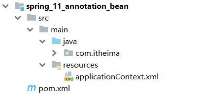
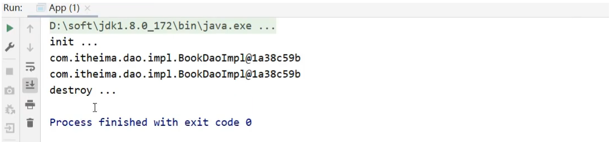
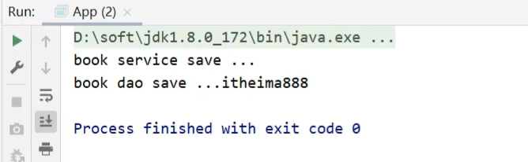

# Spring- 注解开发

## 1 IOC/DI注解开发

使用xml开发比较方便，Spring提供了简单的开发方式：注解开发

Spring注解开发历史：

* 2.0版开始支持注解
* 2.5版注解功能趋于完善
* 3.0版支持纯注解开发

注解开发定义bean用的是2.5版提供的注解，纯注解开发用的是3.0版提供的注解。

### 1.1 环境准备

在学习注解开发之前，先来准备下案例环境:

- 创建一个Maven项目

- pom.xml添加Spring的依赖

  ```xml
  <dependencies>
      <dependency>
          <groupId>org.springframework</groupId>
          <artifactId>spring-context</artifactId>
          <version>5.2.10.RELEASE</version>
      </dependency>
  </dependencies>
  ```

- resources下添加applicationContext.xml

  ```xml
  <?xml version="1.0" encoding="UTF-8"?>
  <beans xmlns="http://www.springframework.org/schema/beans"
         xmlns:xsi="http://www.w3.org/2001/XMLSchema-instance"
         xsi:schemaLocation="
              http://www.springframework.org/schema/beans http://www.springframework.org/schema/beans/spring-beans.xsd">
      <bean id="bookDao" class="com.itheima.dao.impl.BookDaoImpl"/>
  </beans>
  ```

- 添加BookDao、BookDaoImpl、BookService、BookServiceImpl类

  ```java
  public interface BookDao {
      public void save();
  }
  public class BookDaoImpl implements BookDao {
      public void save() {
          System.out.println("book dao save ..." );
      }
  }
  public interface BookService {
      public void save();
  }
  
  public class BookServiceImpl implements BookService {
      public void save() {
          System.out.println("book service save ...");
      }
  }
  
  ```
  
- 创建运行类App

  ```java
  public class App {
      public static void main(String[] args) {
          ApplicationContext ctx = new ClassPathXmlApplicationContext("applicationContext.xml");
          BookDao bookDao = (BookDao) ctx.getBean("bookDao");
          bookDao.save();
      }
  }
  ```

最终创建好的项目结构如下:



### 1.2 注解开发定义bean

1. 删除原XML配置

将配置文件中的`<bean>`标签删除掉

```xml
<bean id="bookDao" class="com.itheima.dao.impl.BookDaoImpl"/>
```

2. Dao上添加注解

在BookDaoImpl类上添加`@Component`注解

```java
@Component("bookDao")
public class BookDaoImpl implements BookDao {
    public void save() {
        System.out.println("book dao save ..." );
    }
}
```

注意:@Component注解不可以添加在接口上，因为接口是无法创建对象的。==

XML与注解配置的对应关系:


3. 配置Spring的注解包扫描

为了让Spring框架能够扫描到写在类上的注解，需要在配置文件上进行包扫描

```xml
<?xml version="1.0" encoding="UTF-8"?>
<beans xmlns="http://www.springframework.org/schema/beans"
       xmlns:xsi="http://www.w3.org/2001/XMLSchema-instance"
       xsi:schemaLocation="
            http://www.springframework.org/schema/beans http://www.springframework.org/schema/beans/spring-beans.xsd">
    <context:component-scan base-package="com.itheima"/>
</beans>
```

**说明:**

component-scan

* component:组件,Spring将管理的bean视作自己的一个组件
* scan:扫描

base-package指定Spring框架扫描的包路径，它会扫描指定包及其子包中的所有类上的注解。

* 包路径越多[如:com.itheima.dao.impl]，扫描的范围越小速度越快
* 包路径越少[如:com.itheima],扫描的范围越大速度越慢
* 一般扫描到项目的组织名称即Maven的groupId下[如:com.itheima]即可。

4. 运行程序

运行`App`类查看打印结果


5. Service上添加注解

在BookServiceImpl类上也添加`@Component`交给Spring框架管理

```java
@Component
public class BookServiceImpl implements BookService {
    private BookDao bookDao;

    public void setBookDao(BookDao bookDao) {
        this.bookDao = bookDao;
    }

    public void save() {
        System.out.println("book service save ...");
        bookDao.save();
    }
}
```

6. 运行程序

在App类中，从IOC容器中获取BookServiceImpl对应的bean对象，打印

```java
public class App {
    public static void main(String[] args) {
        ApplicationContext ctx = new ClassPathXmlApplicationContext("applicationContext.xml");
        BookDao bookDao = (BookDao) ctx.getBean("bookDao");
        System.out.println(bookDao);
        //按类型获取bean
        BookService bookService = ctx.getBean(BookService.class);
        System.out.println(bookService);
    }
}
```

打印观察结果，两个bean对象都已经打印到控制台


**总结**

| 名称 | @Component/@Controller/@Service/@Repository |
| ---- | ------------------------------------------- |
| 类型 | 类注解                                      |
| 位置 | 类定义上方                                  |
| 作用 | 设置该类为spring管理的bean                  |
| 属性 | value（默认）：定义bean的id                 |

- 注解开发按照类型来获取bean对象
- @Component注解如果不起名称，会有一个默认值:就是`当前类名首字母小写`，可以按照名称获取
- 对于@Component注解，还衍生出了其他三个注解`@Controller`、`@Service`、`@Repository`
- 衍生注解和@Component作用一样，方便我们后期在编写类的时候能很好的区分出这个类是属于`表现层`、`业务层`还是`数据层`的类

### 1.3 纯注解开发

Spring3.0开启了纯注解开发模式，使用Java类替代配置文件，下面是实现步骤

1. 创建配置类

创建一个配置类`SpringConfig`

```java
public class SpringConfig {
}
```

2. 标识该类为配置类

在配置类上添加`@Configuration`注解，将其标识为一个配置类,替换`applicationContext.xml`

```java
@Configuration
public class SpringConfig {
}
```

3. 用注解替换包扫描配置

在配置类上添加包扫描注解`@ComponentScan`替换`<context:component-scan base-package=""/>`

```java
@Configuration
@ComponentScan("com.itheima")
public class SpringConfig {
}
```

4. 创建运行类并执行

创建一个新的运行类`AppForAnnotation`

```java
public class AppForAnnotation {

    public static void main(String[] args) {
        ApplicationContext ctx = new AnnotationConfigApplicationContext(SpringConfig.class);
        BookDao bookDao = (BookDao) ctx.getBean("bookDao");
        System.out.println(bookDao);
        BookService bookService = ctx.getBean(BookService.class);
        System.out.println(bookService);
    }
}
```

运行AppForAnnotation,可以看到两个对象依然被获取成功


@Configuration

| 名称 | @Configuration              |
| ---- | --------------------------- |
| 类型 | 类注解                      |
| 位置 | 类定义上方                  |
| 作用 | 设置该类为spring配置类      |
| 属性 | value（默认）：定义bean的id |

@ComponentScan

| 名称 | @ComponentScan                                           |
| ---- | -------------------------------------------------------- |
| 类型 | 类注解                                                   |
| 位置 | 类定义上方                                               |
| 作用 | 设置spring配置类扫描路径，用于加载使用注解格式定义的bean |
| 属性 | value（默认）：扫描路径，此路径可以逐层向下扫描          |

### 1.4 作用范围与生命周期

**环境与纯注解开发一致**

创建运行类App

```java
public class App {
    public static void main(String[] args) {
        AnnotationConfigApplicationContext ctx = new AnnotationConfigApplicationContext(SpringConfig.class);
        BookDao bookDao1 = ctx.getBean(BookDao.class);
        BookDao bookDao2 = ctx.getBean(BookDao.class);
        System.out.println(bookDao1);
        System.out.println(bookDao2);
    }
}
```

#### 1.4.1 作用范围

(1)先运行App类,在控制台打印两个一摸一样的地址，说明默认情况下bean是单例


(2)要想将BookDaoImpl变成非单例，只需要在其类上添加`@scope`注解

```java
@Repository
//@Scope设置bean的作用范围
@Scope("prototype")
public class BookDaoImpl implements BookDao {

    public void save() {
        System.out.println("book dao save ...");
    }
}
```

再次执行App类，打印结果:


@Scope

| 名称 | @Scope                                                       |
| ---- | ------------------------------------------------------------ |
| 类型 | 类注解                                                       |
| 位置 | 类定义上方                                                   |
| 作用 | 设置该类创建对象的作用范围<br/>可用于设置创建出的bean是否为单例对象 |
| 属性 | value（默认）：定义bean作用范围，<br/>==默认值singleton（单例），可选值prototype（非单例）== |

#### 1.4.2 生命周期

(1)在BookDaoImpl中添加两个方法，`init`和`destroy`,方法名可以任意

```java
@Repository
public class BookDaoImpl implements BookDao {
    public void save() {
        System.out.println("book dao save ...");
    }
    public void init() {
        System.out.println("init ...");
    }
    public void destroy() {
        System.out.println("destroy ...");
    }
}

```

(2)如何对方法进行标识，哪个是初始化方法，哪个是销毁方法?

只需要在对应的方法上添加`@PostConstruct`和`@PreDestroy`注解即可。

```java
@Repository
public class BookDaoImpl implements BookDao {
    public void save() {
        System.out.println("book dao save ...");
    }
    @PostConstruct //在构造方法之后执行，替换 init-method
    public void init() {
        System.out.println("init ...");
    }
    @PreDestroy //在销毁方法之前执行,替换 destroy-method
    public void destroy() {
        System.out.println("destroy ...");
    }
}

```

(3)要想看到两个方法执行，需要注意的是`destroy`只有在容器关闭的时候，才会执行，所以需要修改App的类

```java
public class App {
    public static void main(String[] args) {
        AnnotationConfigApplicationContext ctx = new AnnotationConfigApplicationContext(SpringConfig.class);
        BookDao bookDao1 = ctx.getBean(BookDao.class);
        BookDao bookDao2 = ctx.getBean(BookDao.class);
        System.out.println(bookDao1);
        System.out.println(bookDao2);
        ctx.close(); //关闭容器
    }
}
```

(4)运行App,类查看打印结果，证明init和destroy方法都被执行了。



**注意:**@PostConstruct和@PreDestroy注解如果找不到，需要导入下面的jar包==

```java
<dependency>
  <groupId>javax.annotation</groupId>
  <artifactId>javax.annotation-api</artifactId>
  <version>1.3.2</version>
</dependency>
```

找不到的原因是，从JDK9以后jdk中的javax.annotation包被移除了，这两个注解刚好就在这个包中。

@PostConstruct

| 名称 | @PostConstruct         |
| ---- | ---------------------- |
| 类型 | 方法注解               |
| 位置 | 方法上                 |
| 作用 | 设置该方法为初始化方法 |
| 属性 | 无                     |

@PreDestroy

| 名称 | @PreDestroy          |
| ---- | -------------------- |
| 类型 | 方法注解             |
| 位置 | 方法上               |
| 作用 | 设置该方法为销毁方法 |
| 属性 | 无                   |

**小结**


### 1.5 依赖注入

Spring为了使用注解简化开发，并没有提供`构造函数注入`、`setter注入`对应的注解，只提供了自动装配的注解实现。

在BookServiceImpl类中添加BookDao属性

```java
public interface BookDao {
    public void save();
}
@Repository
public class BookDaoImpl implements BookDao {
    public void save() {
        System.out.println("book dao save ..." );
    }
}
public interface BookService {
    public void save();
}
@Service
public class BookServiceImpl implements BookService {
    private BookDao bookDao;
	public void setBookDao(BookDao bookDao) {
        this.bookDao = bookDao;
    }
    public void save() {
        System.out.println("book service save ...");
        bookDao.save();
    }
}
```

#### 1.5.1 按类型注入

(1) 在BookServiceImpl类的bookDao属性上添加`@Autowired`注解

```java
@Service
public class BookServiceImpl implements BookService {
    @Autowired
    private BookDao bookDao;
    
//	  public void setBookDao(BookDao bookDao) {
//        this.bookDao = bookDao;
//    }
    public void save() {
        System.out.println("book service save ...");
        bookDao.save();
    }
}
```

**注意:**

@Autowired可以写在属性上，也可也写在setter方法上，最简单的处理方式是`写在属性上并将setter方法删除掉`。因为自动装配基于反射创建对象，并通过暴力反射为私有属性进行赋值，因此无需提供setter方法

#### 1.5.2 按名称注入

@Autowired是按照类型注入，那么对应BookDao接口如果有多个实现类，比如添加BookDaoImpl2

此时，按照类型注入就无法区分到底注入哪个对象，解决方案:`按照名称注入`

##### 按照属性名配置

1. 先给两个Dao类分别起个名称

```java
@Repository("bookDao")
public class BookDaoImpl implements BookDao {
    public void save() {
        System.out.println("book dao save ..." );
    }
}
@Repository("bookDao2")
public class BookDaoImpl2 implements BookDao {
    public void save() {
        System.out.println("book dao save ...2" );
    }
}
```

2. @Autowired默认按照类型自动装配，如果IOC容器中同类的Bean找到多个，就按照变量名和Bean的名称匹配。因为变量名叫`bookDao`而容器中也有一个`booDao`，所以可以成功注入。

##### 使用@Qualifier注解

当根据类型在容器中找到多个bean,注入参数的属性名又和容器中bean的名称不一致，这个时候该如何解决，就需要使用到`@Qualifier`来指定注入哪个名称的bean对象。

```java
@Service
public class BookServiceImpl implements BookService {
    @Autowired
    @Qualifier("bookDao1")
    private BookDao bookDao;
    
    public void save() {
        System.out.println("book service save ...");
        bookDao.save();
    }
}
```

**注意:**@Qualifier不能独立使用，必须和@Autowired一起使用

#### 1.5.3 简单数据类型注入

简单类型注入的是基本数据类型或者字符串类型，下面在`BookDaoImpl`类中添加一个`name`属性，用其进行简单类型注入

```java
@Repository("bookDao")
public class BookDaoImpl implements BookDao {
    private String name;
    public void save() {
        System.out.println("book dao save ..." + name);
    }
}
```

数据类型换了，对应的注解也要跟着换，这次使用`@Value`注解，将值写入注解的参数中就行了

```java
@Repository("bookDao")
public class BookDaoImpl implements BookDao {
    @Value("itheima")
    private String name;
    public void save() {
        System.out.println("book dao save ..." + name);
    }
}
```

#### 1.5.4 注解读取properties配置文件

`@Value`一般会被用在从properties配置文件中读取内容进行使用，具体如何实现?

1. resource下准备properties文件

```properties
name=itheima888
```

2. 使用注解加载properties配置文件

在配置类上添加`@PropertySource`注解

```java
@Configuration
@ComponentScan("com.itheima")
@PropertySource("jdbc.properties")
public class SpringConfig {
}

```

3. 使用@Value读取配置文件中的内容

```java
@Repository("bookDao")
public class BookDaoImpl implements BookDao {
    @Value("${name}")
    private String name;
    public void save() {
        System.out.println("book dao save ..." + name);
    }
}
```

4. 运行程序

运行App类，查看运行结果，说明配置文件中的内容已经被加载到



**注意:**

* 如果读取的properties配置文件有多个，可以使用`@PropertySource`的属性来指定多个

  ```java
  @PropertySource({"jdbc.properties","xxx.properties"})
  ```

* `@PropertySource`注解属性中不支持使用通配符`*`,运行会报错

  ```java
  @PropertySource({"*.properties"})
  ```

* `@PropertySource`注解属性中可以把`classpath:`加上,代表从当前项目的根路径找文件

  ```java
  @PropertySource({"classpath:jdbc.properties"})
  ```

#### 1.5.5 小结

知识点1：@Autowired


| 名称 | @Autowired                                                   |
| ---- | ------------------------------------------------------------ |
| 类型 | 属性注解  或  方法注解（了解）  或  方法形参注解（了解）     |
| 位置 | 属性定义上方  或  标准set方法上方  或  类set方法上方  或  方法形参前面 |
| 作用 | 为引用类型属性设置值                                         |
| 属性 | required：true/false，定义该属性是否允许为null               |

知识点2：@Qualifier

| 名称 | @Qualifier                                           |
| ---- | ---------------------------------------------------- |
| 类型 | 属性注解  或  方法注解（了解）                       |
| 位置 | 属性定义上方  或  标准set方法上方  或  类set方法上方 |
| 作用 | 为引用类型属性指定注入的beanId                       |
| 属性 | value（默认）：设置注入的beanId                      |

知识点3：@Value

| 名称 | @Value                                               |
| ---- | ---------------------------------------------------- |
| 类型 | 属性注解  或  方法注解（了解）                       |
| 位置 | 属性定义上方  或  标准set方法上方  或  类set方法上方 |
| 作用 | 为  基本数据类型  或  字符串类型  属性设置值         |
| 属性 | value（默认）：要注入的属性值                        |

知识点4：@PropertySource

| 名称 | @PropertySource                                              |
| ---- | ------------------------------------------------------------ |
| 类型 | 类注解                                                       |
| 位置 | 类定义上方                                                   |
| 作用 | 加载properties文件中的属性值                                 |
| 属性 | value（默认）：设置加载的properties文件对应的文件名或文件名组成的数组 |

### 1.6 管理第三方bean

是第三方的类，这些类都是在jar包中，没有办法在类上面添加注解，这个时候该怎么办?

遇到上述问题，就需要有一种更加灵活的方式来定义bean，这种方式不能在原始代码上面书写注解，一样能定义bean,这就用到了一个全新的注解`@Bean`。

#### 1.6.1 环境准备

- 创建一个Maven项目

- pom.xml添加Spring的依赖

  ```xml
  <dependencies>
      <dependency>
          <groupId>org.springframework</groupId>
          <artifactId>spring-context</artifactId>
          <version>5.2.10.RELEASE</version>
      </dependency>
  </dependencies>
  ```

- 添加一个配置类`SpringConfig`

  ```java
  @Configuration
  public class SpringConfig {
  }
  ```

- 添加BookDao、BookDaoImpl类

  ```java
  public interface BookDao {
      public void save();
  }
  @Repository
  public class BookDaoImpl implements BookDao {
      public void save() {
          System.out.println("book dao save ..." );
      }
  }
  ```

- 创建运行类App

  ```java
  public class App {
      public static void main(String[] args) {
          AnnotationConfigApplicationContext ctx = new AnnotationConfigApplicationContext(SpringConfig.class);
      }
  }
  ```

最终创建好的项目结构如下:


#### 1.6.2 实现步骤

在上述环境中完成对`Druid`数据源的管理，具体的实现步骤为:

1. 导入对应的jar包

```xml
<dependency>
    <groupId>com.alibaba</groupId>
    <artifactId>druid</artifactId>
    <version>1.1.16</version>
</dependency>
```

2. 在配置类中添加一个方法

注意该方法的返回值就是要创建的Bean对象类型

```java
@Configuration
public class SpringConfig {
    public DataSource dataSource(){
        DruidDataSource ds = new DruidDataSource();
        ds.setDriverClassName("com.mysql.jdbc.Driver");
        ds.setUrl("jdbc:mysql://localhost:3306/spring_db");
        ds.setUsername("root");
        ds.setPassword("root");
        return ds;
    }
}
```

3. 在方法上添加`@Bean`注解

@Bean注解的作用是将方法的返回值制作为Spring管理的一个bean对象

```java
@Configuration
public class SpringConfig {
	@Bean
    public DataSource dataSource(){
        DruidDataSource ds = new DruidDataSource();
        ds.setDriverClassName("com.mysql.jdbc.Driver");
        ds.setUrl("jdbc:mysql://localhost:3306/spring_db");
        ds.setUsername("root");
        ds.setPassword("root");
        return ds;
    }
}
```

**注意:不能使用`DataSource ds = new DruidDataSource()`**

因为DataSource接口中没有对应的setter方法来设置属性。

4. 从IOC容器中获取对象并打印

```java
public class App {
    public static void main(String[] args) {
        AnnotationConfigApplicationContext ctx = new AnnotationConfigApplicationContext(SpringConfig.class);
        DataSource dataSource = ctx.getBean(DataSource.class);
        System.out.println(dataSource);
    }
}
```

至此使用@Bean来管理第三方bean的案例就已经完成。

如果有多个bean要被Spring管理，直接在配置类中多些几个方法，方法上添加@Bean注解即可。

#### 1.6.3 引入外部配置类

如果把所有的第三方bean都配置到Spring的配置类`SpringConfig`中，虽然可以，但是不利于代码阅读和分类管理，将这些bean配置到不同的配置类中

对于数据源的bean,我们新建一个`JdbcConfig`配置类，并把数据源配置到该类下。

```java
public class JdbcConfig {
	@Bean
    public DataSource dataSource(){
        DruidDataSource ds = new DruidDataSource();
        ds.setDriverClassName("com.mysql.jdbc.Driver");
        ds.setUrl("jdbc:mysql://localhost:3306/spring_db");
        ds.setUsername("root");
        ds.setPassword("root");
        return ds;
    }
}
```

现在的问题是，这个配置类如何能被Spring配置类加载到，并创建DataSource对象在IOC容器中?

**方式一：使用包扫描引入**

1. 在Spring的配置类上添加包扫描

```java
@Configuration
@ComponentScan("com.itheima.config")
public class SpringConfig {
	
}
```

2. 在JdbcConfig上添加配置注解

JdbcConfig类要放入到`com.itheima.config`包下，需要被Spring的配置类扫描到即可

```java
@Configuration
public class JdbcConfig {
	@Bean
    public DataSource dataSource(){
        DruidDataSource ds = new DruidDataSource();
        ds.setDriverClassName("com.mysql.jdbc.Driver");
        ds.setUrl("jdbc:mysql://localhost:3306/spring_db");
        ds.setUsername("root");
        ds.setPassword("root");
        return ds;
    }
}
```

3. 运行程序

依然能获取到bean对象并打印控制台。

这种方式虽然能够扫描到，但是不能很快的知晓都引入了哪些配置类，所有这种方式不推荐使用。

**方拾二：使用`@Import`引入**

这种方案可以不用加`@Configuration`注解，但是必须在Spring配置类上使用`@Import`注解手动引入需要加载的配置类

```java
@Configuration
//@ComponentScan("com.itheima.config")
@Import({JdbcConfig.class})
public class SpringConfig {
	
}
```

**注意:**

* 扫描注解可以移除

* @Import参数需要的是一个数组，可以引入多个配置类。

* @Import注解在配置类中只能写一次，下面的方式是==不允许的==

  ```java
  @Configuration
  //@ComponentScan("com.itheima.config")
  @Import(JdbcConfig.class)
  @Import(Xxx.class)
  public class SpringConfig {
  	
  }
  ```

知识点1：@Bean

| 名称 | @Bean                                  |
| ---- | -------------------------------------- |
| 类型 | 方法注解                               |
| 位置 | 方法定义上方                           |
| 作用 | 设置该方法的返回值作为spring管理的bean |
| 属性 | value（默认）：定义bean的id            |

知识点2：@Import

| 名称 | @Import                                                      |
| ---- | ------------------------------------------------------------ |
| 类型 | 类注解                                                       |
| 位置 | 类定义上方                                                   |
| 作用 | 导入配置类                                                   |
| 属性 | value（默认）：定义导入的配置类类名，<br/>当配置类有多个时使用数组格式一次性导入多个配置类 |

#### 1.6.4 第三方bean注入资源

在使用@Bean创建bean对象的时候，如果方法在创建的过程中需要其他资源该怎么办?

这些资源会有两大类，分别是`简单数据类型` 和`引用数据类型`。

##### 简单数据类型

**需求分析**

对于下面代码关于数据库的四要素不应该写死在代码中，应该是从properties配置文件中读取。如何来优化下面的代码?

```java
public class JdbcConfig {
	@Bean
    public DataSource dataSource(){
        DruidDataSource ds = new DruidDataSource();
        ds.setDriverClassName("com.mysql.jdbc.Driver");
        ds.setUrl("jdbc:mysql://localhost:3306/spring_db");
        ds.setUsername("root");
        ds.setPassword("root");
        return ds;
    }
}
```

实现步骤

1. 类中提供四个属性

```java
public class JdbcConfig {
    private String driver;
    private String url;
    private String userName;
    private String password;
	@Bean
    public DataSource dataSource(){
        DruidDataSource ds = new DruidDataSource();
        ds.setDriverClassName("com.mysql.jdbc.Driver");
        ds.setUrl("jdbc:mysql://localhost:3306/spring_db");
        ds.setUsername("root");
        ds.setPassword("root");
        return ds;
    }
}
```

2. 使用`@Value`注解引入值

```java
public class JdbcConfig {
    @Value("com.mysql.jdbc.Driver")
    private String driver;
    @Value("jdbc:mysql://localhost:3306/spring_db")
    private String url;
    @Value("root")
    private String userName;
    @Value("password")
    private String password;
	@Bean
    public DataSource dataSource(){
        DruidDataSource ds = new DruidDataSource();
        ds.setDriverClassName(driver);
        ds.setUrl(url);
        ds.setUsername(userName);
        ds.setPassword(password);
        return ds;
    }
}
```

##### 引用数据类型

**需求分析** 

假设在构建DataSource对象的时候，需要用到BookDao对象，该如何把BookDao对象注入进方法内让其使用呢?

```java
public class JdbcConfig {
	@Bean
    public DataSource dataSource(){
        DruidDataSource ds = new DruidDataSource();
        ds.setDriverClassName("com.mysql.jdbc.Driver");
        ds.setUrl("jdbc:mysql://localhost:3306/spring_db");
        ds.setUsername("root");
        ds.setPassword("root");
        return ds;
    }
}
```

实现步骤：注入引用数据类型步骤

1. 在SpringConfig中扫描BookDao

扫描的目的是让Spring能管理到BookDao,也就是说要让IOC容器中有一个bookDao对象

```java
@Configuration
@ComponentScan("com.itheima.dao")
@Import({JdbcConfig.class})
public class SpringConfig {
}
```

2. 在JdbcConfig类的方法上添加参数

```java
@Bean
public DataSource dataSource(BookDao bookDao){
    System.out.println(bookDao);
    DruidDataSource ds = new DruidDataSource();
    ds.setDriverClassName(driver);
    ds.setUrl(url);
    ds.setUsername(userName);
    ds.setPassword(password);
    return ds;
}
```

引用类型注入只需要为bean定义方法设置形参即可，容器会根据类型自动装配对象。

3. 运行程序


