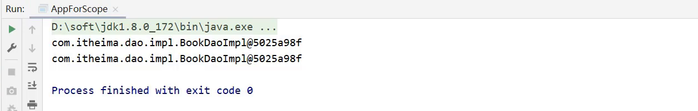
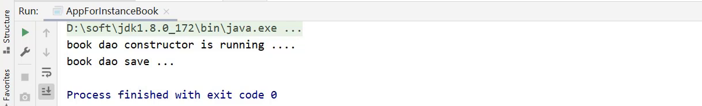
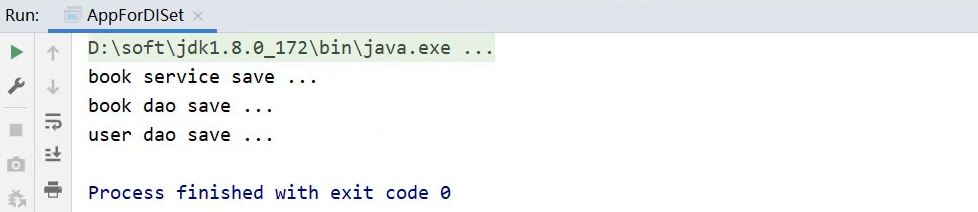
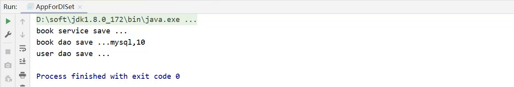

# Spring

官网：https://spring.io

## 1 Spring相关概念

### 1.1 Spring家族

从官网我们可以大概了解到：

* Spring能做什么：用以开发web、微服务以及分布式系统等。（光这三块就已经占了JavaEE开发的九成多）
* Spring并不是单一的一个技术，而是一个大家族，可以从官网的`Projects`中查看其包含的所有技术。

* Spring发展到今天已经形成了一种开发的生态圈,Spring提供了若干个项目,每个项目用于完成特定的功能。

  * Spring已形成了完整的生态圈，也就是说我们可以完全使用Spring技术完成整个项目的构建、设计与开发。

  * Spring有若干个项目，可以根据需要自行选择，把这些个项目组合起来，起了一个名称叫全家桶，如下图所示

    

    > 这些技术并不是所有的都需要学习，额外需要重点关注`Spring Framework`、`SpringBoot`和`SpringCloud`:
    >
    > - Spring Framework:Spring框架，是Spring中最早最核心的技术，也是所有其他技术的基础。
    >
    > - SpringBoot:Spring是来简化开发，而SpringBoot是来帮助Spring在简化的基础上能更快速进行开发。
    >
    > - SpringCloud:这个是用来做分布式之微服务架构的相关开发。


### 1.2 Spring发展史


Spring发展史

* IBM(IT公司-国际商业机器公司)在1997年提出了EJB思想,早期的JAVAEE开发大都基于该思想。
* Rod Johnson(Java和J2EE开发领域的专家)在2002年出版的`Expert One-on-One J2EE Design and Development`,书中有阐述在开发中使用EJB该如何做。
* Rod Johnson在2004年出版的`Expert One-on-One J2EE Development without EJB`,书中提出了比EJB思想更高效的实现方案，并且在同年将方案进行了具体的落地实现，这个实现就是Spring1.0。
* 随着时间推移，版本不断更新维护，目前最新的是Spring5
  * Spring1.0是纯配置文件开发
  * Spring2.0为了简化开发引入了注解开发，此时是配置文件加注解的开发方式
  * Spring3.0已经可以进行纯注解开发，使开发效率大幅提升，我们的课程会以注解开发为主
  * Spring4.0根据JDK的版本升级对个别API进行了调整
  * Spring5.0已经全面支持JDK8，现在Spring最新的是5系列所以建议大家把JDK安装成1.8版

### 1.3 Spring系统架构

前面的spring指的是Spring Framework，下面给出架构图


Spring Framework的5版本目前没有最新的架构图，而最新的是4版本，所以接下来主要研究的是4的架构图


1. 核心层：Core Container（核心容器），这个模块是Spring最核心的模块，其他的都需要依赖该模块
2. AOP层
   - AOP:面向切面编程，它依赖核心层容器，目的是在不改变原有代码的前提下对其进行功能增强
   - Aspects:AOP是思想,Aspects是对AOP思想的具体实现

3. 数据层
   - Data Access:数据访问，Spring全家桶中有对数据访问的具体实现技术
   - Data Integration:数据集成，Spring支持整合其他的数据层解决方案，比如Mybatis
   - Transactions:事务，Spring中事务管理是Spring AOP的一个具体实现，也是后期学习的重点内容

4. Web层
   - 这一层的内容将在SpringMVC框架具体学习

5. Test层
   - Spring主要整合了Junit来完成单元测试和集成测试

### 1.4 Spring核心概念

在Spring核心概念这部分内容中主要包含`IOC/DI`、`IOC容器`和`Bean`

#### 1.4.1 目前项目中的问题

要想解答这个问题，就需要先分析下目前咱们代码在编写过程中遇到的问题:


1. 业务层需要调用数据层的方法，就需要在业务层new数据层的对象
2. 如果数据层的实现类发生变化，那么业务层的代码也需要跟着改变，发生变更后，都需要进行编译打包和重部署
3. 所以，现在代码在编写的过程中存在的问题是：耦合度偏高

**解决方案：**


1. 如果能把框中的内容给去掉，不就可以降低依赖了么，但是又会引入新的问题，去掉以后程序能运行么?
2. 答案肯定是不行，因为bookDao默认赋值为Null，强行运行就会出空指针异常。
3. 所以现在的问题就是，业务层不想new对象，运行的时候又需要这个对象，该咋办呢?

针对这个问题，Spring就提出了一个解决方案：使用对象时，在程序中不要主动使用new产生对象，转换为由外部提供对象

**这种实现思就是Spring的一个核心概念**

#### 1.4.2 IOC控制反转

控制反转：使用对象时，由主动new产生对象转换为由外部提供对象，此过程中对象创建控制权由程序转移到外部，此思想称为控制反转。

IOC：Spring提供了一个容器，称为`IOC容器`，用来充当IOC思想中的`外部`

- IOC容器负责对象的创建、初始化等一系列工作，其中包含了数据层和业务层的类对象

* 被创建或被管理的对象在IOC容器中统称为Bean，IOC容器中放的就是一个个的Bean对象

#### 1.4.3 DI依赖注入

如下图所示，BookServiceImpl需要BookDaoImpl才能执行，这时需要进行`依赖注入`


## 2 入门案例

### 2.1 IOC入门案例

**需求：**将BookServiceImpl和BookDaoImpl交给Spring管理，并从容器中获取对应的bean对象进行方法调用。

1. 思路分析
   1. Spring使用容器来管理项目中所使用到的类对象，每一个这种对象叫做bean
   2. 使用配置文件将被管理的对象告知IOC容器
   3. 被管理的对象交给IOC容器，要想从容器中获取对象，就先得思考如何获取到IOC容器
   4. Spring框架提供相应的接口
   5. IOC容器得到后，调用Spring框架提供对应接口中的方法从容器中获取bean
   6. 使用Spring导入哪些坐标

2. 代码实现
   1. 创建Maven项目


2. 添加Spring的依赖jar包

```xml
<dependencies>
    
    <dependency>
        <groupId>org.springframework</groupId>
        <artifactId>spring-context</artifactId>
        <version>5.2.10.RELEASE</version>
    </dependency>
    
    <dependency>
        <groupId>junit</groupId>
        <artifactId>junit</artifactId>
        <version>4.12</version>
        <scope>test</scope>
    </dependency>
</dependencies>
```

3. 添加案例中需要的类

创建BookService,BookServiceImpl，BookDao和BookDaoImpl四个类

```java
public interface BookDao {
    public void save();
}
public class BookDaoImpl implements BookDao {
    public void save() {
        System.out.println("book dao save ...");
    }
}
public interface BookService {
    public void save();
}
public class BookServiceImpl implements BookService {
    private BookDao bookDao = new BookDaoImpl();
    public void save() {
        System.out.println("book service save ...");
        bookDao.save();
    }
}
```

4. 添加spring配置文件

resources下添加spring配置文件applicationContext.xml，并完成bean的配置


5. 在配置文件中完成bean的配置

```xml
<?xml version="1.0" encoding="UTF-8"?>
<beans xmlns="http://www.springframework.org/schema/beans"
       xmlns:xsi="http://www.w3.org/2001/XMLSchema-instance"
       xsi:schemaLocation="http://www.springframework.org/schema/beans http://www.springframework.org/schema/beans/spring-beans.xsd">
 
    <!--bean标签标示配置bean
    	id属性标示给bean起名字
    	class属性表示给bean定义类型
	-->
	<bean id="bookDao" class="com.itheima.dao.impl.BookDaoImpl"/>
    <bean id="bookService" class="com.itheima.service.impl.BookServiceImpl"/>

</beans>
```

> bean定义时id属性在同一个配置文件不能重复

6. 获取IOC容器

使用Spring提供的接口完成IOC容器的创建，创建App类，编写main方法

```java
public class App {
    public static void main(String[] args) {
        //获取IOC容器
		ApplicationContext ctx = new ClassPathXmlApplicationContext("applicationContext.xml"); 
    }
}
```

7. 从容器中获取对象进行方法调用

```java
public class App {
    public static void main(String[] args) {
        //获取IOC容器
		ApplicationContext ctx = new ClassPathXmlApplicationContext("applicationContext.xml"); 
//        BookDao bookDao = (BookDao) ctx.getBean("bookDao");
//        bookDao.save();
        BookService bookService = (BookService) ctx.getBean("bookService");
        bookService.save();
    }
}
```

8. 运行程序

测试结果为：


### 2.2 DI入门案例

**需求:**基于IOC入门案例，在BookServiceImpl类中删除new对象的方式，使用Spring的DI完成Dao层的注入

1. 思路分析
   1. 要想实现依赖注入，必须要基于IOC管理Bean。DI的入门案例要依赖于前面IOC的入门案例
   2. Service中使用new形式创建的Dao需要删除掉，最终要使用IOC容器中的bean对象
   3. 在Service中提供方法，让Spring的IOC容器可以通过该方法传入bean对象
   4. 使用配置文件描述Service与Dao间的关系

2. 代码实现
   1. 去除代码中的new

在BookServiceImpl类中，删除业务层中使用new的方式创建的dao对象

```java
public class BookServiceImpl implements BookService {
    //删除业务层中使用new的方式创建的dao对象
    private BookDao bookDao;

    public void save() {
        System.out.println("book service save ...");
        bookDao.save();
    }
}
```

2. 为属性提供setter方法

在BookServiceImpl类中,为BookDao提供setter方法

```java
public class BookServiceImpl implements BookService {
    //删除业务层中使用new的方式创建的dao对象
    private BookDao bookDao;

    public void save() {
        System.out.println("book service save ...");
        bookDao.save();
    }
    //提供对应的set方法
    public void setBookDao(BookDao bookDao) {
        this.bookDao = bookDao;
    }
}

```

3. 修改配置完成注入

在配置文件中添加依赖注入的配置

```xml
<?xml version="1.0" encoding="UTF-8"?>
<beans xmlns="http://www.springframework.org/schema/beans"
       xmlns:xsi="http://www.w3.org/2001/XMLSchema-instance"
       xsi:schemaLocation="http://www.springframework.org/schema/beans http://www.springframework.org/schema/beans/spring-beans.xsd">
    <!--bean标签标示配置bean
    	id属性标示给bean起名字
    	class属性表示给bean定义类型
	-->
    <bean id="bookDao" class="com.itheima.dao.impl.BookDaoImpl"/>

    <bean id="bookService" class="com.itheima.service.impl.BookServiceImpl">
        <property name="bookDao" ref="bookDao"/>
    </bean>

</beans>
```

**注意:**配置中的两个bookDao的含义是不一样的

* name="bookDao"中`bookDao`的作用是让Spring的IOC容器在获取到名称后，将首字母大写，前面加set找对应的`setBookDao()`方法进行对象注入
* ref="bookDao"中`bookDao`的作用是让Spring能在IOC容器中找到id为`bookDao`的Bean对象给`bookService`进行注入

4. 运行程序

运行，测试结果为：


## 3 IOC相关内容

### 3.1 bean基础配置

对于bean的配置中，有如下内容

- bean基础配置
- bean的别名配置
- bean的作用范围配置

#### 3.1.1 bean基础配置

bean标签的功能、使用方式以及id和class属性的作用，我们通过一张图来描述下


**注意事项**

* class属性不能写接口，因为接口是没办法创建对象的。

#### 3.1.2 bean的别名

name属性为别名，首先来看下别名的配置说明:


**配置别名**

1. 打开spring的配置文件applicationContext.xml

```xml
<?xml version="1.0" encoding="UTF-8"?>
<beans xmlns="http://www.springframework.org/schema/beans"
       xmlns:xsi="http://www.w3.org/2001/XMLSchema-instance"
       xsi:schemaLocation="http://www.springframework.org/schema/beans http://www.springframework.org/schema/beans/spring-beans.xsd">

    <!--name:为bean指定别名，别名可以有多个，使用逗号，分号，空格进行分隔-->
    <bean id="bookService" name="service service4 bookEbi" class="com.itheima.service.impl.BookServiceImpl">
        <property name="bookDao" ref="bookDao"/>
    </bean>

    <!--scope：为bean设置作用范围，可选值为单例singloton，非单例prototype-->
    <bean id="bookDao" name="dao" class="com.itheima.dao.impl.BookDaoImpl"/>
</beans>
```

> Ebi全称Enterprise Business Interface，翻译为企业业务接口

2. 根据名称容器中获取bean对象

```java
public class AppForName {
    public static void main(String[] args) {
        ApplicationContext ctx = new ClassPathXmlApplicationContext("applicationContext.xml");
        //此处根据bean标签的id属性和name属性的任意一个值来获取bean对象
        BookService bookService = (BookService) ctx.getBean("service4");
        bookService.save();
    }
}
```

3. 运行程序

测试结果为：


**注意事项:**

* bean依赖注入的ref属性指定bean，必须在容器中存在

  

* 如果不存在,则会报错，如下:

  

  这个错误大家需要特别关注下:

  

  获取bean无论是通过id还是name获取，如果无法获取到，将抛出异常：NoSuchBeanDefinitionException

#### 3.1.3 bean的作用范围

bean作用范围的配置属性:


**验证IOC容器中对象是否为单例**

1. 验证思路：同一个bean获取两次，将对象打印到控制台，看打印出的地址值是否一致。

2. 具体实现
   1. 创建一个AppForScope的类，在其main方法中来验证

```java
public class AppForScope {
    public static void main(String[] args) {
        ApplicationContext ctx = new 
            ClassPathXmlApplicationContext("applicationContext.xml");

        BookDao bookDao1 = (BookDao) ctx.getBean("bookDao");
        BookDao bookDao2 = (BookDao) ctx.getBean("bookDao");
        System.out.println(bookDao1);
        System.out.println(bookDao2);
    }
}
```

2. 打印，观察控制台的打印结果



**结论：**默认情况下，Spring创建的bean对象都是单例的

##### 配置bean为非单例

在Spring配置文件中，配置scope属性来实现bean的非单例创建

* 在Spring的配置文件中，修改`<bean>`的scope属性

  ```xml
  <bean id="bookDao" name="dao" class="com.itheima.dao.impl.BookDaoImpl" scope=""/>
  ```

* 将scope设置为`singleton`

  ```xml
  <bean id="bookDao" name="dao" class="com.itheima.dao.impl.BookDaoImpl" scope="singleton"/>
  ```

  运行AppForScope，打印看结果

  

* 将scope设置为`prototype`

  ```
  <bean id="bookDao" name="dao" class="com.itheima.dao.impl.BookDaoImpl" scope="prototype"/>
  ```

  运行AppForScope，打印看结果

  

**注意事项：**

* 为什么bean默认为单例?
  * bean为单例的意思是在Spring的IOC容器中只会有该类的一个对象
  * bean对象只有一个就避免了对象的频繁创建与销毁，达到了bean对象的复用，性能高
* bean在容器中是单例的，会不会产生线程安全问题?
  * 如果对象是有状态对象，即该对象有成员变量可以用来存储数据的，
  * 因为所有请求线程共用一个bean对象，所以会存在线程安全问题。
  * 如果对象是无状态对象，即该对象没有成员变量没有进行数据存储的，
  * 因方法中的局部变量在方法调用完成后会被销毁，所以不会存在线程安全问题。
* 哪些bean对象适合交给容器进行管理?
  * 表现层对象
  * 业务层对象
  * 数据层对象
  * 工具对象
* 哪些bean对象不适合交给容器进行管理?
  * 封装实例的域对象，因为会引发线程安全问题，所以不适合。

### 3.2 bean实例化

IOC实例化对象有下面三种方式：

- 构造方法
- 静态工厂
- 实例工厂

bean本质上就是对象，对象在new的时候会使用构造方法完成，那创建bean也是使用构造方法完成的。

**注意：**本节环境和DI入门案例一样

#### 3.2.1 构造方法实例化

1. 准备需要被创建的类

准备一个BookDao和BookDaoImpl类

```java
public interface BookDao {
    public void save();
}

public class BookDaoImpl implements BookDao {
    public void save() 
    {
        System.out.println("book dao save ...");
    }

}
```

2. 将类配置到Spring容器

```xml
<?xml version="1.0" encoding="UTF-8"?>
<beans xmlns="http://www.springframework.org/schema/beans"
       xmlns:xsi="http://www.w3.org/2001/XMLSchema-instance"
       xsi:schemaLocation="http://www.springframework.org/schema/beans http://www.springframework.org/schema/beans/spring-beans.xsd">

	<bean id="bookDao" class="com.itheima.dao.impl.BookDaoImpl"/>

</beans>
```

3. 编写运行程序

```java
public class AppForInstanceBook {
    public static void main(String[] args) 
    {
        ApplicationContext ctx = new ClassPathXmlApplicationContext("applicationContext.xml");
        BookDao bookDao = (BookDao) ctx.getBean("bookDao");
        bookDao.save();
    }
}
```

4. 类中提供构造函数测试

在BookDaoImpl类中添加一个无参构造函数，并打印一句话，方便观察结果。

```java
public class BookDaoImpl implements BookDao {
    、
    public BookDaoImpl() 
    {
        System.out.println("book dao constructor is running ....");
    }
    public void save() 
    {
        System.out.println("book dao save ...");
    }

}
```

运行程序，如果控制台有打印构造函数中的输出，说明Spring容器在创建对象的时候也走的是构造函数



**注意事项：**

- Spring底层用的是暴力反射
- Spring底层使用的是类的无参构造方法

#### 3.2.2 静态工厂实例化

1.  工厂方式创建bean

   1. 准备一个OrderDao和OrderDaoImpl类

      ```java
      public interface OrderDao {
          public void save();
      }
      
      public class OrderDaoImpl implements OrderDao {
          public void save() 
          {
              System.out.println("order dao save ...");
          }
      }
      ```

   2. 创建一个工厂类OrderDaoFactory并提供一个==静态方法==

      ```java
      //静态工厂创建对象
      public class OrderDaoFactory {
          public static OrderDao getOrderDao()
          {
              return new OrderDaoImpl();
          }
      }
      ```

   3. 编写AppForInstanceOrder运行类，在类中通过工厂获取对象

```java
public class AppForInstanceOrder {
    public static void main(String[] args) {
        //通过静态工厂创建对象
        OrderDao orderDao = OrderDaoFactory.getOrderDao();
        orderDao.save();
    }
}
```

​			4. 运行后，可以查看到结果


2. 静态工厂实例化：需要工厂方式存在

(1)在spring的配置文件application.properties中添加以下内容:

```xml
<bean id="orderDao" class="com.itheima.factory.OrderDaoFactory" factory-method="getOrderDao"/>
```

class:工厂类的类全名

factory-mehod:具体工厂类中创建对象的方法名

对应关系如下图:


3. 在AppForInstanceOrder运行类，使用从IOC容器中获取bean的方法进行运行测试

```java
public class AppForInstanceOrder {
    public static void main(String[] args) {
        ApplicationContext ctx = new ClassPathXmlApplicationContext("applicationContext.xml");

        OrderDao orderDao = (OrderDao) ctx.getBean("orderDao");

        orderDao.save();

    }
}
```

4. 运行后，可以查看到结果


**这种方式一般是用来兼容早期的一些老系统**

#### 3.2.3 实例工厂实例化

1. 环境准备
   1. 准备一个UserDao和UserDaoImpl类

```java
public interface UserDao {
    public void save();
}

public class UserDaoImpl implements UserDao {

    public void save() 
    {
        System.out.println("user dao save ...");
    }
}
```

​		2. 创建一个工厂类OrderDaoFactory并提供一个普通方法，注意此处和静态工厂的工厂类不一样的地方是方法不是静态方法

```java
public class UserDaoFactory {
    public UserDao getUserDao()
    {
        return new UserDaoImpl();
    }
}
```

​		3. 编写AppForInstanceUser运行类，在类中通过工厂获取对象

```java
public class AppForInstanceUser {
    public static void main(String[] args) {
        //创建实例工厂对象
        UserDaoFactory userDaoFactory = new UserDaoFactory();
        //通过实例工厂对象创建对象
        UserDao userDao = userDaoFactory.getUserDao();
        userDao.save();
}
```

​		4. 运行后，可以查看到结果


2. **实例工厂实例化**
   1. 在spring的配置文件中添加以下内容:

```xml
<bean id="userFactory" class="com.itheima.factory.UserDaoFactory"/>
<bean id="userDao" factory-method="getUserDao" factory-bean="userFactory"/>
```

实例化工厂运行的顺序是:

* 创建实例化工厂对象,对应的是第一行配置

* 调用对象中的方法来创建bean，对应的是第二行配置

  * factory-bean:工厂的实例对象

  * factory-method:工厂对象中的具体创建对象的方法名,对应关系如下:

    

​		2. 在AppForInstanceUser运行类，使用从IOC容器中获取bean的方法进行运行测试

```java
public class AppForInstanceUser {
    public static void main(String[] args) {
        ApplicationContext ctx = new 
            ClassPathXmlApplicationContext("applicationContext.xml");
        UserDao userDao = (UserDao) ctx.getBean("userDao");
        userDao.save();
    }
}
```

​		3. 运行后，可以查看到结果


#### 3.2.4 FactoryBean实例化

FactoryBean简化实例工厂实例化操作，具体的使用步骤为:

1. 创建一个UserDaoFactoryBean的类，实现FactoryBean接口，重写接口的方法

```java
public class UserDaoFactoryBean implements FactoryBean<UserDao> {
    //代替原始实例工厂中创建对象的方法
    public UserDao getObject() throws Exception {
        return new UserDaoImpl();
    }
    //返回所创建类的Class对象
    public Class<?> getObjectType() {
        return UserDao.class;
    }
}
```

2. 在Spring的配置文件中进行配置

```xml
<bean id="userDao" class="com.itheima.factory.UserDaoFactoryBean"/>
```

3. AppForInstanceUser运行类不用做任何修改，直接运行


查看源码会发现，FactoryBean接口其实会有三个方法，分别是:

```java
T getObject() throws Exception;	//被重写后，在方法中进行对象的创建并返回

Class<?> getObjectType();	//被重写后，主要返回的是被创建类的Class对象

/*
	没有被重写，因为它已经给了默认值，从方法名中可以看出其作用是设置对象是否为单例
	重写返回FALSE为多例
*/
default boolean isSingleton() {
		return true;
}
```

### 3.3 bean的生命周期

bean生命周期如下：

1. 初始化容器
   1. 创建对象(内存分配)
   2. 执行构造方法
   3. 执行属性注入(set操作)
   4. 执行bean初始化方法
2. 使用bean执行业务操作
3. 关闭/销毁容器，执行bean销毁方法

**注意：**本节环境和DI入门案例一致

编写AppForLifeCycle运行类，加载Spring的IOC容器，并从中获取对应的bean对象

```java
public class AppForLifeCycle {
    public static void main( String[] args ) {
        ApplicationContext ctx = new 
        	ClassPathXmlApplicationContext("applicationContext.xml");
        BookDao bookDao = (BookDao) ctx.getBean("bookDao");
        bookDao.save();
    }
}
```

#### 3.3.1 生命周期设置

在上面这个环境中来为BookDao添加生命周期的控制方法，具体的控制有两个阶段:

* bean创建之后，想要添加内容，比如用来初始化需要用到资源
* bean销毁之前，想要添加内容，比如用来释放用到的资源

1. 添加初始化和销毁方法

针对这两个阶段，我们在BooDaoImpl类中分别添加两个方法，方法名任意

```java
public class BookDaoImpl implements BookDao {
    public void save() {
        System.out.println("book dao save ...");
    }
    //表示bean初始化对应的操作
    public void init(){
        System.out.println("init...");
    }
    //表示bean销毁前对应的操作
    public void destory(){
        System.out.println("destory...");
    }
}
```

2. 配置生命周期

在配置文件添加配置，如下:

```xml
<bean id="bookDao" class="com.itheima.dao.impl.BookDaoImpl" init-method="init" destroy-method="destory"/>
```

3. 运行程序

运行AppForLifeCycle打印结果为:


从结果中可以看出，init方法执行了，但是destroy方法却未执行，这是为什么呢?

* Spring的IOC容器是运行在JVM中
* 运行main方法后,JVM启动,Spring加载配置文件生成IOC容器,从容器获取bean对象，然后调方法执行
* main方法执行完后，JVM退出，这个时候IOC容器中的bean还没有来得及销毁就已经结束了
* 所以没有调用对应的destroy方法

#### 3.3.2 销毁前操作

上节所述，常规方式无法执行destroy方法，下面介绍两种关闭方法

- close关闭容器
  1. ApplicationContext中没有close方法
  2. 需要将ApplicationContext更换成ClassPathXmlApplicationContext

```java
ClassPathXmlApplicationContext ctx = new 
    ClassPathXmlApplicationContext("applicationContext.xml");
```

​		3. 调用ctx的close()方法

```
ctx.close();
```

​		4. 运行程序，就能执行destroy方法的内容


- 注册钩子关闭容器
  1. 在容器未关闭之前，提前设置好回调函数，让JVM在退出之前回调此函数来关闭容器
  2. 调用ctx的registerShutdownHook()方法

```
ctx.registerShutdownHook();
```

>  注意:registerShutdownHook在ApplicationContext中也没有

​		3. 运行后，查询打印结果


两种销毁方式对比：

- 相同点:这两种都能用来关闭容器

- 不同点:close()是在调用的时候关闭，registerShutdownHook()是在JVM退出前调用关闭。

#### 3.3.3 简化设置

上面介绍的方式设置生命周期太过繁琐，可以在bean对应的类中添加两个接口`InitializingBean`， `DisposableBean`并实现接口中的两个方法`afterPropertiesSet`和`destroy`

```java
public class BookServiceImpl implements BookService, InitializingBean, DisposableBean {
    private BookDao bookDao;
    public void setBookDao(BookDao bookDao) {
        this.bookDao = bookDao;
    }
    public void save() {
        System.out.println("book service save ...");
        bookDao.save(); 
    }
    public void destroy() throws Exception {
        System.out.println("service destroy");
    }
    public void afterPropertiesSet() throws Exception {
        System.out.println("service init");
    }
}
```

取消xml中的配置

```xml
<bean id="bookDao" class="com.itheima.dao.impl.BookDaoImpl" />
```

重新运行AppForLifeCycle类


那第二种方式的实现，我们也介绍完了。

> 对于InitializingBean接口中的afterPropertiesSet方法，翻译过来为`属性设置之后`。

## 4 DI相关内容

问题：向一个类中传递数据的方式有几种?
* 普通方法(set方法)
* 构造方法

问题：依赖注入描述了在容器中建立bean与bean之间的依赖关系的过程，如果bean运行需要的是数字或字符串呢?
* 引用类型
* 简单类型(基本数据类型与String)

Spring就是基于上面这些问题，为我们提供了两种注入方式，分别是:

* setter注入
  * 简单类型
  * 引用类型
* 构造器注入
  * 简单类型
  * 引用类型

环境和DI入门案例一致，需要添加UserDao、UserDaoImpl

```java
public interface UserDao {
    public void save();
}
public class UserDaoImpl implements UserDao {
    public void save() {
        System.out.println("user dao save ...");
    }
}
```

### 4.1 setter注入

#### 4.1.1 注入引用类型

**需求:**在bookServiceImpl对象中注入userDao

1. 声明属性并提供setter方法

在BookServiceImpl中声明userDao属性，并提供setter方法

```java
public class BookServiceImpl implements BookService{
    private BookDao bookDao;
    private UserDao userDao;
    
    public void setUserDao(UserDao userDao) {
        this.userDao = userDao;
    }
    public void setBookDao(BookDao bookDao) {
        this.bookDao = bookDao;
    }

    public void save() {
        System.out.println("book service save ...");
        bookDao.save();
        userDao.save();
    }
}
```

2. 配置文件中进行注入配置

在applicationContext.xml配置文件中使用property标签注入

```xml
<?xml version="1.0" encoding="UTF-8"?>
<beans xmlns="http://www.springframework.org/schema/beans"
       xmlns:xsi="http://www.w3.org/2001/XMLSchema-instance"
       xsi:schemaLocation="http://www.springframework.org/schema/beans http://www.springframework.org/schema/beans/spring-beans.xsd">

    <bean id="bookDao" class="com.itheima.dao.impl.BookDaoImpl"/>
    <bean id="userDao" class="com.itheima.dao.impl.UserDaoImpl"/>
    <bean id="bookService" class="com.itheima.service.impl.BookServiceImpl">
        <property name="bookDao" ref="bookDao"/>
        <property name="userDao" ref="userDao"/>
    </bean>
</beans>
```

- name="bookDao"中`bookDao`的作用是让Spring的IOC容器在获取到名称后，将首字母大写，前面加set找对应的`setBookDao()`方法进行对象注入
- ref="bookDao"中`bookDao`的作用是让Spring能在IOC容器中找到id为`bookDao`的Bean对象给`bookService`进行注入

3. 运行程序

运行AppForDISet类，查看结果，说明userDao已经成功注入。



#### 4.1.2 注入简单数据类型

**需求：**给BookDaoImpl注入一些简单数据类型的数据

1. 声明属性并提供setter方法

在BookDaoImpl类中声明对应的简单数据类型的属性,并提供对应的setter方法

```java
public class BookDaoImpl implements BookDao {

    private String databaseName;
    private int connectionNum;

    public void setConnectionNum(int connectionNum) {
        this.connectionNum = connectionNum;
    }

    public void setDatabaseName(String databaseName) {
        this.databaseName = databaseName;
    }

    public void save() {
        System.out.println("book dao save ..."+databaseName+","+connectionNum);
    }
}
```

2. 配置文件中进行注入配置

在applicationContext.xml配置文件中使用property标签注入

```xml
<?xml version="1.0" encoding="UTF-8"?>
<beans xmlns="http://www.springframework.org/schema/beans"
       xmlns:xsi="http://www.w3.org/2001/XMLSchema-instance"
       xsi:schemaLocation="http://www.springframework.org/schema/beans http://www.springframework.org/schema/beans/spring-beans.xsd">

    <bean id="bookDao" class="com.itheima.dao.impl.BookDaoImpl">
        <property name="databaseName" value="mysql"/>
     	<property name="connectionNum" value="10"/>
    </bean>
    <bean id="userDao" class="com.itheima.dao.impl.UserDaoImpl"/>
    <bean id="bookService" class="com.itheima.service.impl.BookServiceImpl">
        <property name="bookDao" ref="bookDao"/>
        <property name="userDao" ref="userDao"/>
    </bean>
</beans>
```

注入简单类型使用value，后面跟的是简单数据类型。需要保证双引号中的值和需要注入的类型一致，否则会强转失败

3. 运行程序

运行AppForDISet类，查看结果，说明userDao已经成功注入。



> 两个property注入标签的顺序可以任意。

### 4.2 构造器注入

环境：和setter注入一致，删除所有setter方法

#### 4.2.1 注入引用数据类型

**需求：**将BookServiceImpl类中的bookDao修改成使用构造器的方式注入。

1. 添加带有bookDao参数的构造方法

```java
public class BookServiceImpl implements BookService{
    private BookDao bookDao;

    public BookServiceImpl(BookDao bookDao) 
    {
        this.bookDao = bookDao;
    }

    public void save() 
    {
        System.out.println("book service save ...");
        bookDao.save();
    }
}
```

2. 配置文件中进行配置构造方式注入

```xml
<?xml version="1.0" encoding="UTF-8"?>
<beans xmlns="http://www.springframework.org/schema/beans"
       xmlns:xsi="http://www.w3.org/2001/XMLSchema-instance"
       xsi:schemaLocation="http://www.springframework.org/schema/beans http://www.springframework.org/schema/beans/spring-beans.xsd">

    <bean id="bookDao" class="com.itheima.dao.impl.BookDaoImpl"/>
    <bean id="bookService" class="com.itheima.service.impl.BookServiceImpl">
        <constructor-arg name="bookDao" ref="bookDao"/>
    </bean>
</beans>
```

标签<constructor-arg>中

* name属性对应的值为构造函数中方法形参的参数名，必须要保持一致。

* ref属性指向的是spring的IOC容器中其他bean对象。

3. 运行程序

运行AppForDIConstructor类，查看结果，说明bookDao已经成功注入。


#### 4.2.2 注入多个引用数据类型

需求:在BookServiceImpl使用构造函数注入多个引用数据类型，比如userDao

1. 提供多个属性的构造函数

在BookServiceImpl声明userDao并提供多个参数的构造函数

```java
public class BookServiceImpl implements BookService{
    private BookDao bookDao;
    private UserDao userDao;

    public BookServiceImpl(BookDao bookDao,UserDao userDao) {
        this.bookDao = bookDao;
        this.userDao = userDao;
    }

    public void save() {
        System.out.println("book service save ...");
        bookDao.save();
        userDao.save();
    }
}
```

2. 配置文件中配置多参数注入

```xml
<?xml version="1.0" encoding="UTF-8"?>
<beans xmlns="http://www.springframework.org/schema/beans"
       xmlns:xsi="http://www.w3.org/2001/XMLSchema-instance"
       xsi:schemaLocation="http://www.springframework.org/schema/beans http://www.springframework.org/schema/beans/spring-beans.xsd">

    <bean id="bookDao" class="com.itheima.dao.impl.BookDaoImpl"/>
    <bean id="userDao" class="com.itheima.dao.impl.UserDaoImpl"/>
    <bean id="bookService" class="com.itheima.service.impl.BookServiceImpl">
        <constructor-arg name="bookDao" ref="bookDao"/>
        <constructor-arg name="userDao" ref="userDao"/>
    </bean>
</beans>
```

> 这两个`<contructor-arg>`的配置顺序可以任意

3. 运行程序

运行AppForDIConstructor类，查看结果，说明userDao已经成功注入。


#### 4.2.3 注入多个简单数据类型

**需求:**在BookDaoImpl中，使用构造函数注入databaseName和connectionNum两个参数。

1. 添加多个简单属性并提供构造方法

```java
public class BookDaoImpl implements BookDao {
    private String databaseName;
    private int connectionNum;

    public BookDaoImpl(String databaseName, int connectionNum) {
        this.databaseName = databaseName;
        this.connectionNum = connectionNum;
    }

    public void save() {
        System.out.println("book dao save ..."+databaseName+","+connectionNum);
    }
}
```

2. 配置完成多个属性构造器注入

```xml
<?xml version="1.0" encoding="UTF-8"?>
<beans xmlns="http://www.springframework.org/schema/beans"
       xmlns:xsi="http://www.w3.org/2001/XMLSchema-instance"
       xsi:schemaLocation="http://www.springframework.org/schema/beans http://www.springframework.org/schema/beans/spring-beans.xsd">

    <bean id="bookDao" class="com.itheima.dao.impl.BookDaoImpl">
        <constructor-arg name="databaseName" value="mysql"/>
        <constructor-arg name="connectionNum" value="666"/>
    </bean>
    <bean id="userDao" class="com.itheima.dao.impl.UserDaoImpl"/>
    <bean id="bookService" class="com.itheima.service.impl.BookServiceImpl">
        <constructor-arg name="bookDao" ref="bookDao"/>
        <constructor-arg name="userDao" ref="userDao"/>
    </bean>
</beans>
```

> 这两个`<contructor-arg>`的配置顺序可以任意

3. 运行程序

运行AppForDIConstructor类，查看结果


#### 4.2.4 参数问题

上面已经完成了构造函数注入的基本使用，但是会存在一些问题:


* 当构造函数中方法的参数名发生变化后，配置文件中的name属性也需要跟着变
* 这两块存在紧耦合，具体该如何解决?

这个参数名发生变化的情况并不多，所以上面的还是比较主流的配置方式，下面介绍的以了解为主。

方式一:删除name属性，添加type属性，按照类型注入

```xml
<bean id="bookDao" class="com.itheima.dao.impl.BookDaoImpl">
    <constructor-arg type="int" value="10"/>
    <constructor-arg type="java.lang.String" value="mysql"/>
</bean>
```

* 这种方式可以解决构造函数形参名发生变化带来的耦合问题
* 但是如果构造方法参数中有类型相同的参数，这种方式就不太好实现了

方式二:删除type属性，添加index属性，按照索引下标注入，下标从0开始

```xml
<bean id="bookDao" class="com.itheima.dao.impl.BookDaoImpl">
    <constructor-arg index="1" value="100"/>
    <constructor-arg index="0" value="mysql"/>
</bean>
```

* 这种方式可以解决参数类型重复问题
* 但是如果构造方法参数顺序发生变化后，这种方式又带来了耦合问题

#### 4.2.5 注入技巧

1. 强制依赖使用构造器进行，使用setter注入有概率不进行注入导致null对象出现
   * 强制依赖指对象在创建的过程中必须要注入指定的参数
2. 可选依赖使用setter注入进行，灵活性强
   * 可选依赖指对象在创建过程中注入的参数可有可无
3. Spring框架倡导使用构造器，第三方框架内部大多数采用构造器注入的形式进行数据初始化，相对严谨
4. 如果有必要可以两者同时使用，使用构造器注入完成强制依赖的注入，使用setter注入完成可选依赖的注入
5. 实际开发过程中还要根据实际情况分析，如果受控对象没有提供setter方法就必须使用构造器注入
6. **==自己开发的模块推荐使用setter注入==**

### 4.3 自动配置

上面介绍的方式对于实际开发来说太过麻烦，Spring提供了自动配置

**自动配置：**IoC容器根据bean所依赖的资源在容器中自动查找并注入到bean中的过程称为自动装配

 自动装配方式

* 按类型（常用）
* 按名称
* 按构造方法
* 不启用自动装配

**本节环境和DI入门案例一致**

#### 4.3.1 按类型装配

自动装配只需要修改applicationContext.xml配置文件即可:

(1)将`<property>`标签删除

(2)在`<bean>`标签中添加autowire属性

首先来实现按照类型注入的配置

```xml
<?xml version="1.0" encoding="UTF-8"?>
<beans xmlns="http://www.springframework.org/schema/beans"
       xmlns:xsi="http://www.w3.org/2001/XMLSchema-instance"
       xsi:schemaLocation="http://www.springframework.org/schema/beans http://www.springframework.org/schema/beans/spring-beans.xsd">

    <bean class="com.itheima.dao.impl.BookDaoImpl"/>
    <!--autowire属性：开启自动装配，通常使用按类型装配-->
    <bean id="bookService" class="com.itheima.service.impl.BookServiceImpl" autowire="byType"/>

</beans>
```

**注意事项:**

* 需要注入属性的类中对应属性的setter方法不能省略
* 被注入的对象必须要被Spring的IOC容器管理
* 按照类型在Spring的IOC容器中如果找到多个对象，会报`NoUniqueBeanDefinitionException`

> 按照类型在Spring的IOC容器中如果找到多个对象，一般都是因为一个接口有多个实现类

#### 4.3.2 按名称注入

一个类型在IOC中有多个对象，还想要注入成功，这个时候就需要按照名称注入，配置方式为:

```xml
<?xml version="1.0" encoding="UTF-8"?>
<beans xmlns="http://www.springframework.org/schema/beans"
       xmlns:xsi="http://www.w3.org/2001/XMLSchema-instance"
       xsi:schemaLocation="http://www.springframework.org/schema/beans http://www.springframework.org/schema/beans/spring-beans.xsd">

    <bean class="com.itheima.dao.impl.BookDaoImpl"/>
    <!--autowire属性：开启自动装配，通常使用按类型装配-->
    <bean id="bookService" class="com.itheima.service.impl.BookServiceImpl" autowire="byName"/>

</beans>
```

**注意事项**

* 按照名称注入中的名称指的是什么?

  

  * bookDao是private修饰的，外部类无法直接方法
  * 外部类只能通过属性的set方法进行访问
  * 对外部类来说，setBookDao方法名，去掉set后首字母小写是其属性名
    * 为什么是去掉set首字母小写?
    * 这个规则是set方法生成的默认规则，set方法的生成是把属性名首字母大写前面加set形成的方法名
  * 所以按照名称注入，其实是和对应的set方法有关，但是如果按照标准起名称，属性名和set对应的名是一致的

* 如果按照名称去找对应的bean对象，找不到则注入Null

* 当某一个类型在IOC容器中有多个对象，按照名称注入只找其指定名称对应的bean对象，不会报错 

#### 4.3.3 自动装配注意事项

- 自动装配用于引用类型依赖注入，不能对简单类型进行操作
- 使用按类型装配时（byType）必须保障容器中相同类型的bean唯一，推荐使用
- 使用按名称装配时（byName）必须保障容器中具有指定名称的bean，因变量名与配置耦合，不推荐使用
- 自动装配优先级低于setter注入与构造器注入，同时出现时自动装配配置失效

### 4.4 集合注入

前面我们已经能完成引入数据类型和简单数据类型的注入，但是还有一种数据类型==集合==，集合中既可以装简单数据类型也可以装引用数据类型，对于集合，在Spring中该如何注入呢?

先来回顾下，常见的集合类型有哪些?

* 数组
* List
* Set
* Map
* Properties

针对不同的集合类型，该如何实现注入呢?

#### 4.4.1 环境准备

- 创建一个Maven项目
- pom.xml添加依赖
- resources下添加spring的配置文件applicationContext.xml

这些步骤和前面的都一致，大家可以快速的拷贝即可，最终项目的结构如下:


(1)项目中添加添加BookDao、BookDaoImpl类

```java
public interface BookDao {
    public void save();
}

public class BookDaoImpl implements BookDao {
    
public class BookDaoImpl implements BookDao {

    private int[] array;

    private List<String> list;

    private Set<String> set;

    private Map<String,String> map;

    private Properties properties;

     public void save() {
        System.out.println("book dao save ...");

        System.out.println("遍历数组:" + Arrays.toString(array));

        System.out.println("遍历List" + list);

        System.out.println("遍历Set" + set);

        System.out.println("遍历Map" + map);

        System.out.println("遍历Properties" + properties);
    }
	//setter....方法省略，自己使用工具生成
}
```

(2)resources下提供spring的配置文件，applicationContext.xml

```xml
<?xml version="1.0" encoding="UTF-8"?>
<beans xmlns="http://www.springframework.org/schema/beans"
       xmlns:xsi="http://www.w3.org/2001/XMLSchema-instance"
       xsi:schemaLocation="http://www.springframework.org/schema/beans http://www.springframework.org/schema/beans/spring-beans.xsd">

    <bean id="bookDao" class="com.itheima.dao.impl.BookDaoImpl"/>
</beans>
```

(3)编写AppForDICollection运行类，加载Spring的IOC容器，并从中获取对应的bean对象

```java
public class AppForDICollection {
    public static void main( String[] args ) {
        ApplicationContext ctx = new ClassPathXmlApplicationContext("applicationContext.xml");
        BookDao bookDao = (BookDao) ctx.getBean("bookDao");
        bookDao.save();
    }
}
```

接下来，在上面这个环境中来完成`集合注入`的学习:

下面的所以配置方式，都是在bookDao的bean标签中使用<property>进行注入

```xml
<?xml version="1.0" encoding="UTF-8"?>
<beans xmlns="http://www.springframework.org/schema/beans"
       xmlns:xsi="http://www.w3.org/2001/XMLSchema-instance"
       xsi:schemaLocation="http://www.springframework.org/schema/beans http://www.springframework.org/schema/beans/spring-beans.xsd">

    <bean id="bookDao" class="com.itheima.dao.impl.BookDaoImpl">
        
    </bean>
</beans>
```

#### 4.4.2 注入数组类型数据

```xml
<property name="array">
    <array>
        <value>100</value>
        <value>200</value>
        <value>300</value>
    </array>
</property>
```

#### 4.4.3 注入List类型数据

```xml
<property name="list">
    <list>
        <value>itcast</value>
        <value>itheima</value>
        <value>boxuegu</value>
        <value>chuanzhihui</value>
    </list>
</property>
```

#### 4.4.4 注入Set类型数据

```xml
<property name="set">
    <set>
        <value>itcast</value>
        <value>itheima</value>
        <value>boxuegu</value>
        <value>boxuegu</value>
    </set>
</property>
```

#### 4.4.5 注入Map类型数据

```xml
<property name="map">
    <map>
        <entry key="country" value="china"/>
        <entry key="province" value="henan"/>
        <entry key="city" value="kaifeng"/>
    </map>
</property>
```

#### 4.4.6 注入Properties类型数据

```xml
<property name="properties">
    <props>
        <prop key="country">china</prop>
        <prop key="province">henan</prop>
        <prop key="city">kaifeng</prop>
    </props>
</property>
```

配置完成后，运行下看结果:


**说明：**

* property标签表示setter方式注入，构造方式注入constructor-arg标签内部也可以写`<array>`、`<list>`、`<set>`、`<map>`、`<props>`标签
* List的底层也是通过数组实现的，所以`<list>`和`<array>`标签是可以混用
* 集合中要添加引用类型，只需要把`<value>`标签改成`<ref>`标签，这种方式用的比较少

## 5 管理第三方bean

**需求:使用Spring的IOC容器来管理Druid连接池对象**

### 5.1 环境准备

* 创建一个Maven项目

  

* pom.xml添加依赖

  ```xml
  <dependencies>
      <dependency>
          <groupId>org.springframework</groupId>
          <artifactId>spring-context</artifactId>
          <version>5.2.10.RELEASE</version>
      </dependency>
  </dependencies>
  ```

* resources下添加spring的配置文件applicationContext.xml

  ```xml
  <?xml version="1.0" encoding="UTF-8"?>
  <beans xmlns="http://www.springframework.org/schema/beans"
         xmlns:xsi="http://www.w3.org/2001/XMLSchema-instance"
         xsi:schemaLocation="
              http://www.springframework.org/schema/beans
              http://www.springframework.org/schema/beans/spring-beans.xsd">
  
  </beans>
  ```

### 5.2 思路分析

1. 使用第三方的技术，需要在pom.xml添加依赖
2. 在配置文件中将`第三方的类`制作成一个bean，让IOC容器进行管理
3. 数据库连接需要基础的四要素`驱动`、`连接`、`用户名`和`密码`，如何注入到对应的bean中
4. 从IOC容器中获取对应的bean对象，将其打印到控制台查看结果

> 对于第三方的类的使用，要么会用，要么会猜

### 5.3 代码实现

1. 导入durid依赖

   ```xml
   <dependency>
       <groupId>com.alibaba</groupId>
       <artifactId>druid</artifactId>
       <version>1.1.16</version>
   </dependency>
   ```

2. 配置第三方bean

   ```xml
   <?xml version="1.0" encoding="UTF-8"?>
   <beans xmlns="http://www.springframework.org/schema/beans"
          xmlns:xsi="http://www.w3.org/2001/XMLSchema-instance"
          xsi:schemaLocation="
               http://www.springframework.org/schema/beans
               http://www.springframework.org/schema/beans/spring-beans.xsd">
   	<!--管理DruidDataSource对象-->
       <bean id="dataSource" class="com.alibaba.druid.pool.DruidDataSource">
           <property name="driverClassName" value="com.mysql.jdbc.Driver"/>
           <property name="url" value="jdbc:mysql://localhost:3306/spring_db"/>
           <property name="username" value="root"/>
           <property name="password" value="root"/>
       </bean>
   </beans>
   ```

3. 从IOC容器中获取对应的bean对象

   ```java
   public class App {
       public static void main(String[] args) {
          ApplicationContext ctx = new ClassPathXmlApplicationContext("applicationContext.xml");
          DataSource dataSource = (DataSource) ctx.getBean("dataSource");
          System.out.println(dataSource);
       }
   }
   ```

4. 运行程序

   打印如下结果: 说明第三方bean对象已经被spring的IOC容器进行管理

   

## 6 加载properties文件

一些软件包需要提取配置文件，Spring需要来加载配置文件来完成属性注入

需求：将数据库连接四要素提取到properties配置文件，spring来加载配置信息并使用这些信息来完成属性注入

代码实现：

1. 准备properties配置文件

   resources下创建一个jdbc.properties文件,并添加对应的属性键值对

   ```properties
   jdbc.driver=com.mysql.jdbc.Driver
   jdbc.url=jdbc:mysql://127.0.0.1:3306/spring_db
   jdbc.username=root
   jdbc.password=root
   ```

2. 开启`context`命名空间

   在applicationContext.xml中开`context`命名空间

   ```xml
   <?xml version="1.0" encoding="UTF-8"?>
   <beans xmlns="http://www.springframework.org/schema/beans"
          xmlns:xsi="http://www.w3.org/2001/XMLSchema-instance"
          xmlns:context="http://www.springframework.org/schema/context"
          xsi:schemaLocation="
               http://www.springframework.org/schema/beans
               http://www.springframework.org/schema/beans/spring-beans.xsd
               http://www.springframework.org/schema/context
               http://www.springframework.org/schema/context/spring-context.xsd">
   </beans>
   ```

3. 加载properties配置文件

   在配置文件中使用`context`命名空间下的标签来加载properties配置文件

   ```xml
   <context:property-placeholder location="jdbc.properties"/>
   ```

4. 完成属性注入

   使用`${key}`来读取properties配置文件中的内容并完成属性注入

   ```xml
   <?xml version="1.0" encoding="UTF-8"?>
   <beans xmlns="http://www.springframework.org/schema/beans"
          xmlns:xsi="http://www.w3.org/2001/XMLSchema-instance"
          xmlns:context="http://www.springframework.org/schema/context"
          xsi:schemaLocation="
               http://www.springframework.org/schema/beans
               http://www.springframework.org/schema/beans/spring-beans.xsd
               http://www.springframework.org/schema/context
               http://www.springframework.org/schema/context/spring-context.xsd">
       
       <context:property-placeholder location="jdbc.properties"/>
       <bean id="dataSource" class="com.alibaba.druid.pool.DruidDataSource">
           <property name="driverClassName" value="${jdbc.driver}"/>
           <property name="url" value="${jdbc.url}"/>
           <property name="username" value="${jdbc.username}"/>
           <property name="password" value="${jdbc.password}"/>
       </bean>
   </beans>
   ```

#### 注意事项

至此，读取properties配置文件中的内容就已经完成，但是在使用的时候，有些注意事项:

* 问题一:键值对的key为`username`引发的问题

  1.在properties中配置键值对的时候，如果key设置为`username`

  ```
  username=root666
  ```

  2.在applicationContext.xml注入该属性

  ```xml
  <?xml version="1.0" encoding="UTF-8"?>
  <beans xmlns="http://www.springframework.org/schema/beans"
         xmlns:xsi="http://www.w3.org/2001/XMLSchema-instance"
         xmlns:context="http://www.springframework.org/schema/context"
         xsi:schemaLocation="
              http://www.springframework.org/schema/beans
              http://www.springframework.org/schema/beans/spring-beans.xsd
              http://www.springframework.org/schema/context
              http://www.springframework.org/schema/context/spring-context.xsd">
      
      <context:property-placeholder location="jdbc.properties"/>
      
      <bean id="bookDao" class="com.itheima.dao.impl.BookDaoImpl">
          <property name="name" value="${username}"/>
      </bean>
  </beans>
  ```

  3.运行后，在控制台打印的却不是`root666`，而是自己电脑的用户名

  

  4.出现问题的原因是`<context:property-placeholder/>`标签会加载系统的环境变量，而且环境变量的值会被优先加载，如何查看系统的环境变量?

  ```java
  public static void main(String[] args) throws Exception{
      Map<String, String> env = System.getenv();
      System.out.println(env);
  }
  ```

  大家可以自行运行，在打印出来的结果中会有一个USERNAME=XXX[自己电脑的用户名称]

  5.解决方案

  ```xml
  <?xml version="1.0" encoding="UTF-8"?>
  <beans xmlns="http://www.springframework.org/schema/beans"
         xmlns:xsi="http://www.w3.org/2001/XMLSchema-instance"
         xmlns:context="http://www.springframework.org/schema/context"
         xsi:schemaLocation="
              http://www.springframework.org/schema/beans
              http://www.springframework.org/schema/beans/spring-beans.xsd
              http://www.springframework.org/schema/context
              http://www.springframework.org/schema/context/spring-context.xsd">
      
      <context:property-placeholder location="jdbc.properties" system-properties-mode="NEVER"/>
  </beans>
  ```

  system-properties-mode:设置为NEVER,表示不加载系统属性，就可以解决上述问题。

  当然还有一个解决方案就是避免使用`username`作为属性的`key`。

* 问题二:当有多个properties配置文件需要被加载，该如何配置?

  1.调整下配置文件的内容，在resources下添加`jdbc.properties`,`jdbc2.properties`,内容如下:

  jdbc.properties

  ```properties
  jdbc.driver=com.mysql.jdbc.Driver
  jdbc.url=jdbc:mysql://127.0.0.1:3306/spring_db
  jdbc.username=root
  jdbc.password=root
  ```

  jdbc2.properties

  ```properties
  username=root666
  ```

  2.修改applicationContext.xml

  ```xml
  <?xml version="1.0" encoding="UTF-8"?>
  <beans xmlns="http://www.springframework.org/schema/beans"
         xmlns:xsi="http://www.w3.org/2001/XMLSchema-instance"
         xmlns:context="http://www.springframework.org/schema/context"
         xsi:schemaLocation="
              http://www.springframework.org/schema/beans
              http://www.springframework.org/schema/beans/spring-beans.xsd
              http://www.springframework.org/schema/context
              http://www.springframework.org/schema/context/spring-context.xsd">
      <!--方式一 -->
      <context:property-placeholder location="jdbc.properties,jdbc2.properties" system-properties-mode="NEVER"/>
      <!--方式二-->
      <context:property-placeholder location="*.properties" system-properties-mode="NEVER"/>
      <!--方式三 -->
      <context:property-placeholder location="classpath:*.properties" system-properties-mode="NEVER"/>
      <!--方式四-->
      <context:property-placeholder location="classpath*:*.properties" system-properties-mode="NEVER"/>
  </beans>	
  ```

  **说明:**

  * 方式一:可以实现，如果配置文件多的话，每个都需要配置
  * 方式二:`*.properties`代表所有以properties结尾的文件都会被加载，可以解决方式一的问题，但是不标准
  * 方式三:标准的写法，`classpath:`代表的是从根路径下开始查找，但是只能查询当前项目的根路径
  * 方式四:不仅可以加载当前项目还可以加载当前项目所依赖的所有项目的根路径下的properties配置文件

## 7 核心容器

这里所说的核心容器，可以把它简单的理解为`ApplicationContext`，前面虽然已经用到过，但是并没有系统的学习。

### 7.1 环境准备

在学习和解决上述问题之前，先来准备下案例环境:

* 创建一个Maven项目

* pom.xml添加Spring的依赖

  ```xml
  <dependencies>
      <dependency>
          <groupId>org.springframework</groupId>
          <artifactId>spring-context</artifactId>
          <version>5.2.10.RELEASE</version>
      </dependency>
  </dependencies>
  ```

* resources下添加applicationContext.xml

  ```xml
  <?xml version="1.0" encoding="UTF-8"?>
  <beans xmlns="http://www.springframework.org/schema/beans"
         xmlns:xsi="http://www.w3.org/2001/XMLSchema-instance"
         xsi:schemaLocation="
              http://www.springframework.org/schema/beans http://www.springframework.org/schema/beans/spring-beans.xsd">
      <bean id="bookDao" class="com.itheima.dao.impl.BookDaoImpl"/>
  </beans>
  ```

* 添加BookDao和BookDaoImpl类

  ```java
  public interface BookDao {
      public void save();
  }
  public class BookDaoImpl implements BookDao {
      public void save() {
          System.out.println("book dao save ..." );
      }
  }
  ```

* 创建运行类App

  ```java
  public class App {
      public static void main(String[] args) {
          ApplicationContext ctx = new ClassPathXmlApplicationContext("applicationContext.xml");
          BookDao bookDao = (BookDao) ctx.getBean("bookDao");
          bookDao.save();
      }
  }
  ```

最终创建好的项目结构如下:


### 7.2 容器

#### 7.2.1 容器的创建方式

1. 类路径下的XML配置文件

```java
ApplicationContext ctx = new ClassPathXmlApplicationContext("applicationContext.xml");
```

2. 文件系统下的XML配置文件

```java
ApplicationContext ctx = new FileSystemXmlApplicationContext("applicationContext.xml");
```

#### 7.2.2 Bean的三种获取方式

1. 就是目前案例中获取的方式:

```java
BookDao bookDao = (BookDao) ctx.getBean("bookDao");
```

这种方式存在的问题是每次获取的时候都需要进行类型转换，有没有更简单的方式呢?

2. 不需要类型转换

```
BookDao bookDao = ctx.getBean("bookDao"，BookDao.class);
```

这种方式可以解决类型强转问题，但是参数又多加了一个，相对来说没有简化多少。

3. 自动匹配

```
BookDao bookDao = ctx.getBean(BookDao.class);
```

这种方式就类似我们之前所学习依赖注入中的按类型注入。必须要确保IOC容器中该类型对应的bean对象只能有一个。

#### 7.2.3 容器类层次结构

(1)在IDEA中双击`shift`,输入BeanFactory


(2)点击进入BeanFactory类，ctrl+h,就能查看到如下结构的层次关系


从图中可以看出，容器类也是从无到有根据需要一层层叠加上来的，大家重点理解下这种设计思想。

#### 7.2.4 BeanFactory的使用

使用BeanFactory来创建IOC容器的具体实现方式为:

```java
public class AppForBeanFactory {
    public static void main(String[] args) {
        Resource resources = new ClassPathResource("applicationContext.xml");
        BeanFactory bf = new XmlBeanFactory(resources);
        BookDao bookDao = bf.getBean(BookDao.class);
        bookDao.save();
    }
}
```

为了更好的看出`BeanFactory`和`ApplicationContext`之间的区别，在BookDaoImpl添加如下构造函数:

```java
public class BookDaoImpl implements BookDao {
    public BookDaoImpl() {
        System.out.println("constructor");
    }
    public void save() {
        System.out.println("book dao save ..." );
    }
}
```

如果不去获取bean对象，打印会发现：

* BeanFactory是延迟加载，只有在获取bean对象的时候才会去创建

* ApplicationContext是立即加载，容器加载的时候就会创建bean对象

* ApplicationContext要想成为延迟加载，只需要按照如下方式进行配置

  ```xml
  <?xml version="1.0" encoding="UTF-8"?>
  <beans xmlns="http://www.springframework.org/schema/beans"
         xmlns:xsi="http://www.w3.org/2001/XMLSchema-instance"
         xsi:schemaLocation="
              http://www.springframework.org/schema/beans http://www.springframework.org/schema/beans/spring-beans.xsd">
      <bean id="bookDao" class="com.itheima.dao.impl.BookDaoImpl"  lazy-init="true"/>
  </beans>
  ```

