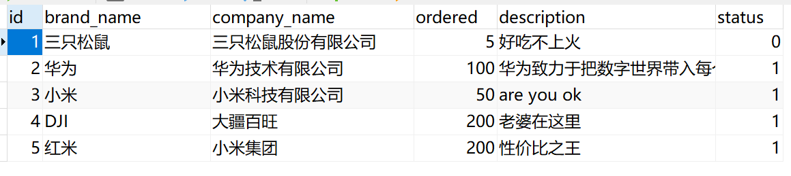
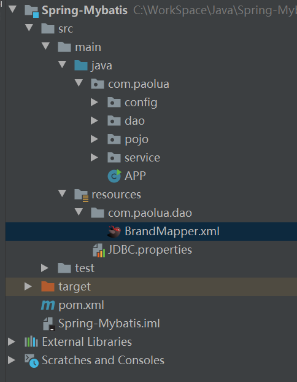
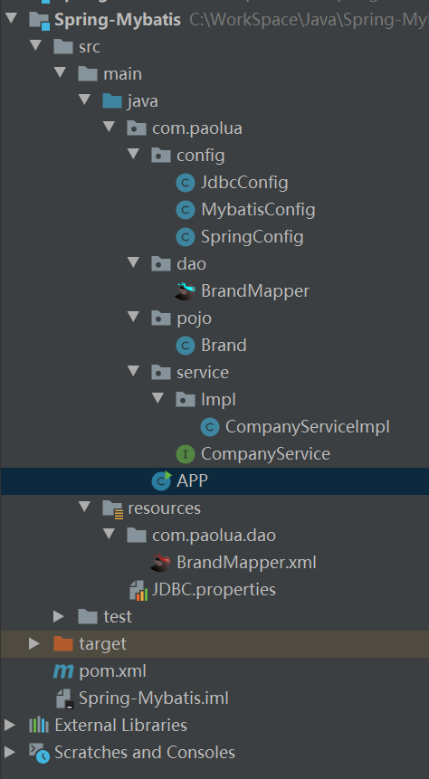
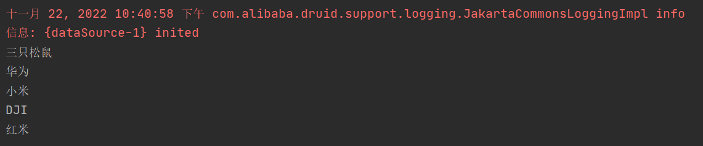

# Spring整合Mybatis

Spring整合mybaits有如下优点

- 可以省略mybatis的配置文件
- 用更简单的方式配置数据源
- 大幅简化开发步骤

**需求：**Spring整合Mybatis，并将Druid作为数据源。查询表中数据

表如下：



1. 导入坐标

   ```xml
   <dependencies>
           <!--Spring基础框架-->
           <dependency>
               <groupId>org.springframework</groupId>
               <artifactId>spring-context</artifactId>
               <version>5.2.10.RELEASE</version>
           </dependency>
   
           <!--Druid-->
           <dependency>
               <groupId>com.alibaba</groupId>
               <artifactId>druid</artifactId>
               <version>1.1.16</version>
           </dependency>
   
           <!--Mybatis-->
           <dependency>
               <groupId>org.mybatis</groupId>
               <artifactId>mybatis</artifactId>
               <version>3.5.6</version>
           </dependency>
   
           <!--Spring整个Mybatis的包-->
           <dependency>
               <groupId>org.mybatis</groupId>
               <artifactId>mybatis-spring</artifactId>
               <version>1.3.0</version>
           </dependency>
   
           <!--JDBC，必须和数据库一致-->
           <dependency>
               <groupId>mysql</groupId>
               <artifactId>mysql-connector-java</artifactId>
               <version>8.0.26</version>
           </dependency>
   
           <!--Spring操作数据库需要该jar包-->
           <dependency>
               <groupId>org.springframework</groupId>
               <artifactId>spring-jdbc</artifactId>
               <version>5.2.10.RELEASE</version>
           </dependency>
       </dependencies>
   ```

2. 按照MVC三层框架创建各个包

   

3. 定义pojo类

   ```java
   public class Brand {
   
       private Integer id;
       private String BrandName;
       private String CompanyName;
       private Integer Ordered;
       private String description;
       private Integer status;
   	//setter和getter方法
   }
   ```

4. 定义Druid配置文件

   ```properties
   driverClassName=com.mysql.cj.jdbc.Driver
   url=jdbc:mysql://120.26.81.186/mybatis?useSSL=false&allowPublicKeyRetrieval=true
   jdbc.username=root
   password=Asd3366554785.
   # 初始化连接数量
   initialSize=5
   # 最大连接数
   maxActive=10
   # 最大等待时间
   maxWait=3000
   ```

5. 利用Mybatis的代理模式创建Mapper类和SQL文件

   ```java
   public interface BrandMapper {
   
   
       public List<Brand> selectAll();
   }
   ```

   ```xml
   <?xml version="1.0" encoding="UTF-8" ?>
   <!DOCTYPE mapper PUBLIC "-//mybatis.org//DTD Mapper 3.0//EN" "http://mybatis.org/dtd/mybatis-3-mapper.dtd">
   <mapper namespace="com.paolua.dao.BrandMapper">
   
       <resultMap id="BrandResultMap" type="brand">
           <result column="brand_name" property="BrandName"/>
           <result column="company_name" property="CompanyName"/>
           <result column="ordered" property="Ordered"/>
       </resultMap>
       
       <select id="selectAll" resultMap="BrandResultMap">
           select * from tb_brand;
       </select>
   </mapper>
   ```

6. 编写Spring配置类

   ```java
   @Configuration
   @ComponentScan("com.paolua")
   @PropertySource("classpath:JDBC.properties")
   @Import({JdbcConfig.class,MybatisConfig.class})
   public class SpringConfig {
   }
   ```

7. 编写Durid配置类

   ```java
   public class JdbcConfig {
   
       @Value("${driverClassName}")
       private String driver;
       @Value("${url}")
       private String url;
       @Value("${jdbc.username}")
       private String userName;
       @Value("${password}")
       private String password;
   
       @Bean
       public DataSource dataSource()
       {
           DruidDataSource ds = new DruidDataSource();
           ds.setDriverClassName(driver);
           ds.setUrl(url);
           ds.setUsername(userName);
           System.out.println(userName);
           ds.setPassword(password);
           System.out.println(password);
           return ds;
   
       }
   }
   ```

8. 编写mybatis配置类

   ```java
   public class MybatisConfig {
   
       @Bean
       public SqlSessionFactoryBean sqlSessionFactoryBean(DataSource dataSource)
       {
           SqlSessionFactoryBean ssfb = new SqlSessionFactoryBean();
           ssfb.setTypeAliasesPackage("com.paolua.pojo");
           ssfb.setDataSource(dataSource);
           return ssfb;
       }
   
       @Bean
       public MapperScannerConfigurer mapperScannerConfigurer()
       {
           MapperScannerConfigurer msc = new MapperScannerConfigurer();
           msc.setBasePackage("com.paolua.dao");
           return msc;
       }
   }
   ```

9. 定义业务方法

   ```java
   public interface CompanyService {
   
       public List<Brand> selectAll();
   }
   
   public class CompanyServiceImpl implements CompanyService {
   
       @Autowired
       private BrandMapper brandMapper;
   
       public List<Brand> selectAll()
       {
           List<Brand> brands = brandMapper.selectAll();
           for (Brand brand : brands) {
               brand.getCompanyName();
           }
           return brands;
       }
   }
   ```

   注意：Spring会自动创建sqlsession并采用代理模式

10. 编写APP类

    ```java
    public class APP {
        public static void main(String[] args) throws IOException {
    
            AnnotationConfigApplicationContext alx = new AnnotationConfigApplicationContext(SpringConfig.class);
            CompanyService companyService = alx.getBean(CompanyService.class);
            List<Brand> brands = companyService.selectAll();
            for (Brand brand : brands) {
                System.out.println(brand.getBrandName());
            }
    
        }
    }
    ```

11. 最后的文件结构



运行程序，结果如下

