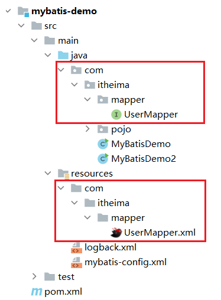

# 1 Mybatis概述

## 1.1 Mybatis概念

- MyBatis 是一款优秀的持久层框架，用于简化 JDBC 开发
- MyBatis 本是 Apache 的一个开源项目iBatis, 2010年这个项目由apache software foundation 迁移到了google code，并且改名为MyBatis 。2013年11月迁移到Github
- 官网：https://mybatis.org/mybatis-3/zh/index.html 

> 持久层：
>
> ​	JavaEE将业务分为三层：表现层，业务层，持久层。持久层指的是负责将数据保存到数据库的代码

> 框架：
>
> 框架就是一个半成品软件，是一套可重用的、通用的、软件基础代码模型。在框架的基础之上构建软件编写更加高效、规范、通用、可扩展

## 1.2 Mybatis解决JDBC缺点

下面是 JDBC 代码，我们通过该代码分析都存在什么缺点：


* 硬编码

  * 注册驱动、获取连接

    上图标1的代码有很多字符串，而这些是连接数据库的四个基本信息，以后如果要将Mysql数据库换成其他的关系型数据库的话，这四个地方都需要修改，如果放在此处就意味着要修改我们的源代码。

  * SQL语句

    上图标2的代码。如果表结构发生变化，SQL语句就要进行更改。这也不方便后期的维护。

* 操作繁琐

  * 手动设置参数

  * 手动封装结果集

    上图标4的代码是对查询到的数据进行封装，而这部分代码是没有什么技术含量，而且特别耗费时间的。

**解决方案**：

* 硬编码可以配置到**配置文件**
* 操作繁琐的地方mybatis**都自动完成**

如图所示


# 2 Mybatis使用步骤

**需求：查询user表中所有的数据，user表如下所示**


## 2.1 创建模块，导入坐标

在创建好的模块中的 pom.xml 配置文件中添加依赖的坐标

```xml
<dependencies>
    
    <!--mybatis 依赖-->
    <dependency>
        <groupId>org.mybatis</groupId>
        <artifactId>mybatis</artifactId>
        <version>3.5.5</version>
    </dependency>

    <!--mysql 驱动-->
    <dependency>
        <groupId>mysql</groupId>
        <artifactId>mysql-connector-java</artifactId>
        <version>5.1.46</version>
    </dependency>

    <!--junit 单元测试-->
    <dependency>
        <groupId>junit</groupId>
        <artifactId>junit</artifactId>
        <version>4.13</version>
        <scope>test</scope>
    </dependency>

    <!-- 添加slf4j日志api -->
    <dependency>
        <groupId>org.slf4j</groupId>
        <artifactId>slf4j-api</artifactId>
        <version>1.7.20</version>
    </dependency>
    
    <!-- 添加logback-classic依赖 -->
    <dependency>
        <groupId>ch.qos.logback</groupId>
        <artifactId>logback-classic</artifactId>
        <version>1.2.3</version>
    </dependency>
    
    <!-- 添加logback-core依赖 -->
    <dependency>
        <groupId>ch.qos.logback</groupId>
        <artifactId>logback-core</artifactId>
        <version>1.2.3</version>
    </dependency>
    
</dependencies>
```

注意：需要在项目的 resources 目录下创建logback的配置文件

## 2.2 编写 MyBatis 核心配置文件

此步骤的目的是：替换连接信息，解决硬编码问题

在模块下的 resources 目录下创建mybatis的配置文件 `mybatis-config.xml`，内容如下：

```xml
<?xml version="1.0" encoding="UTF-8" ?>
<!DOCTYPE configuration
        PUBLIC "-//mybatis.org//DTD Config 3.0//EN"
        "http://mybatis.org/dtd/mybatis-3-config.dtd">
<configuration>

    <typeAliases>
        <package name="com.itheima.pojo"/>
    </typeAliases>
    
    <!--
    	environments：配置数据库连接环境信息。可以配置多个environment，通过default属性切换不同的environment
    -->
    <environments default="development">
        <environment id="development">
            <transactionManager type="JDBC"/>
            <dataSource type="POOLED">
                <!--数据库连接信息-->
                <property name="driver" value="com.mysql.jdbc.Driver"/>
                <property name="url" value="jdbc:mysql://IP地址/数据库名称?useSSL=false"/>
                <property name="username" value="root"/>
                <property name="password" value="1234"/>
            </dataSource>
        </environment>

        <environment id="test">
            <transactionManager type="JDBC"/>
            <dataSource type="POOLED">
                <!--数据库连接信息-->
                <property name="driver" value="com.mysql.jdbc.Driver"/>
                <property name="url" value="jdbc:mysql://IP地址/mybatis?useSSL=false"/>
                <property name="username" value="root"/>
                <property name="password" value="1234"/>
            </dataSource>
        </environment>
    </environments>
    <mappers>
       <!--加载sql映射文件-->
       <mapper resource="UserMapper.xml"/>
    </mappers>
</configuration>
```

## 2.3 编写 SQL 映射文件

此步骤目的：统一管理sql语句，解决硬编码问题

在模块的 `resources` 目录下创建映射配置文件 `UserMapper.xml`，内容如下：

```xml
<?xml version="1.0" encoding="UTF-8" ?>
<!DOCTYPE mapper PUBLIC "-//mybatis.org//DTD Mapper 3.0//EN" "http://mybatis.org/dtd/mybatis-3-mapper.dtd">
<mapper namespace="test">
    
    <!--resultType必须是相应的实体类-->
    <select id="selectAll" resultType="com.itheima.pojo.User">
        select * from tb_user;
    </select>
</mapper>
```

## 2.4 编写相应代码

* 在 `com.itheima.pojo` 包下创建 User类

  ```java
  public class User {
      private int id;
      private String username;
      private String password;
      private String gender;
      private String addr;
      
      //省略了 setter 和 getter
  }
  ```

* 在 `com.itheima` 包下编写 MybatisDemo 测试类

  ```java
  public class MyBatisDemo {
  
      public static void main(String[] args) throws IOException 
      {
          //1. 加载mybatis的核心配置文件，获取 SqlSessionFactory
          String resource = "mybatis-config.xml";
          InputStream inputStream = Resources.getResourceAsStream(resource);
          SqlSessionFactory sqlSessionFactory = new SqlSessionFactoryBuilder().build(inputStream);
  
          //2. 获取SqlSession对象，用它来执行sql
          SqlSession sqlSession = sqlSessionFactory.openSession();
          
          //3. 执行sql
          List<User> users = sqlSession.selectList("test.selectAll"); 
          //参数是一个字符串，该字符串必须是映射配置文件的namespace.id
          System.out.println(users);
          
          //4. 释放资源
          sqlSession.close();
      }
  }
  ```

# 3 Mapper代理开发

**日后直接使用代理开发**

## 3.1 Mapper代理开发概述

之前我们写的代码是基本使用方式，它也存在硬编码的问题，如下：


这里调用 `selectList()` 方法传递的参数是映射配置文件中的 namespace.id值。这样写也不便于后期的维护。如果使用 Mapper 代理方式（如下图）则不存在硬编码问题。


通过上面的描述可以看出 Mapper 代理方式的目的：

* 解决原生方式中的硬编码
* 简化后期执行SQL

## 3.2 Mapper代理开发要求

使用Mapper代理方式，必须满足以下要求：

* 定义与SQL映射文件同名的Mapper接口，并且将Mapper接口和SQL映射文件放置在同一目录下。如下图：

  

  > 注意：在编译后两个文件在同一目录下即可

* 设置SQL映射文件的namespace属性为Mapper接口全限定名

  

* 在 Mapper 接口中定义方法，方法名就是SQL映射文件中sql语句的id，并保持参数类型和返回值类型一致

  

## 3.3 案例代码实现

* 在 `com.itheima.mapper` 包下创建 UserMapper接口，代码如下：

  ```java
  public interface UserMapper {
      List<User> selectAll();
      User selectById(int id);
  }
  ```

* 在 `resources` 下创建 `com/itheima/mapper` 目录，并在该目录下创建 UserMapper.xml 映射配置文件

  ```xml
  <!--
      namespace:名称空间。必须是对应接口的全限定名
  -->
  <mapper namespace="com.itheima.mapper.UserMapper">
      <select id="selectAll" resultType="com.itheima.pojo.User">
          select *
          from tb_user;
      </select>
  </mapper>
  ```

  > 注意：
  >
  > ​	在Java文件夹下，使用com.xxx.xxx来创建多层目录
  >
  > ​	在resource文件夹下，使用com/xxx/xxx来创建多层目录

* 在 `com.itheima` 包下创建 MybatisDemo2 测试类，代码如下：

  ```java
  /**
   * Mybatis 代理开发
   */
  public class MyBatisDemo2 {
  
      public static void main(String[] args) throws IOException {
  
          //1. 加载mybatis的核心配置文件，获取 SqlSessionFactory
          String resource = "mybatis-config.xml";
          InputStream inputStream = Resources.getResourceAsStream(resource);
          SqlSessionFactory sqlSessionFactory = new SqlSessionFactoryBuilder().build(inputStream);
  
          //2. 获取SqlSession对象，用它来执行sql
          SqlSession sqlSession = sqlSessionFactory.openSession();
          
          //3. 执行sql
          //获取UserMapper接口的代理对象
          UserMapper userMapper = sqlSession.getMapper(UserMapper.class);
          List<User> users = userMapper.selectAll();
          System.out.println(users);
          
          //4. 释放资源
          sqlSession.close();
      }
  }
  ```

# 3 核心配置文件

上面的核心配置文件配置了一些内容。但配置文件中还可以配置很多内容，我们可以通过查询官网看可以配置的内容


> 注意：核心配置文件的标签顺序必须和官方介绍的顺序一样，否则会报错（官方标签顺序如上图）

## 3.1 多环境配置

在核心配 儿段配置。我们一般就配置一个 `environment` 即可。

```xml
<environments default="development">
    <environment id="development">
        <transactionManager type="JDBC"/>
        <dataSource type="POOLED">
            <!--数据库连接信息-->
            <property name="driver" value="com.mysql.jdbc.Driver"/>
            <property name="url" value="jdbc:mysql:///mybatis?useSSL=false"/>
            <property name="username" value="root"/>
            <property name="password" value="1234"/>
        </dataSource>
    </environment>

    <environment id="test">
        <transactionManager type="JDBC"/>
        <dataSource type="POOLED">
            <!--数据库连接信息-->
            <property name="driver" value="com.mysql.jdbc.Driver"/>
            <property name="url" value="jdbc:mysql:///mybatis?useSSL=false"/>
            <property name="username" value="root"/>
            <property name="password" value="1234"/>
        </dataSource>
    </environment>
</environments>
```

## 3.2 类型别名

在映射配置文件中的 `resultType` 属性需要配置数据封装的类型（类的全限定名）。而每次这样写是特别麻烦的，Mybatis 提供了 `类型别名`(typeAliases) 可以简化这部分的书写。

首先需要现在核心配置文件中配置类型别名，也就意味着给pojo包下所有的类起了别名（别名就是类名），不区分大小写。内容如下：

```xml
<typeAliases>
    <!--name属性的值是实体类所在包-->
    <package name="com.itheima.pojo"/> 
</typeAliases>
```

通过上述的配置，我们就可以简化映射配置文件中 `resultType` 属性值的编写

```xml
<mapper namespace="com.itheima.mapper.UserMapper">
    <select id="selectAll" resultType="user">
        select * from tb_user;
    </select>
</mapper>
```

## 3.3 简化映射文件的加载

如果Mapper接口名称和SQL映射文件名称相同，并在同一目录下。则可以使用包扫描的方式简化SQL映射文件的加载。也就是将核心配置文件的加载映射配置文件的配置修改为

```xml
<mappers>
    <!--加载sql映射文件-->
    <!-- <mapper resource="com/itheima/mapper/UserMapper.xml"/>-->
    <!--Mapper代理方式-->
    <package name="com.itheima.mapper"/>
</mappers>
```

# 4 SQL映射文件

## 4.1 数据库变量和实体类封装问题

数据库一般的习惯为brand_name，Java实体类为brandName。如果对应的变量名相同，可以直接映射。如果不相同，则无法映射

### 4.1.1 起别名

我们可以在写sql语句时给这两个字段起别名，将别名定义成和属性名一致即可。

```xml
<select id="selectAll" resultType="brand">
    select
    id, brand_name as brandName, company_name as companyName, ordered, description, status
    from tb_brand;
</select>
```

### 4.1.2 SQL片段

* 将需要复用的SQL片段抽取到 `sql` 标签中

  ```xml
  <sql id="brand_column">
  	id, brand_name as brandName, company_name as companyName, ordered, description, status
  </sql>
  ```

  id属性值是唯一标识，引用时也是通过该值进行引用。

* 在原sql语句中进行引用

  使用 `include` 标签引用上述的 SQL 片段，而 `refid` 指定上述 SQL 片段的id值。

  ```xml
  <select id="selectAll" resultType="brand">
      select
      <include refid="brand_column" />
      from tb_brand;
  </select>
  ```

### 4.1.3 ResultMap

* 在映射配置文件中使用resultMap定义字段和属性的映射关系

  ```xml
  <resultMap id="brandResultMap" type="brand">
      <!--
              id：为映射起名字
  			type：需要映射的实体类
                  
              result：完成一般字段的映射
                  column：表的列名
                  property：实体类的属性名
          -->
      <result column="brand_name" property="brandName"/>
      <result column="company_name" property="companyName"/>
  </resultMap>
  ```

  > 注意：在上面只需要定义字段名和属性名不一样的映射，而一样的则不需要专门定义出来。

* SQL语句正常编写

  ```xml
  <!--
  	注意：
  		这里不需要使用resultType，而需要使用resultMap返回
  -->
  <select id="selectAll" resultMap="brandResultMap">
      select *
      from tb_brand;
  </select>
  ```

## 4.2 SQL语句参数问题

### 4.2.1 parameterType使用

对于有参数的mapper接口方法，我们在映射配置文件中应该配置 `ParameterType` 来指定参数类型。只不过该属性都可以省略

```xml
<select id="selectById" parameterType="int" resultMap="brandResultMap">
    select *
    from tb_brand where id = ${id};
</select>
```

### 4.2.2 参数占位符

有时，需要让Java程序给SQL语句赋值，mybatis中采用参数占位符的方式来进行相应的赋值操作

```xml
<select id="selectById"  resultMap="brandResultMap">
    select *
    from tb_brand where id = ${id};
</select>
```

mybaits中参数占位符有如下两种

- #{param}:执行SQL时，会将 #{} 占位符替换为？将自动设置参数值。底层调用的是PreparedStatement
- ${param}:执行SQL。底层使用的是 `Statement`，会存在SQL注入问题。

### 4.2.3 参数传递

有的时候，需要向数据库传输一些数据，比如修改值的时候。mybatis可以传输多个参数或一个参数

```xml
<select id="selectById"  resultMap="brandResultMap">
    select *
    from tb_brand where id = ${id};
    <!--id值需要从Java程序传入数据库中-->
</select>
```

#### 单个参数传递

- POJO 类型

  直接使用。要求 `属性名` 和 `参数占位符名称` 一致

- Map 集合类型

  直接使用。要求 `map集合的键名` 和 `参数占位符名称` 一致

- Collection 集合类型

  Mybatis 会将集合封装到 map 集合中，如下：

  ```java
  map.put("arg0"，collection集合);
  map.put("collection"，collection集合);
  ```

  > 可以使用 `@Param` 注解替换map集合中默认的 arg 键名。

- List 集合类型

  Mybatis 会将集合封装到 map 集合中，如下：

  ```java
  map.put("arg0"，list集合);
  map.put("collection"，list集合);
  map.put("list"，list集合);
  ```

  > 可以使用 `@Param` 注解替换map集合中默认的 arg 键名。

- Array 类型

  Mybatis 会将集合封装到 map 集合中，如下：

  ```java
  map.put("arg0"，数组);
  map.put("array"，数组);
  ```

  > 可以使用 `@Param` 注解替换map集合中默认的 arg 键名。

- 其他类型

  比如int类型，`参数占位符名称` 叫什么都可以。尽量做到见名知意

#### 多个参数传递

- 方式：在接口处使用@Param注解，注解中的内容对应着映射文件中同名的变量

  ```java
  User select(@Param("username") String username,@Param("password") String password);
  /*
  	第一个@Param中的username对应着映射文件的#{username}
  	第二个@Param中的password对应着映射文件的#{password}
  */
  ```

  ```xml
  <select id="select" resultType="user">
  	select *
      from tb_user
      where 
      	username=#{username}
      	and password=#{password}
  </select>
  ```

- 原理

  我们在接口方法中定义多个参数，Mybatis 会将这些参数封装成 Map 集合对象，值就是参数值，而键在没有使用 `@Param` 注解时有以下命名规则：

  * 以 arg 开头  ：第一个参数就叫 arg0，第二个参数就叫 arg1，以此类推。如：

    ```java
    map.put("arg0"，参数值1);
    map.put("arg1"，参数值2);
    ```

    ```xml
    <!--username后面的参数使用arg访问-->
    <select id="select" resultType="user">
    	select *
        from tb_user
        where 
        	username=#{arg0}
        	and password=#{arg1}
    </select>
    ```
  
  * 以 param 开头 ： 第一个参数就叫 param1，第二个参数就叫 param2，依次类推。如：
  
    ```java
    map.put("param1"，参数值1);
    map.put("param2"，参数值2);
    ```
    
    ```xml
    <!--username后面的参数也可以使用param访问-->
    <select id="select" resultType="user">
    	select *
        from tb_user
        where 
        	username=#{param1}
        	and password=#{param2}
    </select>
    ```
  
  现在，在接口方法参数上使用 `@Param` 注解，Mybatis 会将 `arg` 开头的键名替换为对应注解的属性值。
  
  ```java
  User select(@Param("username") String username, String password);
  ```
  
  ```xml
  <!--
  	- 可以使用@Param注解中的参数访问
  	- 也可以使用param访问
  	- 但不可以使用arg访问
  -->
  <select id="select" resultType="user">
  	select *
      from tb_user
      where 
      	username=#{username}
      	and password=#{param2}
  </select>
  ```

## 4.3 动态SQL

### 4.3.1 条件查询标签

````xml
<if></if>	
<choose></choose>
<trim></trim>
<foreach></foreach>
<where></where>
<set></set>
````

### 4.3.2 if标签

作用：条件判断

test属性：逻辑表达式

```xml
<!--举个例子-->
<select id="selectByCondition" resultMap="brandResultMap">
    select *
    from tb_brand
    where
    	<!--test属性的字符串为真，则在语句中加入if标签中语句-->
        <if test="status != null">
            and status = #{status}
        </if>
        <if test="companyName != null and companyName != '' ">
            and company_name like #{companyName}
        </if>
        <if test="brandName != null and brandName != '' ">
            and brand_name like #{brandName}
        </if>
</select>
```

### 4.3.3 where 标签

```xml
<where></where>
<!--
	作用：
		- 替换where关键字
		- 防止语法错误，会动态的去掉第一个条件前的 and 
		- 如果所有的参数没有值则不加where关键字（下面的例子如果所有if都不成立，框架不会加where）
	注意：需要给每个条件前都加相应的关键字（如and）
-->

<select id="selectByCondition" resultMap="brandResultMap">
    select *
    from tb_brand
    <where>
        <if test="status != null">
            and status = #{status}
        </if>
        <if test="companyName != null and companyName != '' ">
            and company_name like #{companyName}
        </if>
        <if test="brandName != null and brandName != '' ">
            and brand_name like #{brandName}
        </if>
    </where>
</select>
```

### 4.3.4 set 标签

```xml
<set></set>
<!--
	作用：可以用于动态包含需要更新的列，忽略其它不更新的列。
-->

<update id="update">
    update tb_brand
    <set>
        <if test="brandName != null and brandName != ''">
            brand_name = #{brandName},
        </if>
        <if test="companyName != null and companyName != ''">
            company_name = #{companyName},
        </if>
        <if test="ordered != null">
            ordered = #{ordered},
        </if>
        <if test="description != null and description != ''">
            description = #{description},
        </if>
        <if test="status != null">
            status = #{status}
        </if>
    </set>
    where id = #{id};
</update>
```

### 4.3.5 多条件动态查询


在一些查询条件下，会出现多条件查询的场景。有时候用户不会提交多个条件，这时会导致需要编写多个SQL，使用动态SQL可以有效解决这个问题

**if标签**

```xml
<select id="selectByCondition" resultMap="brandResultMap">
    select *
    from tb_brand
    where
        <if test="status != null">
            and status = #{status}
        </if>
        <if test="companyName != null and companyName != '' ">
            and company_name like #{companyName}
        </if>
        <if test="brandName != null and brandName != '' ">
            and brand_name like #{brandName}
        </if>
</select>
```

### 4.3.6 单条件动态查询


有时，我们会碰到一个条件可以是不同的情况，比如前端页面的一个单选框。需要根据单选框的内容进行查找，这时需要用到单条件动态查询

```xml
<choose></choose>	
<!--
	- 选择标签，相当于switch
	- 内含两个字标签<when>和<otherwise>，相当于case和default
-->

<select id="selectByConditionSingle" resultMap="brandResultMap">
    select *
    from tb_brand
    <where>
        <choose><!--相当于switch-->
            <when test="status != null"><!--相当于case-->
                status = #{status}
            </when>
            <when test="companyName != null and companyName != '' "><!--相当于case-->
                company_name like #{companyName}
            </when>
            <when test="brandName != null and brandName != ''"><!--相当于case-->
                brand_name like #{brandName}
            </when>
        </choose>
    </where>
</select>
```

### 4.3.7 批量删除

```xml
<foreach></foreach>	//循环标签
<!--
	属性：
		- collection：mybatis会将数组参数，封装为一个Map集合。
			-- 默认：array = 数组
			-- 使用@Param注解改变map集合的默认key的名称
		- item 属性：本次迭代获取到的元素
		注意：这两个参数和Java中的新循环相似，如for(int i : int[])
			-- collection相当于int[]
			-- item相当于i
		- separator 属性：集合项迭代之间的分隔符。
			-- foreach标签不会错误地添加多余的分隔符。也就是最后一次迭代不会加分隔符。
		- open 属性：该属性值是在拼接SQL语句之前拼接的语句，只会拼接一次
		- close 属性：该属性值是在拼接SQL语句拼接后拼接的语句，只会拼接一次
-->

<delete id="deleteByIds">
    delete from tb_brand where id
    in
    <foreach collection="array" item="id" separator="," open="(" close=")">
        #{id}
    </foreach>
    ;
</delete>
```

### 4.3.8 SQL语句中的特殊字符处理

由于映射文件是xml文档，因此无法书写一些特殊字符，如：<，>

可以使用如下两种方式进行转义

- 转义字符，下图的 `&lt;` 就是 `<` 的转义字符。

  

- <![CDATA[内容]]>：将特殊字符写到内容位置

  

### 4.3.9 使用Mybatis进行增加操作

#### 添加-主键返回

在数据添加成功后，有时候需要获取插入数据库数据的主键（主键是自增长）。比如创建一个订单表，添加了商品A和商品B，需要为两个商品设置订单号

```xml
<!--
	在insert标签上添加如下属性
		- useGeneratedKeys：是够获取自动增长的主键值。true表示获取
		- keyProperty  ：指定将获取到的主键值封装到哪个属性里
-->

<insert id="add" useGeneratedKeys="true" keyProperty="id">
    insert into tb_brand (brand_name, company_name, ordered, description, status)
    values (#{brandName}, #{companyName}, #{ordered}, #{description}, #{status});
</insert>
```

# 5 注解开发

使用注解开发会比配置文件开发更加方便。如下就是使用注解进行开发

```java
@Select(value = "select * from tb_user where id = #{id}")
public User select(int id);
```

> 注意：注解是用来替换映射配置文件方式配置的，所以使用了注解，就不需要再映射配置文件中书写对应的SQL语句。

Mybatis 针对 CURD 操作都提供了对应的注解，已经做到见名知意。如下：

* 查询 ：@Select
* 添加 ：@Insert
* 修改 ：@Update
* 删除 ：@Delete

**注意：注解完成简单功能，配置文件完成复杂功能。**

# 6 实用工具

## 6.1 MybatisX

MybatisX 是一款基于 IDEA 的快速开发插件，为效率而生

* 主要功能

  * XML映射配置文件 和 接口方法 间相互跳转
  * 根据接口方法生成 statement 

安装方式：

- 打开IDEA的setting，找到plugins选项。搜索mybatisX即可


> 注意：安装完毕后需要重启IDEA

* 插件效果

  

  红色头绳的表示映射配置文件，蓝色头绳的表示mapper接口。在mapper接口点击红色头绳的小鸟图标会自动跳转到对应的映射配置文件，在映射配置文件中点击蓝色头绳的小鸟图标会自动跳转到对应的mapper接口。也可以在mapper接口中定义方法，自动生成映射配置文件中的 `statement` ，如图所示

  

## 6.2 IDEA连接数据库

* 点击IDEA右边框的 `Database` ，在展开的界面点击 `+` 选择 `Data Source` ，再选择 `MySQL`

  

* 在弹出的界面进行基本信息的填写

  

* 点击完成后就能看到如下界面

  

  而此界面就和 `navicat` 工具一样可以进行数据库的操作。也可以编写SQL语句


