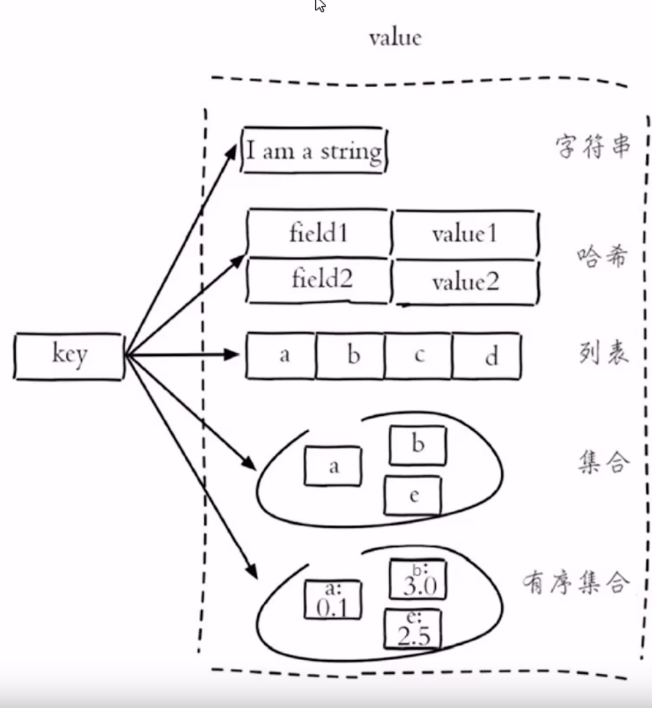

# 1 数据类型

- string 普通字符串
- hash 适合存储对象
- list 按照插入顺序排序
- set 无序集合，没有重复元素
- sorted set有序集合，没有重复元素

## 1.1 普通字符串

| 命令                    | 描述                             |
| ----------------------- | -------------------------------- |
| set key value           | 设置指定key的值                  |
| get key                 | 获取指定key的值                  |
| setex key seconds value | 设置指定key值，seconds为过期时间 |
| setnx key value         | key不存在时设置key的值           |

## 1.2 哈希类型

| 命令                 | 描述                       |
| -------------------- | -------------------------- |
| hset key field value | 将哈希表key中字段field的值 |
|                      |                            |
|                      |                            |
|                      |                            |
|                      |                            |
|                      |                            |

Java操作redis：Jedis

redis默认有16个数据库，默认为0号数据库，使用select 1 切换
