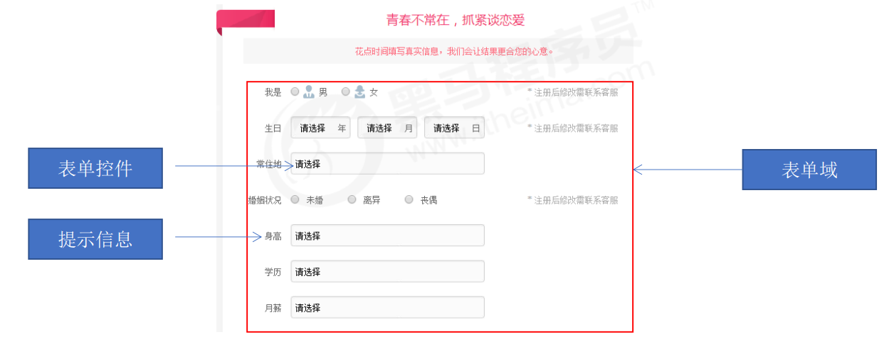

# 1 基础知识

W3c官网：[w3school 在线教程](https://www.w3school.com.cn/)

mdn官网：[MDN Web Docs (mozilla.org)](https://developer.mozilla.org/zh-CN/)

## 1.1 一些概念

**名称**：HyperText Markup Language 超文本标记语言

	1. 超文本：可以加入除了文字以外的其他内容，如图片，视频等等。并且可以从一个文件跳转到另一个文件
	1. 标记： 不同于其他编程语言，html没有很强的语法。使用标签来描述语义

**常用浏览器的内核**，如下图所示

| 浏览器       | 内核     |
| ------------ | -------- |
| IE浏览器     | Trident  |
| edge浏览器   | Chromium |
| chrome浏览器 | Blink    |
| 火狐浏览器   | Gecko    |
| safari浏览器 | Webkit   |
| oprea浏览器  | Blink    |

## 1.2 web标准

Web 标准是由 W3C 组织和其他标准化组织制定的一系列标准的集合。W3C（万维网联盟）是国际最著名的标准化组织。

通过使用该标准，可以保证用不同的浏览器加载同一个html文件，效果都是一样的

**web标准的构成**

| 标准 | 说明                                                |
| ---- | --------------------------------------------------- |
| 结构 | 结构用于对网页元素进行整理和分类，由html负责        |
| 表现 | 用于设置网页的版式，颜色，大小等外观样式，由css负责 |
| 行为 | 指网页模型的定义及交互的编写，由js负责              |

最佳实践为：结构，样式，行为相分离

# 2 标签相关

**注**：本笔记不记录所有标签。如有需要，请查询mdn或w3c官网

## 2.1 语法规范

### 2.1.1 基本语法

1. HTML 标签是由尖括号包围的关键词，例如 。 
2. HTML 标签通常是成对出现的，例如`<html>`和`</html>`，我们称为双标签。标签对中的第一个标签是 开始标签，第二个标签是结束标签。 
3. 有些特殊的标签必须是单个标签，例如`<br />`，我们称为单标签。 

### 2.1.2 基本结构

```html
<!--根标签-->
<html>
    <!--文档头部-->
    <head>
        <!--文档标题-->
        <title></title>
    </head>
    <!--文档身体-->
    <body>
        
    </body>
</html>
```

## 2.2 基础标签

| 标签                      | 描述                     |
| ------------------------- | ------------------------ |
| &lt;h1&gt;  ~  &lt;h6&gt; | 定义标题，h1最大，h6最小 |
| &lt;p&gt;                 | 定义段落                 |
| &lt;br /&gt;              | 定义换行                 |
| &lt;hr&gt;                | 定义水平线               |

## 2.3 文本格式化标签

| 作用   | 标签                       | 补充                         |
| ------ | -------------------------- | ---------------------------- |
| 加粗   | <strong></strong>或<b></b> | 推荐使用<strong>，语义更强烈 |
| 倾斜   | <em></em>或<i></i>         | 推荐使用<em>，语义更强烈     |
| 删除线 | <del></del>或<s></s>       | 推荐使用<del>，语义更强烈    |
| 下划线 | <ins></ins>或<u></u>       | 推荐使用<ins>，语义更强烈    |

## 2.4 转义字符

| HTML 原代码 | 显示结果 | 描述                   |
| ----------- | -------- | ---------------------- |
| \&lt;       | <        | 小于号或显示标记       |
| \&gt ;      | >        | 大于号或显示标记       |
| \&amp;      | &        | 可用于显示其它特殊字符 |
| \&quot;     | “        | 引号                   |
| \&reg;      | ®        | 已注册                 |
| \&copy;     | ©        | 版权                   |
| \&trade;    | ™        | 商标                   |
| \&nbsp;     |          | 不断行的空白           |

## 2.5 布局标签

| 标签         | 描述                   |
| ------------ | ---------------------- |
| &lt;div&gt;  | 一行只能放一个的大盒子 |
| &lt;span&gt; | 一行可以放多个的小盒子 |

> 一般使用<div>标签嵌套<span>使用

## 2.6 图片标签

```html

```

属性如下：

| 属性   | 属性值单位 | 描述                           |
| ------ | ---------- | ------------------------------ |
| src    | 图片路径   | 必须存在的属性                 |
| alt    | 文本       | 图片不能显示时，显示该属性的值 |
| title  | 文本       | 鼠标放在图像上显示的文本       |
| width  | 像素       | 设置图像的宽度                 |
| height | 像素       | 设置图像的高度                 |
| border | 像素       | 设置图像边框的粗细             |

## 2.4 超链接标签

```html
<a>提示文字</a>
```

| 属性   | 作用                                                         |
| ------ | ------------------------------------------------------------ |
| href   | 指定超链接的目标地址                                         |
| target | 指定链接页面的打开方式。_self为默认值，当前页面跳转。__blank为新窗口打开 |

链接分类如下

```html
<!-- 1.外部链接：跳转到其他网站 -->
<a href="http://www.baidu.com">点我</a>
<!-- 2.内部链接:跳转到本地服务器的html -->
<a href="index.html">点我</a>
<!-- 3.空链接：点了什么反应也没有 -->
<a href="#">点我</a>
<!-- 4.下载链接:如果href是一个文件或者压缩包，会下载该文件 -->
<a href="../lalal.zip">点我下载</a>
<!-- 5.网页元素链接:可以将网页中的各种元素添加为超链接 -->
<a href="http://www.baidu.com"></a>
<!-- 6.锚点链接:点击链接，快速定位到页面中的某个位置 -->
<!--目标位置需要用id属性--><h3 id="two">你好 </h3>
<!--链接文本中，设置#id属性值--><a href="#two">点我快速到达</a>
```


## 2.5 列表标签

```html
<!--无序列表-->
<ul>
    <li>列表项1</li>
    <li>列表项2</li>
    <li>列表项3</li>
</ul>
```

```html
<!--有序列表-->
<ol>
    <li>列表项1</li>
    <li>列表项2</li>
    <li>列表项3</li>
</ol>
```

```html
<!-- 列表嵌套 -->
<ul>
    <li>
    	北京市
        <ul>
            <li>海淀区</li>
            <li>朝阳区</li>
            <li>昌平区</li>
        </ul>
    </li>
    <li>
    	河北省
        <ul>
            <li>石家庄</li>
            <li>保定</li>
        </ul>
    </li>
</ul>
```

```html
<!--自定义列表:
		- 一个<dl>包含多个<dt>
		- 一个<dt>由多个<dd>组成
-->
<dl>
   	<dt></dt>
    <dd></dd>
    <dd></dd>
</dl>
```


## 2.6 表格标签

用途：展示数据

```html
<!--表格标签-->
<table>
    <tr>
        <!--表头标签:所有数据居中加粗显示-->
        <th></th>
    </tr>
    <!--行标签-->
    <tr>
        <!--列标签-->
        <td></td>
    </tr>
</table>

<!--另一种方式-->
<table>
    <!--定义表格的头部-->
    <thead>
        <tr>
            <td></td>
        </tr>
    </thead>
    
    <!--定义表格的身体-->
    <tbody>
        <tr>
            <td></td>
        </tr>
    </tbody>
</table>
```

| 属性名      | 属性值单位        | 描述                               |
| ----------- | ----------------- | ---------------------------------- |
| align       | left,center,right | 表格相对周围元素的对齐方式         |
| border      | 1或者""（空）     | 单元格是否有边框，默认为""表示没有 |
| cellpadding | 像素值            | 单元格与内容的空白，默认1像素      |
| cellspacing | 像素值            | 单元格之间的空白，默认2像素        |
| width       | 像素值或百分比    | 规定表格的宽度                     |
| rowspan     | 个数              | 跨行合并                           |
| colspan     | 个数              | 跨列合并                           |

**合并单元格注意事项**

1. 确定合并单元格的方式是跨行还是跨列
2. 该从哪个地方进行合并操作
3. 删除多余的单元格

## 2.7 表单

**目的：**收集用户信息

**组成：**由表单域，表单控件，提示信息3部分组成，如图所示



### 2.7.1 表单域

一个包含表单元素的区域

```html
<form action="url地址" method="提交方式" name="表单域名称">
    <!--表单控件-->
</form>
```

常用属性

| 属性   | 属性值                         |
| ------ | ------------------------------ |
| action | 接受并处理表单数据的服务器地址 |
| method | get/post                       |
| name   | 表单名称                       |

### 2.7.2 表单控件

#### input

type属性决定该input是什么类型

| type 取值 | 描述                                           |
| --------- | ---------------------------------------------- |
| text      | 默认值。定义单行的输入字段                     |
| password  | 定义密码字段                                   |
| radio     | 定义单选按钮                                   |
| checkbox  | 定义复选框                                     |
| file      | 定义文件上传按钮                               |
| hidden    | 定义隐藏的输入字段                             |
| submit    | 定义提交按钮，提交按钮会把表单数据发送到服务器 |
| reset     | 定义重置按钮，重置按钮会清除表单中的所有数据   |
| button    | 定义可点击按钮                                 |

> 关于submit按钮：name为上传到服务器的参数名称，value为提交按钮提示的关键字
>
> 单选复选框使用check属性标记默认。使用name属性进行分组

input其他属性

| 属性      | 描述                      |
| --------- | ------------------------- |
| name      | 定义input元素的名称       |
| value     | input元素的提示/默认值    |
| checked   | 该input首次加载被选中     |
| maxlength | input标签中字符的最大长度 |

### 2.7.3 下拉菜单

| 标签           | 描述                 |
| -------------- | -------------------- |
| <select&gt;    | 定义下拉列表         |
| &lt;option&gt; | 定义下拉列表的列表项 |

### 2.7.4 文本域

```html
<textarea></textarea>
```

### 2.7.5 label标签

作用：<label>标签用于绑定一个表单元素, 当点击 标签内的文本时，浏览器就会自动将焦点(光标)转到或者 选择对应的表单元素上,用来增加用户体验.

```html
<label for="sex">男</label>
<input type="radio" name="sex" id="sex">
```

