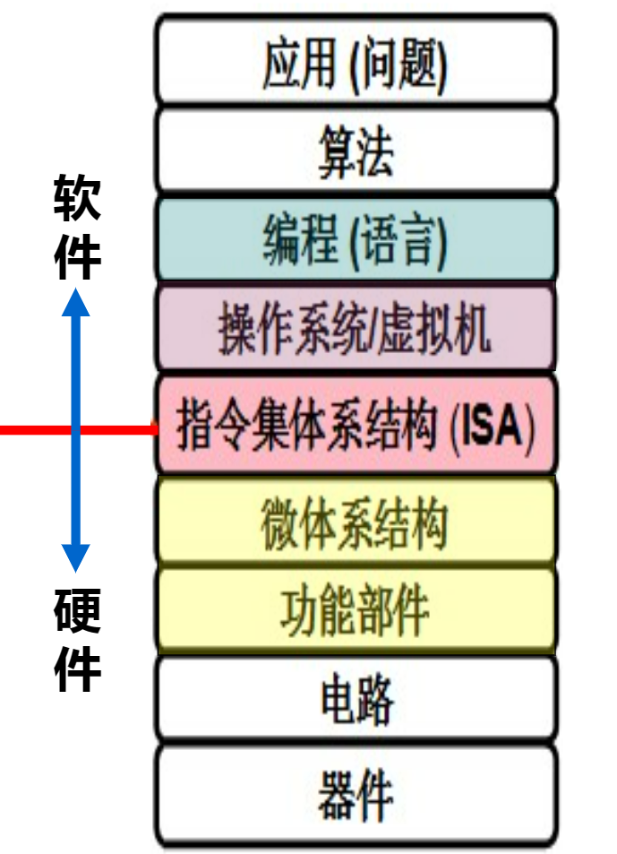
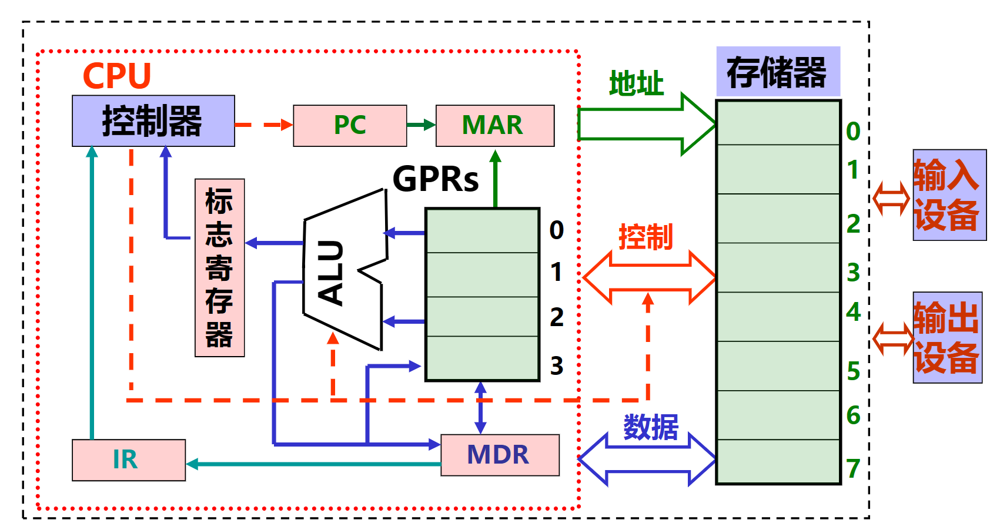
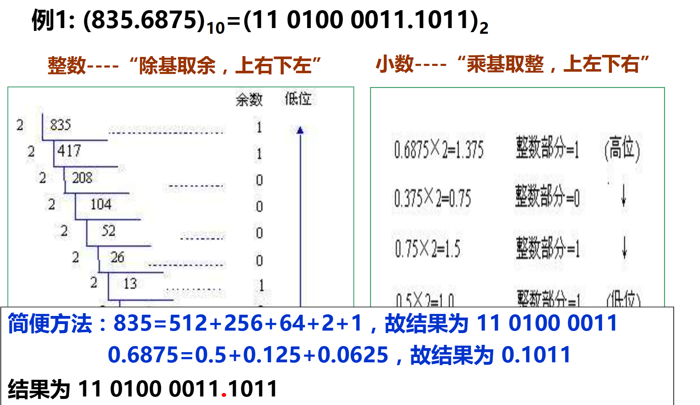

# 1 第0章  序章

课程目标：使学生清楚理解计算机是如何生成和运行可执行文件的

范围及相关内容：

如上为计算机系统抽象层。本课程讲述彩色背景中的内容

- 编程语言层：数据的机器级表示、运算。语句和过程调用的机器级表示
- 操作系统、编译和链接的部分内容
- 指令集体系结构(ISA)和汇编层：指令系统、机器代码、汇编语言
- 微体系结构及硬件层：CPU的通用结构、层次结构存储系统

## 1.1 冯·诺依曼结构

- 主要思想：存储程序
- 工作方式：任何要计算机完成的工作都要被编写成程序，然后将程序和原始数据送入主存并启动执行。一旦程序被启动，计算机应能在不需要操作人员的干预下，自动完成逐条取出指令和执行指令的任务
- 组成：由运算器，控制器，存储器，输入设备，输出设备五个基本部件组成
  - 存储器：存储数据和指令的地方。形式上都为二进制表示，但计算机可以区分哪些是指令，哪些是数据。
  - 控制器：能自动取出指令并执行
  - 运算器：提供加减乘除等算数运算及逻辑运算。包括其他运算
  - 输入，输出设备：计算机与用户通信的设备
  - 另外还有总线，将上述部件连接在一起

## 1.2 计算机基本组成

各部件名称对应如下

| 部件简写 | 部件名称         |
| -------- | ---------------- |
| CPU      | 中央处理器       |
| PC       | 程序计数器       |
| MAR      | 存储器地址寄存器 |
| ALU      | 算术逻辑部件     |
| IR       | 指令寄存器       |
| MDR      | 存储器数据寄存器 |
| GPRs     | 通用寄存器组     |

- 运算器：ALU，GPRs，标志寄存器等
- 存储器：存储阵列，地址译码器，读写控制电路
- 总线：MDR，MAR，控制线
- 控制器：对指令进行译码并生成控制信号

## 1.3 程序执行运行流程

- 程序在执行前：数据和指令事先存放在存储器中，每条指令和每个数据都有地址，指令按序存放，指令由OP，ADDR字段组成。程序起始地址置PC
- 开始执行程序：
  1. 根据PC取指令
  2. 指令译码
  3. 取操作数
  4. 指令执行
  5. 回写结果
  6. 修改PC的值
  7. 循环上述步骤
- 指令需要提供的信息
  1. 操作性质
  2. 源操作数：可以包含立即数，寄存器编号（操作数在寄存器中），存储地址（操作数在内存中）
  3. 目的操作数：寄存器编号（结果写入寄存器），存储地址（结果写入内存）

> 什么是指令：包含操作码和操作数或其地址码(机器语言使用01序列，汇编指令使用符号。汇编和机器语言是一一对应关系)。只能描述存取操作数、两个数运算、根据条件判断

## 1.4 程序开发过程

- 发展历史
  1. 机器语言：第一代语言，机器码。只有01序列 。可移植性差
  2. 汇编语言：第二代语言，使用助记符来简化机器码，汇编指令与机器指令一一对应。需要借助汇编程序将代码编程机器码执行
  3. 过程式语言：第三代语言
  4. 高级语言：第四代语言。与机器结构无关，描述算法即可，一条语句对应多条机器指令(即机器语言或汇编语言)。各种编程范式(面向对象，过程，方法)。两种转换方式(编译程序，解释程序)
- 环境变化
  1. 从前只需将数据和指令输入进内存，并把第一条指令送入PC即可、
  2. 现在需要由语言处理系统和操作系统共同组成
     1. 语言处理系统：编辑器编写源代码，用编译器或解释器运行程序
     2. 操作系统：提供输入输出路径（键盘，屏幕），程序运行环境(系统内核，ISA等)
- ISA指令集体系结构：规定了如何使用硬件
  1. 可执行的指令集合：包括指令格式、指令种类、每种操作对应的操作数
  2. 指令可以接受的操作数的类型
  3. 操作数所能存放的寄存器组的结构：名称，编号，长度，用途
  4. 操作数所能存放的存储空间的大小（4字节，8字节）和编址方式
  5. 操作数存放时是大端法存放还是小端法
  6. 获取操作数时的寻址方式
  7. 指令执行过程的控制方式，程序计数器或条件码
  8. 没有ISA，就不能称这台计算机为通用计算机

# 2 数字与编码

计算机中，如何存储信息非常重要。信息是计算机的基石。本章专门介绍在计算机中如何存储、表示数字及其他非数值

## 2.1 基本概念

- 数值数据：无符号整数、带符号整数、浮点数(实数)

- 非数值数据：逻辑数（包括位串），各种字符

- 计算机内部所有信息都采用二进制进行编码

- 真值：现实中的值

- 机器数：现实中的值在机器中的样子

- 数值数据表示的三要素：
  1. 进位计数制：十进制、二进制、八进制、十六进制
  2. 定、浮点表示(解决小数点问题)：定点整数、定点小数、浮点数
  3. 二进制编码(解决正负号问题)：原码、补码、反码、移码
- R进制数
  1. 基数：表示每一位可能由几个数字组成。如10进制以10为基数，每一位有10种表示(0~9)
  2. 权：基数的i次方，最低为从0开始。如10（十进制）中的1的权为(10^1)
- 在计算机中，我们使用16进制来对二进制进行简写

## 2.2 计算机存储数据

### 2.2.1 大端法&小端法

LSB:表示最低有效位

MSB：最高有效位

## 2.3 编码方式

### 2.3.1 原码

### 2.3.2 补码

### 2.3.3 移码

## 2.4 进制之间的转换

R进制转十进制：按“权”展开。

十进制转二进制：整数除基取余，上右下左。小数取整，上左下右

R进制转十进制举例：(307.6)8 = 3×8^2 + 7×8^0+6×8^-1

十进制转二进制举例：

计算机中的小数点:

- 定点数：小数点位置约定在固定位置的数称为定点小数
- 浮点数：小数点位置约定在可浮动的数称为浮点数
- 计算机中只能存储定点小数

## 2.5 计算机中的整数

## 2.6 计算机中的浮点数

## 2.7 计算机中的非数值

### 2.7.1 逻辑值

计算机中逻辑值有两个：1(真)，0(假)。

- 表示：一位表示逻辑值，或者使用位串
- 运算时按位运算，与或非，左移，右移
- 计算机根据指令识别

### 2.7.2 字符

在计算机中存储的依旧是二进制数据。计算机根据数据结构和编码方式进行识别。其中最常用的为ASCII码

# 3 机器指令表示

 
