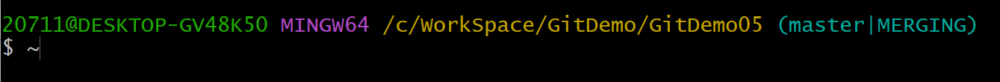

# 1 简介

官网：[Git (git-scm.com)](https://git-scm.com/)

## 1.1 版本控制

 版本控制是一种记录一个或若干文件内容变化，以便将来查阅特定版本修订情况的系统。

1. 本地版本控制：许多人习惯用复制整个项目目录的方式来保存不同的版本，或许还会改名加上备份时间以示区别。 这么做唯一的好处就是简单，但是特别容易犯错。为了解决这个问题，人们很久以前就开发了许多种本地版本控制系统，大多都是采用某种简单的数据库来记录文件的历次更新差异。

   > 如：RCS

2. 集中化版本控制：接下来人们又遇到一个问题，如何让在不同系统上的开发者协同工作？ 于是，集中化的版本控制系统应运而生。这类系统都有一个单一的集中管理的服务器，保存所有文件的修订版本，而协同工作的人们都通过客户端连到这台服务器，取出最新的文件或者提交更新。

   > 如：CVS、Subversion 以及 Perforce 

3. 分布式版本控制：使用集中式版本控制系统，存在一些问题会导致开发者无法无法工作甚至丢失项目（如中央服务器单点故障）。于是分布式版本控制系统面世了，在这类系统中，客户端并不只提取最新版本的文件快照， 而是把代码仓库完整地镜像下来，包括完整的历史记录。

   > 如：Git、Mercurial、Bazaar 及 Darcs 

## 1.2 Git

### 1.2.1 Git简史

Linux 内核开源项目有着为数众多的参与者。 绝大多数的 Linux 内核维护工作都花在了提交补丁和保存归档的繁琐事务上（1991－2002年间）。 到 2002 年，整个项目组开始启用一个专有的分布式版本控制系统 BitKeeper 来管理和维护代码。

到了 2005 年，开发 BitKeeper 的商业公司同 Linux 内核开源社区的合作关系结束，他们收回了 Linux 内核社区免费使用 BitKeeper 的权力。 这就迫使 Linux 开源社区（特别是 Linux 的缔造者 Linus Torvalds）基于使用 BitKeeper 时的经验教训，开发出自己的版本系统。 他们对新的系统制订了若干目标：

- 速度
- 简单的设计
- 对非线性开发模式的强力支持（允许成千上万个并行开发的分支）
- 完全分布式
- 有能力高效管理类似 Linux 内核一样的超大规模项目（速度和数据量）

### 1.2.2 Git是什么

#### 直接记录快照

Git 和其它版本控制系统的主要差别在于 Git 对待数据的方式。 从概念上来说，其它大部分系统记录的是文件的变化。


Git 更像是把数据看作是对小型文件系统的一系列快照。 在 Git 中，每当你提交更新或保存项目状态时，它基本上就会对当时的全部文件创建一个快照并保存这个快照的索引。 为了效率，如果文件没有修改，Git 不再重新存储该文件，而是只保留一个链接指向之前存储的文件。 


#### 本地执行所有操作

集中式版本控制系统需要连接中央服务器才能执行对比版本等操作。而在Git上，除了需要上传操作之外，都可以在本地进行

#### 保证数据完整性

Git 中所有的数据在存储前都计算校验和，然后以校验和来引用。 这意味着不可能在 Git 不知情时更改任何文件内容或目录内容。 这个功能建构在 Git 底层，是构成 Git 哲学不可或缺的部分。 若你在传送过程中丢失信息或损坏文件，Git 就能发现。

Git 用以计算校验和的机制叫做 SHA-1 散列（hash，哈希）。 这是一个由 40 个十六进制字符（0-9 和 a-f）组成的字符串，基于 Git 中文件的内容或目录结构计算出来。Git 数据库中保存的信息都是以文件内容的哈希值来索引，而不是文件名。

```
24b9da6552252987aa493b52f8696cd6d3b00373
```

#### Git一般只添加数据

你执行的 Git 操作，几乎只往 Git 数据库中 **添加** 数据。 你很难使用 Git 从数据库中删除数据，也就是说 Git 几乎不会执行任何可能导致文件不可恢复的操作。（未提交更新还是会丢失数据）

#### 工作流程

Git有三种状态，文件可能处于其中之一

- **已修改（modified）**：表示修改了文件，但还没保存到数据库中。如果自上次检出后，作了修改但还没有放到暂存区域，就是已修改状态。
- **已暂存（staged）**：对一个已修改文件的当前版本做了标记，使之包含在下次提交的快照中。如果文件已修改并放入暂存区，就属于已暂存状态。
- **已提交（committed）**：数据已经安全地保存在本地数据库中。如果 Git 目录中保存着特定版本的文件，就属于已提交状态。

以上三种状态，会让我们的Git项目拥有三个阶段：

- **工作区**：工作区是对项目的某个版本独立提取出来的内容。 这些从 Git 仓库的压缩数据库中提取出来的文件，放在磁盘上供你使用或修改
- **暂存区**：暂存区是一个文件，保存了下次将要提交的文件列表信息，一般在 Git 仓库目录中。
- **Git目录**：Git 仓库目录是 Git 用来保存项目的元数据和对象数据库的地方。 这是 Git 中最重要的部分，从其它计算机克隆仓库时，复制的就是这里的数据。


基本的 Git 工作流程如下：

1. 在工作区中修改文件。
2. 将你想要下次提交的更改选择性地暂存，这样只会将更改的部分添加到暂存区。
3. 提交更新，找到暂存区的文件，将快照永久性存储到 Git 目录。

### 1.2.3 起步

本笔记采用kali 2022.4版本，如果使用其他平台，请阅读如下连接：[Git - Book (git-scm.com)](https://git-scm.com/book/en/v2)

#### 初次运行前的配置

Git 自带一个 `git config` 的工具来帮助设置控制 Git 外观和行为的配置变量。 这些变量存储在三个不同的位置：

1. `/etc/gitconfig` 文件: 包含系统上每一个用户及他们仓库的通用配置。 如果在执行 `git config` 时带上 `--system` 选项，那么它就会读写该文件中的配置变量。 （由于它是系统配置文件，因此你需要管理员或超级用户权限来修改它。）
2. `~/.gitconfig` 或 `~/.config/git/config` 文件：只针对当前用户。 你可以传递 `--global` 选项让 Git 读写此文件，这会对你系统上 **所有** 的仓库生效。
3. 当前使用仓库的 Git 目录中的 `config` 文件（即 `.git/config`）：针对该仓库。 你可以传递 `--local` 选项让 Git 强制读写此文件，虽然默认情况下用的就是它。（当然，你需要进入某个 Git 仓库中才能让该选项生效。）

> 注意：每一个级别会覆盖上一级别的配置，`.git/config` 的配置变量会覆盖 `/etc/gitconfig` 中的配置变量

#### 用户信息

安装完 Git 之后，要做的第一件事就是设置你的用户名和邮件地址。 这一点很重要，因为每一个 Git 提交都会使用这些信息，它们会写入到你的每一次提交中，不可更改：

```shell
git config --global user.name "Paolua"
git config --global user.email Paolua@example.com
```

#### 文本编辑器

既然用户信息已经设置完毕，你可以配置默认文本编辑器了，当 Git 需要你输入信息时会调用它。 如果未配置，Git 会使用操作系统默认的文本编辑器。

```shell
git config --global core.editor vim
```

#### 检查配置信息

如果想要检查配置，可以使用如下命令来列出所有 Git 当时能找到的配置

```shell
git config --list
```

# 2 Git基础

## 2.1 获取git仓库

通常有两种获取 Git 项目仓库的方式

- 将尚未进行版本控制的本地目录转换为 Git 仓库

  1. 进入项目目录

     ```shell
     cd /home/Project/my_project
     ```

  2. 执行初始化动作

     ```shell
     git init
     ```

     > 该命令将创建一个名为 `.git` 的子目录，这个子目录中存放的是git仓库初始化时所有必须的文件

- 从其它服务器**克隆**一个已存在的 Git 仓库

  ```shell
  git clone <url>
  ```

  > 克隆是将git仓库中的每一个文件的每一个版本都拉取下来

## 2.2 基础操作

### 2.2.1 文件状态

自2.1节后，我们已经有了一个工作目录。工作目录下的每一个文件都不外乎这两种状态：**已跟踪** 或 **未跟踪**

已跟踪文件：Git已经知道的文件

未跟踪文件：除了以跟踪文件之外的所有文件

| 命令                | 描述                                   |
| ------------------- | -------------------------------------- |
| git status          | 检查文件处于什么状态                   |
| git add 文件名/目录 | 开始追踪新文件或目录，添加文件到暂存区 |

> git add 后加目录时，该命令将递归地跟踪该目录下的所有文件。

使用git status -s命令来简化git status命令的输出，下面列出了简化的例子

```git
$ git status -s
 M README
MM Rakefile
A  lib/git.rb
M  lib/simplegit.rb
?? LICENSE.txt
```

??表示未跟踪文件。左栏指明暂存区的状态，右栏表明工作区的状态。`README` 文件在工作区已修改但尚未暂存，而 `lib/simplegit.rb` 文件已修改且已暂存。

### 2.2.2 忽略文件

一般我们总会有些文件无需纳入 Git 的管理，也不希望它们总出现在未跟踪文件列表。 通常都是些自动生成的文件，比如日志文件，或者编译过程中创建的临时文件等。 在这种情况下，我们可以创建一个名为 `.gitignore` 的文件，列出要忽略的文件的模式。 


文件 `.gitignore` 的格式规范如下：

- 所有空行或者以 `#` 开头的行都会被 Git 忽略。
- 可以使用标准的 glob 模式匹配，它会递归地应用在整个工作区中。
- 匹配模式可以以（`/`）开头防止递归。
- 匹配模式可以以（`/`）结尾指定目录。
- 要忽略指定模式以外的文件或目录，可以在模式前加上叹号（`!`）取反。

### 2.2.3 查看修改

| 命令                      | 描述                                         |
| ------------------------- | -------------------------------------------- |
| git diff                  | 查看尚未暂存的文件更新(工作区和暂存区的变化) |
| git diff --staged/--cache | 对已暂存文件与最后一次提交的文件差异         |

### 2.2.4 提交更新

| 命令                       | 描述     |
| -------------------------- | -------- |
| git commit [-m '注释信息'] | 提交更新 |

linux环境使用命令行时，该命令会输出最后一次执行git status 的信息，开始行会提示用户输入注释信息，也可以在提交命令后加上-m来跳过该画面

```
# Please enter the commit message for your changes. Lines starting
# with '#' will be ignored, and an empty message aborts the commit.
# On branch master
# Your branch is up-to-date with 'origin/master'.
#
# Changes to be committed:
#	new file:   README
#	modified:   CONTRIBUTING.md
#
~
~
~
".git/COMMIT_EDITMSG" 9L, 283C
```

### 2.2.5 移除文件

要从 Git 中移除某个文件，就必须要从已跟踪文件清单中移除（确切地说，是从暂存区域移除），然后提交。 

- 删除文件

  1. 手动删除该文件
  2. 执行命令:git rm '文件名'

  下一次提交时，该文件就不再纳入版本管理了。 如果要删除之前修改过或已经放到暂存区的文件，则必须使用强制删除选项 `-f`

- 从git移除，工作区保留

  1. git rm --cached '文件名'

  取消git的追踪，在工作区保留该文件，可以使用正则表达式

### 2.2.6 其他操作

| 命令               | 描述               |
| ------------------ | ------------------ |
| git mv file1 file2 | 移动文件/重命名    |
| git commit -a      | 跳过暂存，直接提交 |

## 2.3 查看提交历史

```git
git log
```

不传入任何参数的默认情况下，`git log` 会按时间先后顺序列出所有的提交，最近的更新排在最上面。 正如你所看到的，这个命令会列出每个提交的 SHA-1 校验和、作者的名字和电子邮件地址、提交时间以及提交说明。

```git
git log -p -2
```

其中一个比较有用的选项是 `-p` 或 `--patch` ，它会显示每次提交所引入的差异（按 **补丁** 的格式输出）。 你也可以限制显示的日志条目数量，例如使用 `-2` 选项来只显示最近的两次提交

```git
git log --stat
```

`--stat` 选项在每次提交的下面列出所有被修改过的文件、有多少文件被修改了以及被修改过的文件的哪些行被移除或是添加了。 在每次提交的最后还有一个总结。

```git
git log --pretty=oneline
```

另一个非常有用的选项是 `--pretty`。 这个选项可以使用不同于默认格式的方式展示提交历史。 这个选项有一些内建的子选项供你使用。`oneline`表示会将每个提交放在一行

```git
git log --pretty=format:"%h - %an, %ar : %s"
```

当`--pretty`使用`format`后，可以在自定义格式，具体的选项参考：[Git - 查看提交历史 (git-scm.com)](https://git-scm.com/book/zh/v2/Git-基础-查看提交历史)

```git
git log --pretty=format:"%h %s" --graph
```

当 `oneline` 或 `format` 与另一个 `log` 选项 `--graph` 结合使用时尤其有用。 这个选项添加了一些 ASCII 字符串来形象地展示你的分支、合并历史

```git
git log --since=2.weeks
```

git log 还可以使用各种各样的选项来限制输出

具体的log选项和限制输出长度，请翻阅[Git - 查看提交历史 (git-scm.com)](https://git-scm.com/book/zh/v2/Git-基础-查看提交历史)

## 2.4 撤销操作

### 2.4.1 "重新"提交

有时候我们提交完了才发现漏掉了几个文件没有添加，或者提交信息写错了。 此时，可以运行带有 `--amend` 选项的提交命令来重新提交

```git
git commit --amend
```

从命令的解释看，使用该命令以前已经有了一次提交。使用该命令后，git会使用一个完全新的提交来替换旧的提交

### 2.4.2 取消暂存的文件

你已经修改了两个文件并且想要将它们作为两次独立的修改提交， 但是却意外地输入 `git add *` 暂存了它们两个。如何只取消暂存两个中的一个呢？

```git
git reset HEAD 文件名
```

> 注意：该条命令使用git status 命令后会有相应提示

### 2.4.3 撤销对文件的修改

如果并不想保留对一个文件的修改怎么办？ 该如何方便地撤消修改——将它还原成上次提交时的样子（或者刚克隆完的样子，或者刚把它放入工作目录时的样子）

```git
git checkout -- CONTRIBUTING.md
```

> 注意：该条命令使用git status 命令后会有相应提示

## 2.5 远程仓库的使用

## 2.6 打标签

## 2.7 别名


# 3 Git分支

## 3.1 Git分支原理

> 阅读本节前，请先复习Git存储文件的方式

 在很多版本控制系统中，这是一个略微低效的过程——常常需要完全创建一个源代码目录的副本。如果项目规模较大，这样的过程会耗费很多时间。Git采用指针的方式来进行分支相关的工作

从添加一个为跟踪的文件开始，来看一下Git是如何工作的

1. 假设现在有一个文件：`test.txt`，内容如下所示

   ```
   111
   ```

2. 使用`git add`将其添加到暂存区。 暂存操作会为每一个文件计算校验和，然后会把当前版本的文件快照保存到 Git 仓库中 （Git 使用 *blob* 对象来保存它们），最终将校验和加入到暂存区域等待提交

3. 当使用 `git commit` 进行提交操作时，Git 会先计算每一个子目录的校验和， 然后在 Git 仓库中将这些校验和保存为树对象。随后，Git 便会创建一个提交对象。 如此一来，Git 就可以在需要的时候重现此次保存的快照

   

   > git提交对象的内容：
   >
   > - 一个指向暂存内容快照的指针
   > - 作者的姓名和邮箱
   > - 提交时输入的信息
   > - 父对象的指针（上一次提交的提交对象）
   > - 指向树对象（项目根目录）的指针

Git 的分支，其实本质上仅仅是指向提交对象的可变指针。 Git 的默认分支名字是 `master`。 在多次提交操作之后，你其实已经有一个指向最后那个提交对象的 `master` 分支。 `master` 分支会在每次提交时自动向前移动。

Git使用Head指针来表示目前处于哪个分支


## 3.2 分支操作

```git
git branch 分支名
```

创建一个新分支，但不会改变`head`指针

```git
git checkout 分支名
```

切换分支，也就是切换head指针所指的对象

```git
git checkout -b 分支名
```

创建分支并切换

```git
git branch -d 分支名
```

删除分支

```git
git log --oneline --decorate
```

可以简单地使用 `git log` 命令查看各个分支当前所指的对象

```git
git log --oneline --decorate --graph --all
```

你可以简单地使用 `git log` 命令查看分叉历史。上述会输出你的提交历史、各个分支的指向以及项目的分支分叉情况

## 3.3 分支合并

有些时候，可能会遇到在多条工作同时工作的场景。此时，有可能出现文件冲突（同一行代码有两个版本的内容），称之为冲突。以下为命令行的解决方法

### 3.3.1 快进合并


假设上图为我们的分支图，此时我们想将hotfix合并到master分支，可以使用如下命令

```git
git merge hotfix #注意：该命令需要在master分支运行
```

合并的提示如下

```
$ git checkout master
$ git merge hotfix
Updating f42c576..3a0874c
Fast-forward
 index.html | 2 ++
 1 file changed, 2 insertions(+)
```

注意“快进（fast-forward）”这个词。 由于想要合并的分支 `hotfix` 所指向的提交 `C4` 是所在的提交 `C2` 的直接后继， 因此 Git 会直接将指针向前移动。换句话说，当你试图合并两个分支时， 如果顺着一个分支走下去能够到达另一个分支，那么 Git 在合并两者的时候， 只会简单的将指针向前推进（指针右移），因为这种情况下的合并操作没有需要解决的分歧——这就叫做 “快进（fast-forward）”。


合并完成后，删除`hotfix`，并在`iss53`工作量一下，提交了`C5`版本。这时我们想将`iss53`合并到`master`

### 3.3.2 三方合并

如果没有什么冲突，会进行一个三方合并，如下所示


> 翻译：
>
> ​	common ancestor:共同祖先
>
> ​	snapshot to merge into:要合并的快照
>
> ​	snapshot to merge in：要合并的快照

和之前将分支指针向前推进所不同的是，Git 将此次三方合并的结果做了一个新的快照并且自动创建一个新的提交指向它。 这个被称作一次合并提交，它的特别之处在于他有不止一个父提交。


> 注意：三方合并是git自动完成的

### 3.3.3 手动合并


回到上图。如果，我们要合并的文件出现冲突，git不知道怎么做，就会出现如下错误

```git
$ git merge iss53 	#命令
Auto-merging index.html
CONFLICT (content): Merge conflict in index.html
Automatic merge failed; fix conflicts and then commit the result.
```

> 翻译：
>
> ​	自动合并index.html
>
> ​	冲突(内容):合并index.html时发生冲突
>
> ​	自动合并失败;修复冲突，然后提交结果。

此时，命令行会发生变化



后面不会显示所在分支，而是显示两个有冲突的分支

运行`git status`命令，显示如下

```git
git status
On branch master
You have unmerged paths.
  (fix conflicts and run "git commit")
  (use "git merge --abort" to abort the merge)

Unmerged paths:
  (use "git add <file>..." to mark resolution)
        both modified:   test.txt

no changes added to commit (use "git add" and/or "git commit -a")
```

Unmerged paths下会显示有冲突的文件，需要打开文本编辑器或其他软件手动编辑

```
master	#内容
<<<<<<< HEAD
hotfix	#内容
=======
iss53	#内容
>>>>>>> iss53
```

符号解释

- `<<<<<<<`后的分支名是你要合并到的分支名称
- `=======`代表两个文件的分割
- `>>>>>>>`后的分支名代表你要合并的分支名
- 解决冲突后，删除所有符号即可，如下所示

```
master	#内容
hotfix	#内容
iss53	#内容
```

解决了所有文件里的冲突之后，对每个文件使用 `git add` 命令来将其标记为冲突已解决。 

## 3.4 分支管理

```git
$ git branch #命令，下面是输出
  iss53
* master
  testing
```

`git branch` 命令不只是可以创建与删除分支。 如果不加任何参数运行它，会得到当前所有分支的一个列表。带`*`表示当前所在分支

```
$ git branch -v
  iss53   93b412c fix javascript issue
* master  7a98805 Merge branch 'iss53'
  testing 782fd34 add scott to the author list in the readmes
```

加上`-v`显示版本号

```console
$ git branch --merged
  iss53
* master
```

`--merged`查看哪些分支已经合并到当前分支

```git
$ git branch --no-merged
  testing
```

`--no-merged`查看哪些分支没有合并到当前分支


# 4 GitHub


